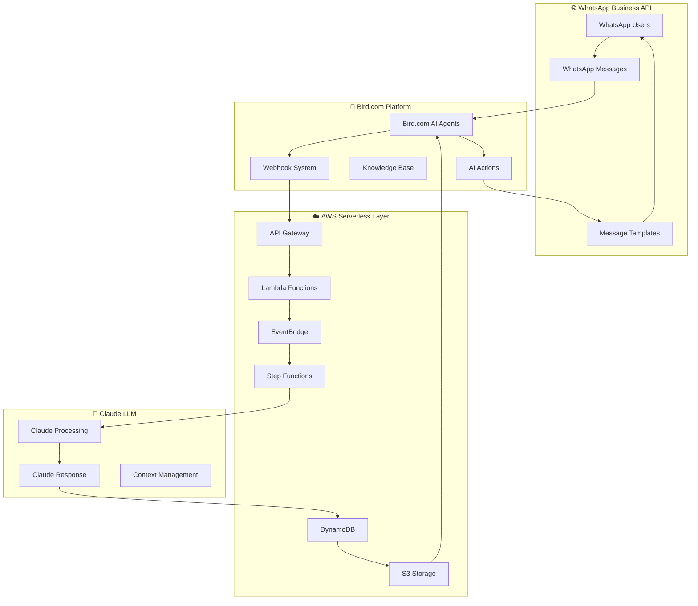

# 🤖 Bird.com Hybrid AI Agent - Claude Code Implementation

## 🎯 Visión General

**Bird.com Hybrid AI Agent** es una solución completa para implementar agentes de IA híbridos especializados en Bird.com utilizando AWS Serverless, WhatsApp Business API como canal principal, y Claude como LLM principal. 

Esta implementación sigue los patrones documentados en UrbanHub y las mejores prácticas identificadas para crear sistemas multimodales escalables y de alto rendimiento.

## 🏗️ Arquitectura del Sistema



## 🤖 Agentes Especializados

### 1. 🚦 Orchestrator Coordinator
**Función**: Director de tráfico inteligente que clasifica intenciones y rutea conversaciones
- Clasificación de intención en <20 segundos
- Routing automático basado en contexto
- Preservación de contexto entre transfers
- Manejo de multi-intents y situaciones ambiguas

### 2. 💬 Conversation AI Agent  
**Función**: Procesador principal de conversaciones WhatsApp con Claude
- Procesamiento de mensajes de texto, voz e imagen
- Gestión de sesiones conversacionales
- Integración nativa con Claude API
- Optimización de context window

### 3. 📄 Document Intelligence Agent
**Función**: Procesamiento avanzado de documentos con OCR y análisis
- OCR avanzado con Amazon Textract
- Clasificación automática de documentos
- Extracción de entidades y metadatos
- Validación de contenido

### 4. 🎨 Visual Analyzer Agent
**Función**: Análisis de imágenes y contenido visual
- Computer vision con Amazon Rekognition
- Análisis de productos y propiedades
- Detección de objetos y texto en imágenes
- Procesamiento de capturas de pantalla

### 5. 🎤 Voice Assistant Agent
**Función**: Procesamiento de mensajes de voz y audio
- Transcripción de voz con Amazon Transcribe
- Síntesis de voz con Amazon Polly
- Procesamiento de comandos de voz
- Soporte multiidioma (ES/EN)

## ⚡ Características Principales

### 🔄 Integración Híbrida Bird.com + AWS
- **Webhook Enhancement Pattern**: Bird.com → AWS Lambda → Claude → Response
- **Event-Driven Architecture**: EventBridge para orquestación
- **Serverless Processing**: Lambda con AWS Powertools
- **Real-time Updates**: WebSocket para actualizaciones instantáneas

### 🌍 WhatsApp Business API Optimizado
- **Multi-número Strategy**: Números especializados por función
- **Rich Media Support**: Imágenes, documentos, ubicación
- **Message Templates**: Pre-aprobados por Meta
- **Session Management**: Contexto persistente

### 🧠 Claude LLM Integration
- **Context Window Management**: 200k tokens optimizados
- **Conversation Memory**: Estado persistente en DynamoDB
- **Prompt Engineering**: Templates especializados
- **Token Optimization**: Estrategias de costo/rendimiento

### 🔐 Seguridad y Compliance
- **End-to-End Encryption**: Todas las comunicaciones
- **HMAC-SHA256 Verification**: Webhooks seguros
- **PII Detection**: Detección automática de datos personales
- **GDPR/CCPA Ready**: Cumplimiento regulatorio

## 📁 Estructura del Proyecto

```
bird-hybrid-agent/
├── agent-definitions/           # Configuraciones de agentes especializados
│   ├── orchestrator.yaml       # Coordinador principal
│   ├── conversation-ai.yaml    # Agente conversacional
│   ├── document-processor.yaml # Procesador de documentos
│   ├── visual-analyzer.yaml    # Analizador visual
│   └── voice-assistant.yaml    # Asistente de voz
├── aws-infrastructure/          # Infraestructura como código
│   ├── lambda-functions/        # Funciones Lambda especializadas
│   ├── cloudformation/          # Templates CloudFormation
│   └── terraform/               # Configuración Terraform
├── bird-config-templates/       # Templates para configuración manual Bird.com
│   ├── personality-configs/     # Configuraciones de personalidad
│   ├── knowledge-base/          # Estructura de knowledge base
│   └── ai-actions/              # Configuración de acciones IA
├── whatsapp-integration/        # Integración WhatsApp Business API
│   ├── message-templates/       # Templates de mensajes
│   ├── session-manager/         # Gestión de sesiones
│   └── media-handler/           # Procesamiento multimedia
├── claude-prompts/              # Prompts especializados para Claude
│   ├── intent-classification.md # Clasificación de intenciones
│   ├── response-generation.md   # Generación de respuestas
│   └── multimodal-processing.md # Procesamiento multimodal
├── testing/                     # Framework de testing
│   ├── integration-tests/       # Tests de integración
│   ├── conversation-simulations/# Simulaciones de conversación
│   └── performance-benchmarks/  # Benchmarks de rendimiento
└── documentation/               # Documentación completa
    ├── setup-guide.md           # Guía de configuración
    ├── api-reference.md         # Referencia de API
    └── troubleshooting.md       # Guía de resolución de problemas
```

## 🚀 Quick Start

### Prerrequisitos
- Cuenta Bird.com con plan AI Employee activado
- AWS Account con permisos de administrador  
- WhatsApp Business API aprobado
- API Key de Anthropic Claude
- Node.js 18+ para herramientas de desarrollo

### Instalación Rápida (30 minutos)

```bash
# 1. Clonar y configurar
git clone <repository>
cd bird-hybrid-agent
npm install

# 2. Configurar variables de entorno
cp .env.example .env
# Editar .env con tus credenciales

# 3. Desplegar infraestructura AWS
cd aws-infrastructure/terraform
terraform init && terraform apply

# 4. Configurar Bird.com (manual)
# Seguir guías en bird-config-templates/

# 5. Validar integración
cd ../../testing
npm run test:integration
```

## 📊 Métricas de Rendimiento

### 🎯 Objetivos de Performance
- **Response Time**: <2 segundos para consultas multimodales
- **Intent Accuracy**: >95% en clasificación de intenciones  
- **Resolution Rate**: >80% consultas resueltas sin escalación
- **System Uptime**: 99.9% disponibilidad garantizada
- **Cost per Conversation**: <$0.10 USD

### 📈 KPIs de Negocio
- **Lead Qualification**: 80% automatización
- **Customer Satisfaction**: >4.7/5 rating
- **Conversation Resolution**: <24h promedio
- **Agent Utilization**: 50% time savings

## 🛡️ Seguridad y Compliance

### 🔒 Características de Seguridad
- **Webhook Signature Verification**: HMAC-SHA256
- **PII Detection & Redaction**: Automática con Amazon Comprehend
- **Rate Limiting**: Protección contra abuso
- **Audit Logging**: Registro completo de eventos
- **Encryption**: End-to-end para todas las comunicaciones

### 📋 Cumplimiento Regulatorio
- **GDPR Compliance**: Derecho al olvido implementado
- **Data Retention**: Políticas automatizadas
- **Access Control**: Basado en roles
- **Security Audits**: Programados regularmente

## 🔄 Roadmap de Desarrollo

### Q1 2025: Foundation Complete
- ✅ Arquitectura híbrida operacional
- ✅ 5 agentes especializados activos
- ✅ Integración WhatsApp Business API
- ✅ Claude LLM completamente integrado

### Q2 2025: AI Enhancement
- 🔄 Modelos personalizados fine-tuned
- 🔄 Análisis predictivo avanzado
- 🔄 Automatización de workflows complejos
- 🔄 Optimización de costos IA

### Q3 2025: Scale & Intelligence  
- 📋 Expansión multi-tenant
- 📋 Machine learning adaptativo
- 📋 Integración con más canales
- 📋 Dashboard analytics avanzado

### Q4 2025: Innovation Leadership
- 🎯 AR/VR integration para tours
- 🎯 Blockchain para verificación
- 🎯 AI-powered insights predictivos
- 🎯 Expansión internacional

## 📞 Soporte y Contacto

**🤖 Generado con Claude Code + AWS Powertools + LangChain Patterns**  
📅 Última actualización: 2025-09-01  
🔄 Próxima revisión: 2025-10-01  
📊 Versión: 1.0 - Initial Implementation

---

*Esta implementación combina las mejores prácticas identificadas en la documentación de UrbanHub con los patrones más avanzados de integración Bird.com + AWS Serverless para crear el sistema de agentes híbridos más completo y escalable disponible.*