# 🚀 Setup Guide: Bird.com Hybrid AI Agent System

## 📋 Overview

This comprehensive setup guide will walk you through implementing the **Bird.com Hybrid AI Agent System** - a sophisticated multi-agent AI architecture that combines Bird.com's native capabilities with AWS serverless infrastructure and Claude as the primary LLM.

### What You'll Build

- **5 Specialized AI Agents** working in coordination
- **Hybrid Bird.com + AWS architecture** for enhanced processing
- **WhatsApp Business API integration** as primary channel
- **Claude-powered conversational intelligence** with context management
- **Complete monitoring and analytics** dashboard

### Architecture Overview

```mermaid
graph TB
    subgraph "🌐 WhatsApp Business API"
        WA[Users] --> WM[Messages]
    end
    
    subgraph "🚀 Bird.com Platform"
        BP[AI Agents]
        BK[Knowledge Base] 
        BA[AI Actions]
    end
    
    subgraph "☁️ AWS Serverless"
        AG[API Gateway]
        LF[Lambda Functions]
        SF[Step Functions]  
        DDB[DynamoDB]
        S3[S3 Storage]
    end
    
    subgraph "🧠 Claude AI"
        CP[Processing]
        CM[Context Management]
    end
    
    WM --> BP
    BP --> AG
    AG --> LF
    LF --> CP
    CP --> CM
    CM --> DDB
    DDB --> S3
    S3 --> BP
```



---

## 🔧 Prerequisites

### Required Accounts & Credentials

#### 1. Bird.com Setup
```
✅ Bird.com Business Account
✅ AI Employee plan activated
✅ WhatsApp Business API approved
✅ Webhook URL ready for configuration
```

#### 2. AWS Account Setup
```
✅ AWS Account with administrative access
✅ AWS CLI configured
✅ Default region set (recommended: us-east-1)
✅ AWS CDK or CloudFormation access
```

#### 3. Anthropic Claude Access
```
✅ Anthropic API account
✅ Claude API key with sufficient credits
✅ API rate limits appropriate for expected volume
```

#### 4. WhatsApp Business API
```
✅ Meta Business Account
✅ WhatsApp Business API access
✅ Phone number verified and approved
✅ Message templates pre-approved by Meta
```

### Development Environment

#### Required Tools
```bash
# Node.js for infrastructure tooling
node --version  # v18+ required
npm --version   # v8+ required

# Python for Lambda functions
python --version  # v3.11+ required
pip --version

# AWS Tools
aws --version     # AWS CLI v2
sam --version     # SAM CLI (optional)

# Testing Tools  
pytest --version  # For integration tests
```

#### Optional but Recommended
```bash
# Infrastructure as Code
terraform --version  # If using Terraform
cdk --version       # If using AWS CDK

# Container Tools (for local testing)
docker --version
docker-compose --version
```

---

## 📦 Phase 1: AWS Infrastructure Deployment

### Step 1: Clone and Setup

```bash
# Clone the repository
git clone <repository-url>
cd bird-hybrid-agent

# Install dependencies
npm install

# Set up Python virtual environment
python -m venv venv
source venv/bin/activate  # On Windows: venv\Scripts\activate
pip install -r requirements.txt
```

### Step 2: Configure Environment Variables

Create environment configuration file:

```bash
# Create .env file
cp .env.example .env
```

Edit `.env` with your credentials:

```bash
# AWS Configuration
AWS_REGION=us-east-1
AWS_ACCOUNT_ID=your-account-id

# Anthropic Claude
ANTHROPIC_API_KEY=your-claude-api-key

# Bird.com Configuration  
BIRD_WEBHOOK_SECRET=your-webhook-secret

# WhatsApp Business API
WHATSAPP_ACCESS_TOKEN=your-whatsapp-token
WHATSAPP_PHONE_NUMBER_ID=your-phone-id
WHATSAPP_VERIFY_TOKEN=your-verify-token

# Infrastructure Naming
ENVIRONMENT=prod  # or dev, staging
PROJECT_NAME=urbanhub-bird-ai
```

### Step 3: Deploy AWS Infrastructure

#### Option A: Using CloudFormation (Recommended)

```bash
# Navigate to CloudFormation directory
cd aws-infrastructure/cloudformation

# Deploy infrastructure stack
aws cloudformation deploy \
  --template-file infrastructure.yaml \
  --stack-name urbanhub-bird-hybrid \
  --parameter-overrides \
    Environment=prod \
    AnthropicApiKey=$ANTHROPIC_API_KEY \
    BirdWebhookSecret=$BIRD_WEBHOOK_SECRET \
    WhatsAppBusinessToken=$WHATSAPP_ACCESS_TOKEN \
  --capabilities CAPABILITY_IAM

# Wait for deployment completion
aws cloudformation describe-stacks \
  --stack-name urbanhub-bird-hybrid \
  --query 'Stacks[0].StackStatus'
```

#### Option B: Using Terraform

```bash
# Navigate to Terraform directory
cd aws-infrastructure/terraform

# Initialize Terraform
terraform init

# Plan deployment
terraform plan \
  -var="anthropic_api_key=$ANTHROPIC_API_KEY" \
  -var="bird_webhook_secret=$BIRD_WEBHOOK_SECRET" \
  -var="whatsapp_access_token=$WHATSAPP_ACCESS_TOKEN"

# Apply infrastructure
terraform apply
```

### Step 4: Deploy Lambda Functions

```bash
# Package Lambda functions
cd aws-infrastructure/lambda-functions

# Deploy webhook processor
cd webhook-processor
zip -r webhook-processor.zip .
aws lambda update-function-code \
  --function-name UrbanHub-prod-WebhookProcessor \
  --zip-file fileb://webhook-processor.zip

# Deploy Claude integration
cd ../claude-integration
zip -r claude-integration.zip .
aws lambda update-function-code \
  --function-name UrbanHub-prod-ClaudeIntegration \
  --zip-file fileb://claude-integration.zip

# Continue for other functions...
```

### Step 5: Verify Infrastructure

```bash
# Check CloudFormation stack status
aws cloudformation describe-stacks \
  --stack-name urbanhub-bird-hybrid

# Test API Gateway endpoint
WEBHOOK_URL=$(aws cloudformation describe-stacks \
  --stack-name urbanhub-bird-hybrid \
  --query 'Stacks[0].Outputs[?OutputKey==`WebhookEndpointURL`].OutputValue' \
  --output text)

echo "Webhook URL: $WEBHOOK_URL"

# Test webhook endpoint
curl -X POST $WEBHOOK_URL \
  -H "Content-Type: application/json" \
  -d '{"test": "connection"}'
```

---

## 🤖 Phase 2: Bird.com Agent Configuration

### Step 1: Configure Orchestrator Agent

Follow the detailed guide: [`orchestrator-setup-guide.md`](../bird-config-templates/orchestrator-setup-guide.md)

**Key Configuration Points:**
```
1. Create AI Employee named "UrbanHub Orchestrator"
2. Set LLM Model to GPT-4
3. Configure webhook URL from Phase 1
4. Set up intent classification protocol  
5. Configure routing to specialized agents
6. Test with sample scenarios
```

### Step 2: Configure Conversation AI Agent

Follow the detailed guide: [`conversation-ai-setup-guide.md`](../bird-config-templates/conversation-ai-setup-guide.md)

**Key Configuration Points:**
```
1. Create "UrbanHub Conversation AI" agent
2. Configure to receive transfers from Orchestrator
3. Set up multimodal processing capabilities
4. Configure voice brand messaging
5. Set up knowledge base with property information
6. Test contextual conversations
```

### Step 3: Configure Specialized Agents

Create remaining specialized agents following similar patterns:

#### Document Processor Agent
```
Purpose: Process PDFs, images, and documents
Key Features: OCR, document classification, validation
Integration: Amazon Textract + Claude analysis
```

#### Visual Analyzer Agent  
```
Purpose: Analyze property images and visual content
Key Features: Computer vision, property comparison
Integration: Amazon Rekognition + Claude Vision
```

#### Voice Assistant Agent
```
Purpose: Process voice messages and generate audio responses  
Key Features: Speech transcription, voice synthesis
Integration: Amazon Transcribe + Polly + Claude
```

### Step 4: Configure Agent Routing

In Bird.com platform:

1. **Set up agent handoffs** between Orchestrator and specialists
2. **Configure escalation rules** for complex scenarios  
3. **Set up fallback procedures** for error handling
4. **Test end-to-end routing** with sample conversations

---

## 📱 Phase 3: WhatsApp Business API Integration

### Step 1: Configure WhatsApp Webhook

```bash
# Set webhook URL in WhatsApp Business API
WEBHOOK_URL="your-api-gateway-url/webhook"
VERIFY_TOKEN="your-verification-token"

curl -X POST \
  "https://graph.facebook.com/v18.0/your-phone-number-id/webhooks" \
  -H "Authorization: Bearer $WHATSAPP_ACCESS_TOKEN" \
  -H "Content-Type: application/json" \
  -d '{
    "webhook_url": "'$WEBHOOK_URL'",
    "verify_token": "'$VERIFY_TOKEN'",
    "webhooks": ["messages"]
  }'
```

### Step 2: Test WhatsApp Integration

```bash
# Send test message via WhatsApp Business API
curl -X POST \
  "https://graph.facebook.com/v18.0/your-phone-number-id/messages" \
  -H "Authorization: Bearer $WHATSAPP_ACCESS_TOKEN" \
  -H "Content-Type: application/json" \
  -d '{
    "messaging_product": "whatsapp",
    "to": "your-test-phone-number",
    "type": "text",
    "text": {
      "body": "🤖 UrbanHub AI System is now active! Send me a message to test."
    }
  }'
```

### Step 3: Configure Message Templates

Submit message templates to Meta for approval:

```json
{
  "name": "urbanhub_welcome",
  "language": "es_MX", 
  "category": "UTILITY",
  "components": [
    {
      "type": "BODY",
      "text": "¡Hola {{1}}! 👋 Bienvenido a UrbanHub. Soy tu asistente personal y estoy aquí para ayudarte a encontrar tu nuevo hogar. ¿En qué puedo ayudarte hoy?"
    }
  ]
}
```

---

## 🧠 Phase 4: Claude Integration Configuration

### Step 1: Verify Claude API Access

```python
# Test Claude API connection
import anthropic

client = anthropic.Anthropic(api_key="your-api-key")

response = client.messages.create(
    model="claude-3-5-sonnet-20241022",
    max_tokens=100,
    messages=[{
        "role": "user", 
        "content": "Test message for UrbanHub integration"
    }]
)

print(response.content[0].text)
```

### Step 2: Configure Context Management

Update DynamoDB table for conversation context:

```bash
# Verify DynamoDB table exists
aws dynamodb describe-table \
  --table-name UrbanHub-prod-Conversations

# Test context storage
aws dynamodb put-item \
  --table-name UrbanHub-prod-Conversations \
  --item '{
    "conversation_id": {"S": "test_123"},
    "user_id": {"S": "test_user"},
    "messages": {"L": []},
    "timestamp": {"S": "'$(date -u +%Y-%m-%dT%H:%M:%SZ)'"}
  }'
```

### Step 3: Test Prompt Templates

Verify prompt templates are working:

```python
# Test intent classification prompt
from claude_integration.claude_client import ClaudeClient

client = ClaudeClient()
result = await client.classify_intent(
    "Hola, tengo una fuga de agua en mi baño, es urgente!"
)

print(f"Intent: {result['intent']}")
print(f"Confidence: {result['confidence']}")
print(f"Routing: {result['routing_recommendation']}")
```

---

## 🧪 Phase 5: Testing and Validation

### Step 1: Run Integration Tests

```bash
# Navigate to testing directory
cd testing/integration-tests

# Install test dependencies  
pip install pytest pytest-asyncio moto

# Run integration tests
pytest test_hybrid_integration.py -v

# Run with coverage
pytest test_hybrid_integration.py --cov=../../aws-infrastructure --cov-report=html
```

### Step 2: Run Conversation Simulations

```bash
# Run conversation simulations
cd testing/conversation-simulations

python conversation_simulator.py

# Run batch simulations for all personas
python -c "
import asyncio
from conversation_simulator import BatchSimulationRunner

async def main():
    runner = BatchSimulationRunner()
    results = await runner.run_persona_analysis(iterations_per_persona=3)
    print('Simulation completed successfully')

asyncio.run(main())
"
```

### Step 3: Manual End-to-End Testing

Test each user journey manually:

#### 1. Maintenance Request Flow
```
1. Send WhatsApp message: "Tengo una fuga de agua urgente"
2. Verify: Orchestrator classifies as MAINTENANCE
3. Verify: Routes to appropriate specialist
4. Verify: Response includes empathy and next steps
5. Verify: Context preserved throughout interaction
```

#### 2. Property Inquiry Flow
```  
1. Send WhatsApp message: "Me interesa Josefa, ¿qué precios manejan?"
2. Verify: Orchestrator classifies as LEASING
3. Verify: Routes to Conversation AI agent
4. Verify: Response includes Josefa details and voice brand
5. Verify: Offers tour scheduling
```

#### 3. Multimodal Content Flow
```
1. Send image of property + text: "¿Cómo se compara con UrbanHub?"
2. Verify: Visual Analyzer processes image
3. Verify: Comparison provided with UrbanHub properties
4. Verify: Appropriate recommendations made
```

---

## 📊 Phase 6: Monitoring and Analytics Setup

### Step 1: Configure CloudWatch Dashboard

```bash
# Create custom dashboard
aws cloudwatch put-dashboard \
  --dashboard-name "UrbanHub-Bird-Integration" \
  --dashboard-body file://cloudwatch-dashboard.json
```

### Step 2: Set Up Alerting

```bash
# Create CloudWatch alarms
aws cloudwatch put-metric-alarm \
  --alarm-name "UrbanHub-HighLatency" \
  --alarm-description "High response latency detected" \
  --metric-name "ProcessingLatency" \
  --namespace "UrbanHub/BirdIntegration" \
  --statistic "Average" \
  --period 300 \
  --threshold 3000 \
  --comparison-operator "GreaterThanThreshold" \
  --evaluation-periods 2
```

### Step 3: Monitor Key Metrics

Track these essential metrics:

```yaml
Performance Metrics:
  - Response Time: <2 seconds (target)
  - Intent Accuracy: >95% (target)  
  - Context Preservation: >99% (target)
  - Error Rate: <2% (target)

Business Metrics:
  - User Satisfaction: >4.7/5 (target)
  - Conversation Resolution: >80% (target)
  - Agent Utilization: Monitor load distribution
  - Voice Brand Integration: >40% appropriate usage

Technical Metrics:
  - Claude API Latency: <1.5 seconds
  - DynamoDB Performance: <100ms reads/writes
  - WhatsApp API Success Rate: >99%
  - Lambda Function Cold Starts: <5%
```

---

## 🛠️ Troubleshooting Common Issues

### Issue 1: Webhook Not Receiving Messages

**Symptoms:**
- Bird.com not triggering webhooks
- Messages not reaching Lambda functions

**Resolution:**
```bash
# Check API Gateway logs
aws logs describe-log-groups --log-group-name-prefix "/aws/apigateway"

# Check webhook URL configuration
curl -X GET "https://graph.facebook.com/v18.0/your-phone-number-id/webhooks" \
  -H "Authorization: Bearer $WHATSAPP_ACCESS_TOKEN"

# Verify webhook secret
aws lambda get-function-configuration \
  --function-name UrbanHub-prod-WebhookProcessor \
  --query 'Environment.Variables'
```

### Issue 2: Claude API Rate Limiting

**Symptoms:**
- 429 errors in Claude integration
- Slow response times

**Resolution:**
```python
# Implement exponential backoff
from tenacity import retry, stop_after_attempt, wait_exponential

@retry(
    stop=stop_after_attempt(3),
    wait=wait_exponential(multiplier=1, min=4, max=60)
)
async def call_claude_with_retry(client, messages):
    return await client.messages.create(
        model="claude-3-5-sonnet-20241022",
        messages=messages
    )
```

### Issue 3: Context Not Preserving

**Symptoms:**  
- Agents not referencing previous messages
- Conversations feel disconnected

**Resolution:**
```bash
# Check DynamoDB table
aws dynamodb scan \
  --table-name UrbanHub-prod-Conversations \
  --limit 5

# Verify context is being saved
aws logs filter-log-events \
  --log-group-name "/aws/lambda/UrbanHub-prod-WebhookProcessor" \
  --filter-pattern "context saved"
```

### Issue 4: Poor Intent Classification

**Symptoms:**
- Messages routed to wrong agents
- Low confidence scores

**Resolution:**
1. **Review training data** in Claude prompts
2. **Adjust confidence thresholds** in agent configuration  
3. **Add more examples** to intent classification prompt
4. **Monitor and retrain** based on real conversation data

---

## 🚀 Going Live Checklist

### Pre-Launch Validation

- [ ] **Infrastructure deployed** and tested in production environment
- [ ] **All 5 agents configured** and responding appropriately
- [ ] **WhatsApp Business API** integration working end-to-end
- [ ] **Claude API** responding with appropriate latency
- [ ] **Context preservation** working across agent transfers
- [ ] **Voice brand messaging** integrated naturally
- [ ] **Error handling** working for edge cases
- [ ] **Monitoring and alerting** configured and tested
- [ ] **Performance benchmarks** meeting target thresholds
- [ ] **Security measures** in place (HMAC validation, encryption)

### Launch Day Procedures

1. **Start with limited users** (internal team, pilot customers)
2. **Monitor metrics closely** for first 24 hours
3. **Have rollback plan ready** in case of issues
4. **Collect user feedback** systematically
5. **Gradually increase traffic** based on system performance

### Post-Launch Optimization

- **Week 1**: Monitor performance and fix any immediate issues
- **Week 2**: Analyze conversation data and optimize agent responses
- **Week 3**: Fine-tune Claude prompts based on real interactions
- **Week 4**: Implement improvements based on user feedback

---

## 📞 Support and Maintenance

### Regular Maintenance Tasks

#### Daily
- [ ] Check CloudWatch dashboard for anomalies
- [ ] Review error logs and resolve issues
- [ ] Monitor Claude API usage and costs

#### Weekly  
- [ ] Analyze conversation quality metrics
- [ ] Review and update knowledge base content
- [ ] Check for new WhatsApp Business API features

#### Monthly
- [ ] Optimize Claude prompts based on interaction data
- [ ] Review and update voice brand messaging
- [ ] Analyze user satisfaction surveys
- [ ] Plan infrastructure scaling if needed

### Getting Help

**Technical Issues:**
- Check logs in CloudWatch
- Review troubleshooting section in documentation
- Contact AWS Support for infrastructure issues

**Claude Integration Issues:**  
- Check Anthropic documentation
- Review API rate limits and usage
- Contact Anthropic support if needed

**Bird.com Configuration:**
- Review Bird.com documentation  
- Contact Bird.com support for platform issues
- Check community forums for configuration help

---

## 🎯 Next Steps and Advanced Features

### Phase 7: Advanced Features (Future Enhancements)

1. **Multi-language Support**
   - Extend beyond Spanish/English
   - Cultural localization for different markets

2. **Advanced Analytics**
   - Predictive analytics for user behavior
   - A/B testing for response variations
   - Sentiment analysis trends

3. **Integration Expansions**
   - CRM integration (HubSpot, Salesforce)
   - Payment processing integration
   - Calendar and scheduling automation

4. **AI Enhancements**
   - Custom fine-tuned models
   - Advanced multimodal capabilities
   - Proactive conversation initiation

### Success Metrics Goals

After 3 months of operation, target metrics:

```yaml
Operational Excellence:
  - Response Time: <1.5 seconds average
  - Uptime: 99.9%
  - Error Rate: <1%

User Experience:
  - Satisfaction Score: >4.8/5
  - Conversation Resolution: >85%
  - Return User Engagement: >70%

Business Impact:
  - Lead Qualification Automation: >80%
  - Tour Conversion Rate: >40%
  - Customer Service Cost Reduction: >60%
```

---

**🎉 Congratulations!** You now have a fully functional Bird.com Hybrid AI Agent system that combines the best of Bird.com's native capabilities with AWS serverless infrastructure and Claude's advanced AI processing.

For ongoing support and updates, monitor the repository and maintain regular system health checks as outlined in this guide.