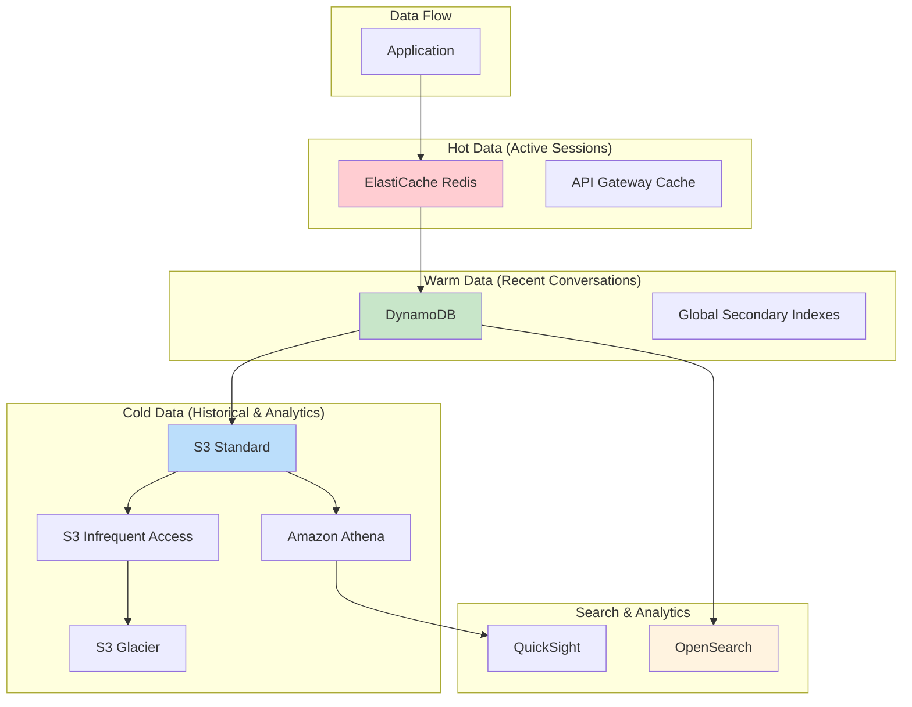

# Data Architecture - Storage & Processing Strategy

## 🎯 Estrategia de Datos

La arquitectura de datos está diseñada para manejar eficientemente el almacenamiento, recuperación y procesamiento de conversaciones, contexto de usuarios, archivos multimedia y métricas del sistema, optimizando para rendimiento, escalabilidad y costos.

## 🏗️ Arquitectura de Datos General



## 💾 Data Stores por Caso de Uso

### 1. ElastiCache Redis - Hot Data Layer

#### Propósito
Almacenar datos de sesiones activas y respuestas frecuentes para acceso ultra-rápido.

#### Estructura de Datos
```python
# Session Data Structure
session_data = {
    "session_id": "sess_123abc",
    "user_id": "whatsapp:+1234567890",
    "last_activity": "2024-01-15T10:30:00Z",
    "current_state": "waiting_for_response",
    "context_summary": "User asking about product pricing",
    "cached_responses": {
        "pricing_info": "Our premium plan starts at $29/month...",
        "support_hours": "We're available 24/7 for assistance..."
    },
    "user_preferences": {
        "language": "es",
        "timezone": "America/Mexico_City",
        "previous_interactions": 5
    }
}

# Frequently Used Responses Cache
common_responses = {
    "greeting_es": "¡Hola! ¿En qué puedo ayudarte hoy?",
    "business_hours": "Nuestro horario de atención es de 9 AM a 6 PM, lunes a viernes.",
    "contact_info": "Puedes contactarnos por WhatsApp, email o teléfono..."
}
```

#### Cache Strategy
```python
class CacheManager:
    def __init__(self):
        self.redis_client = redis.Redis(
            host='elasticache-cluster.region.cache.amazonaws.com',
            port=6379,
            decode_responses=True
        )
    
    def get_session(self, user_id):
        """Retrieve active session data"""
        session_key = f"session:{user_id}"
        session_data = self.redis_client.hgetall(session_key)
        
        if session_data:
            # Extend TTL on access
            self.redis_client.expire(session_key, 1800)  # 30 minutes
            
        return session_data
    
    def cache_response(self, response_type, content, ttl=3600):
        """Cache common responses"""
        cache_key = f"response:{response_type}"
        self.redis_client.setex(cache_key, ttl, content)
    
    def get_user_context(self, user_id, limit=5):
        """Get recent conversation context"""
        context_key = f"context:{user_id}"
        return self.redis_client.lrange(context_key, 0, limit-1)
```

#### Performance Characteristics
- **Latency**: <1ms for cache hits
- **TTL Strategy**: 30 minutes for sessions, 24 hours for responses
- **Memory Allocation**: 4GB Redis cluster
- **Eviction Policy**: allkeys-lru

### 2. DynamoDB - Warm Data Layer

#### Tables Design

##### Conversation Contexts Table
```python
# Primary Table
ConversationContexts = {
    "TableName": "conversation-contexts",
    "KeySchema": [
        {"AttributeName": "user_id", "KeyType": "HASH"},
        {"AttributeName": "timestamp", "KeyType": "RANGE"}
    ],
    "AttributeDefinitions": [
        {"AttributeName": "user_id", "AttributeType": "S"},
        {"AttributeName": "timestamp", "AttributeType": "S"},
        {"AttributeName": "session_id", "AttributeType": "S"},
        {"AttributeName": "message_type", "AttributeType": "S"}
    ],
    "GlobalSecondaryIndexes": [
        {
            "IndexName": "SessionIndex",
            "KeySchema": [
                {"AttributeName": "session_id", "KeyType": "HASH"},
                {"AttributeName": "timestamp", "KeyType": "RANGE"}
            ]
        },
        {
            "IndexName": "MessageTypeIndex",
            "KeySchema": [
                {"AttributeName": "message_type", "KeyType": "HASH"},
                {"AttributeName": "timestamp", "KeyType": "RANGE"}
            ]
        }
    ]
}

# Sample Record
conversation_record = {
    "user_id": "whatsapp:+1234567890",
    "timestamp": "2024-01-15T10:30:00.000Z",
    "session_id": "sess_123abc",
    "message_id": "msg_456def",
    "message_type": "text",
    "role": "user",  # or "assistant"
    "content": "¿Cuál es el precio de su plan premium?",
    "ai_model_used": "anthropic.claude-v2",
    "confidence_score": 0.95,
    "processing_time_ms": 1250,
    "tokens_used": 150,
    "escalation_triggered": False,
    "metadata": {
        "sentiment": "neutral",
        "intent": "pricing_inquiry",
        "language": "es"
    },
    "ttl": 1642176600  # Auto-expire after 30 days
}
```

##### User Profiles Table
```python
UserProfiles = {
    "TableName": "user-profiles",
    "KeySchema": [
        {"AttributeName": "user_id", "KeyType": "HASH"}
    ],
    "AttributeDefinitions": [
        {"AttributeName": "user_id", "AttributeType": "S"},
        {"AttributeName": "created_date", "AttributeType": "S"}
    ],
    "GlobalSecondaryIndexes": [
        {
            "IndexName": "CreatedDateIndex",
            "KeySchema": [
                {"AttributeName": "created_date", "KeyType": "HASH"}
            ]
        }
    ]
}

# Sample Profile Record
user_profile = {
    "user_id": "whatsapp:+1234567890",
    "created_date": "2024-01-01",
    "last_interaction": "2024-01-15T10:30:00Z",
    "total_conversations": 12,
    "preferred_language": "es",
    "timezone": "America/Mexico_City",
    "interaction_history": {
        "total_messages": 45,
        "escalations_count": 2,
        "satisfaction_scores": [4, 5, 3, 5, 4],
        "common_topics": ["pricing", "technical_support", "billing"]
    },
    "preferences": {
        "notification_frequency": "immediate",
        "response_style": "detailed",
        "business_hours_only": False
    }
}
```

#### DynamoDB Access Patterns
```python
class DynamoDBManager:
    def __init__(self):
        self.dynamodb = boto3.resource('dynamodb')
        self.conversations_table = self.dynamodb.Table('conversation-contexts')
        self.profiles_table = self.dynamodb.Table('user-profiles')
    
    def get_conversation_history(self, user_id, limit=20):
        """Retrieve recent conversation history"""
        response = self.conversations_table.query(
            KeyConditionExpression=Key('user_id').eq(user_id),
            ScanIndexForward=False,  # Latest first
            Limit=limit
        )
        return response['Items']
    
    def store_conversation(self, conversation_data):
        """Store new conversation message"""
        self.conversations_table.put_item(Item=conversation_data)
        
        # Update user profile stats
        self.update_user_stats(conversation_data['user_id'])
    
    def query_by_session(self, session_id):
        """Get all messages in a session"""
        response = self.conversations_table.query(
            IndexName='SessionIndex',
            KeyConditionExpression=Key('session_id').eq(session_id)
        )
        return response['Items']
```

### 3. S3 - Cold Data & Media Storage

#### Bucket Structure
```yaml
whatsapp-chatbot-data/
├── media/
│   ├── images/
│   │   ├── 2024/01/15/
│   │   │   ├── msg_123abc.jpg
│   │   │   └── msg_456def.png
│   ├── documents/
│   │   ├── 2024/01/15/
│   │   │   └── msg_789ghi.pdf
│   └── audio/
│       ├── 2024/01/15/
│           └── msg_101jkl.mp3
├── conversations/
│   ├── year=2024/
│   │   ├── month=01/
│   │   │   ├── day=15/
│   │   │   │   └── conversations.parquet
├── analytics/
│   ├── daily_metrics/
│   │   ├── 2024-01-15.json
│   └── user_behavior/
│       ├── aggregated_patterns.parquet
└── backups/
    ├── dynamodb/
    │   ├── conversation-contexts-2024-01-15.json
    └── elasticache/
        ├── session-dump-2024-01-15.rdb
```

#### Storage Classes & Lifecycle
```python
# S3 Lifecycle Policy
lifecycle_policy = {
    "Rules": [
        {
            "Status": "Enabled",
            "Filter": {"Prefix": "media/"},
            "Transitions": [
                {
                    "Days": 30,
                    "StorageClass": "STANDARD_IA"
                },
                {
                    "Days": 90,
                    "StorageClass": "GLACIER"
                },
                {
                    "Days": 365,
                    "StorageClass": "DEEP_ARCHIVE"
                }
            ]
        },
        {
            "Status": "Enabled",
            "Filter": {"Prefix": "conversations/"},
            "Transitions": [
                {
                    "Days": 7,
                    "StorageClass": "STANDARD_IA"
                },
                {
                    "Days": 30,
                    "StorageClass": "GLACIER"
                }
            ]
        }
    ]
}
```

#### Data Export Pipeline
```python
class DataExportPipeline:
    def __init__(self):
        self.dynamodb = boto3.resource('dynamodb')
        self.s3 = boto3.client('s3')
    
    def export_conversations_to_s3(self, date):
        """Export daily conversations to S3 for analytics"""
        
        # Query conversations for specific date
        conversations = self.query_conversations_by_date(date)
        
        # Convert to Parquet format for efficient querying
        df = pd.DataFrame(conversations)
        parquet_buffer = BytesIO()
        df.to_parquet(parquet_buffer, index=False)
        
        # Upload to S3
        s3_key = f"conversations/year={date.year}/month={date.month:02d}/day={date.day:02d}/conversations.parquet"
        self.s3.put_object(
            Bucket='whatsapp-chatbot-data',
            Key=s3_key,
            Body=parquet_buffer.getvalue()
        )
```

### 4. OpenSearch - Search & Analytics

#### Index Structure
```python
# Conversation Search Index
conversation_index = {
    "mappings": {
        "properties": {
            "user_id": {"type": "keyword"},
            "timestamp": {"type": "date"},
            "content": {
                "type": "text",
                "analyzer": "spanish",
                "fields": {
                    "keyword": {"type": "keyword"}
                }
            },
            "sentiment": {"type": "keyword"},
            "intent": {"type": "keyword"},
            "ai_model": {"type": "keyword"},
            "confidence_score": {"type": "float"},
            "processing_time": {"type": "integer"},
            "escalation_triggered": {"type": "boolean"}
        }
    }
}

# Analytics Aggregations
analytics_queries = {
    "daily_message_volume": {
        "aggs": {
            "daily_messages": {
                "date_histogram": {
                    "field": "timestamp",
                    "interval": "day"
                }
            }
        }
    },
    "sentiment_distribution": {
        "aggs": {
            "sentiments": {
                "terms": {"field": "sentiment"}
            }
        }
    },
    "top_intents": {
        "aggs": {
            "popular_intents": {
                "terms": {
                    "field": "intent",
                    "size": 20
                }
            }
        }
    }
}
```

## 🔄 Data Flow & Processing

### Real-time Data Pipeline
```python
# Step Functions Workflow for Data Processing
data_processing_workflow = {
    "Comment": "Process incoming WhatsApp messages",
    "StartAt": "StoreInCache",
    "States": {
        "StoreInCache": {
            "Type": "Task",
            "Resource": "arn:aws:lambda:region:account:function:store-in-cache",
            "Next": "StoreToDynamoDB"
        },
        "StoreToDynamoDB": {
            "Type": "Task",
            "Resource": "arn:aws:lambda:region:account:function:store-to-dynamodb",
            "Next": "IndexToOpenSearch"
        },
        "IndexToOpenSearch": {
            "Type": "Task",
            "Resource": "arn:aws:lambda:region:account:function:index-to-opensearch",
            "Next": "CheckForAnalytics"
        },
        "CheckForAnalytics": {
            "Type": "Choice",
            "Choices": [
                {
                    "Variable": "$.shouldAnalyze",
                    "BooleanEquals": True,
                    "Next": "PerformAnalytics"
                }
            ],
            "Default": "Success"
        },
        "PerformAnalytics": {
            "Type": "Task",
            "Resource": "arn:aws:lambda:region:account:function:perform-analytics",
            "Next": "Success"
        },
        "Success": {
            "Type": "Succeed"
        }
    }
}
```

### Batch Processing Jobs
```python
# Daily Analytics Job
class DailyAnalyticsJob:
    def __init__(self):
        self.glue_client = boto3.client('glue')
        self.athena_client = boto3.client('athena')
    
    def run_daily_analytics(self, date):
        """Run daily analytics processing"""
        
        # Start Glue ETL job
        job_response = self.glue_client.start_job_run(
            JobName='daily-conversation-analytics',
            Arguments={
                '--date': date.isoformat(),
                '--s3-input-path': f's3://whatsapp-chatbot-data/conversations/year={date.year}/month={date.month:02d}/day={date.day:02d}/',
                '--s3-output-path': f's3://whatsapp-chatbot-data/analytics/daily_metrics/'
            }
        )
        
        return job_response['JobRunId']
    
    def query_conversation_metrics(self, date):
        """Query daily conversation metrics using Athena"""
        
        query = f"""
        SELECT 
            COUNT(*) as total_messages,
            COUNT(DISTINCT user_id) as unique_users,
            AVG(confidence_score) as avg_confidence,
            AVG(processing_time_ms) as avg_processing_time,
            SUM(CASE WHEN escalation_triggered THEN 1 ELSE 0 END) as escalations
        FROM conversation_contexts
        WHERE DATE(timestamp) = '{date}'
        """
        
        response = self.athena_client.start_query_execution(
            QueryString=query,
            ResultConfiguration={
                'OutputLocation': 's3://whatsapp-chatbot-data/athena-results/'
            }
        )
        
        return response['QueryExecutionId']
```

## 📊 Data Retention & Compliance

### Retention Policies
```yaml
Data Retention Strategy:
  Hot Data (ElastiCache):
    - Session data: 30 minutes
    - Cached responses: 24 hours
    - User context: 1 hour
    
  Warm Data (DynamoDB):
    - Active conversations: 30 days (TTL)
    - User profiles: 2 years
    - System metrics: 90 days
    
  Cold Data (S3):
    - Media files: 7 years (regulatory compliance)
    - Conversation archives: 5 years
    - Analytics data: 3 years
    - Backup data: 1 year
```

### GDPR Compliance
```python
class GDPRComplianceManager:
    def __init__(self):
        self.dynamodb = boto3.resource('dynamodb')
        self.s3 = boto3.client('s3')
        self.opensearch = boto3.client('es')
    
    def delete_user_data(self, user_id):
        """Complete user data deletion (Right to be Forgotten)"""
        
        deletion_report = {
            'user_id': user_id,
            'deletion_date': datetime.now().isoformat(),
            'deleted_items': []
        }
        
        # 1. Delete from DynamoDB
        conversations_table = self.dynamodb.Table('conversation-contexts')
        response = conversations_table.query(
            KeyConditionExpression=Key('user_id').eq(user_id)
        )
        
        for item in response['Items']:
            conversations_table.delete_item(
                Key={
                    'user_id': item['user_id'],
                    'timestamp': item['timestamp']
                }
            )
            deletion_report['deleted_items'].append(f"DynamoDB: {item['message_id']}")
        
        # 2. Delete from S3 (user's media)
        s3_objects = self.s3.list_objects_v2(
            Bucket='whatsapp-chatbot-data',
            Prefix=f'media/users/{user_id}/'
        )
        
        for obj in s3_objects.get('Contents', []):
            self.s3.delete_object(
                Bucket='whatsapp-chatbot-data',
                Key=obj['Key']
            )
            deletion_report['deleted_items'].append(f"S3: {obj['Key']}")
        
        # 3. Delete from OpenSearch
        opensearch_query = {
            "query": {"term": {"user_id": user_id}}
        }
        
        # Delete by query
        self.opensearch.delete_by_query(
            index='conversations',
            body=opensearch_query
        )
        deletion_report['deleted_items'].append("OpenSearch: All user documents")
        
        # 4. Clear cache
        redis_client = redis.Redis(host='elasticache-endpoint')
        cache_keys = redis_client.keys(f"*{user_id}*")
        if cache_keys:
            redis_client.delete(*cache_keys)
            deletion_report['deleted_items'].append(f"Cache: {len(cache_keys)} keys")
        
        return deletion_report
```

## 🔍 Query Patterns & Performance

### Common Query Patterns
```python
# Pattern 1: Get Recent Conversation Context
def get_recent_context(user_id, limit=10):
    """Optimized for AI context retrieval"""
    
    # Try cache first
    cached_context = redis_client.get(f"context:{user_id}")
    if cached_context:
        return json.loads(cached_context)
    
    # Query DynamoDB
    response = dynamodb_table.query(
        KeyConditionExpression=Key('user_id').eq(user_id),
        ScanIndexForward=False,
        Limit=limit,
        ProjectionExpression="timestamp, role, content, confidence_score"
    )
    
    # Cache for future use
    redis_client.setex(f"context:{user_id}", 3600, json.dumps(response['Items']))
    return response['Items']

# Pattern 2: Analytics Query
def get_daily_metrics(date):
    """Get daily conversation metrics"""
    
    athena_query = f"""
    SELECT 
        DATE(timestamp) as date,
        COUNT(*) as total_messages,
        COUNT(DISTINCT user_id) as unique_users,
        AVG(confidence_score) as avg_confidence,
        COUNT(CASE WHEN escalation_triggered THEN 1 END) as escalations,
        COUNT(CASE WHEN sentiment = 'POSITIVE' THEN 1 END) as positive_sentiment,
        COUNT(CASE WHEN sentiment = 'NEGATIVE' THEN 1 END) as negative_sentiment
    FROM conversation_contexts
    WHERE DATE(timestamp) = '{date}'
    GROUP BY DATE(timestamp)
    """
    
    return execute_athena_query(athena_query)

# Pattern 3: User Behavior Analysis
def analyze_user_patterns(user_id):
    """Deep analysis of user conversation patterns"""
    
    opensearch_query = {
        "query": {"term": {"user_id": user_id}},
        "aggs": {
            "topics": {
                "terms": {"field": "intent", "size": 10}
            },
            "hourly_activity": {
                "date_histogram": {
                    "field": "timestamp",
                    "interval": "hour"
                }
            },
            "sentiment_trend": {
                "date_histogram": {
                    "field": "timestamp",
                    "interval": "day"
                },
                "aggs": {
                    "avg_sentiment_score": {
                        "avg": {"field": "sentiment_score"}
                    }
                }
            }
        }
    }
    
    return opensearch_client.search(
        index='conversations',
        body=opensearch_query
    )
```

## 💰 Cost Optimization Strategies

### Storage Cost Analysis
```yaml
Monthly Storage Costs (30,000 messages):
  ElastiCache (4GB Redis):
    - Cost: $45-60/month
    - Optimization: Right-size based on actual memory usage
    
  DynamoDB:
    - Storage: $0.25 per GB/month
    - Read/Write: On-demand pricing
    - Estimated: $15-30/month
    - Optimization: Use TTL, optimize partition keys
    
  S3 Storage:
    - Standard (first 30 days): $23 per TB/month
    - IA (30-90 days): $12.5 per TB/month
    - Glacier (90+ days): $4 per TB/month
    - Estimated: $10-25/month
    - Optimization: Lifecycle policies, compression
    
  OpenSearch:
    - t3.small.search: $17-25/month
    - Storage: $0.135 per GB/month
    - Estimated: $30-50/month
    - Optimization: Index lifecycle management
```

### Performance Optimization
```python
# Query optimization strategies
optimization_strategies = {
    "DynamoDB": {
        "Use GSI strategically": "Avoid over-indexing",
        "Batch operations": "Use batch_get_item and batch_write_item",
        "Consistent reads": "Only when absolutely necessary",
        "TTL": "Automatic cleanup reduces storage costs"
    },
    "ElastiCache": {
        "Connection pooling": "Reuse connections across Lambda invocations",
        "Pipeline operations": "Batch Redis commands",
        "Appropriate TTL": "Balance memory usage vs hit rate",
        "Cluster mode": "For datasets > 90GB"
    },
    "S3": {
        "Multipart uploads": "For files > 100MB",
        "Transfer acceleration": "For global users",
        "Compression": "Gzip for text data",
        "Intelligent tiering": "Automatic cost optimization"
    }
}
```

---

**Próximo**: Revisar [security-architecture.md](security-architecture.md) para entender la implementación de seguridad enterprise.