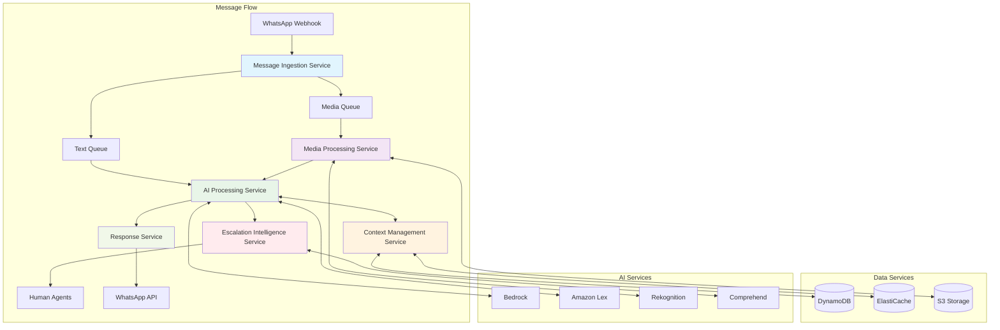

# Microservices Design - Event-Driven Architecture

## 🎯 Diseño de Microservicios

La arquitectura implementa un patrón de microservicios event-driven donde cada servicio tiene una responsabilidad específica y se comunica a través de eventos asíncronos, garantizando desacoplamiento y escalabilidad independiente.

## 🏗️ Arquitectura de Servicios



## 🔧 Service Definitions

### 1. Message Ingestion Service

#### Responsabilidades
- **Webhook Management**: Recibir y validar webhooks de WhatsApp
- **Message Parsing**: Extraer y normalizar datos de mensajes
- **Routing Logic**: Determinar el tipo de procesamiento requerido
- **Rate Limiting**: Aplicar límites de velocidad y throttling
- **Security Validation**: Verificar firmas HMAC de WhatsApp

#### API Contract
```yaml
Input Events:
  - WhatsApp Webhook POST
  - Message verification GET

Output Events:
  - TextMessageEvent → Text Processing Queue
  - MediaMessageEvent → Media Processing Queue
  - StatusMessageEvent → Status Processing Queue

Error Handling:
  - InvalidSignature → Security Alert
  - RateLimitExceeded → Throttle Response
  - ParseError → Dead Letter Queue
```

#### Implementation Details
```python
# Lambda Function Handler
def lambda_handler(event, context):
    try:
        # Validate webhook signature
        if not validate_signature(event):
            return {'statusCode': 403, 'body': 'Invalid signature'}
        
        # Parse webhook payload
        webhook_data = parse_webhook(event['body'])
        
        # Route to appropriate queue
        for message in webhook_data.get('messages', []):
            route_message(message)
        
        return {'statusCode': 200, 'body': 'OK'}
    
    except Exception as e:
        logger.error(f"Ingestion error: {str(e)}")
        return {'statusCode': 500, 'body': 'Internal error'}

def route_message(message):
    message_type = message.get('type')
    
    if message_type == 'text':
        sqs.send_message(
            QueueUrl=TEXT_QUEUE_URL,
            MessageBody=json.dumps(message)
        )
    elif message_type in ['image', 'document', 'audio']:
        sqs.send_message(
            QueueUrl=MEDIA_QUEUE_URL,
            MessageBody=json.dumps(message)
        )
```

#### Scaling Characteristics
- **Concurrency**: 100 Lambda concurrent executions
- **Throughput**: 1,000 messages/minute
- **Latency**: <100ms processing time
- **Error Rate**: <0.1% target

### 2. AI Processing Service

#### Responsabilidades
- **Context Retrieval**: Obtener historial de conversación
- **Model Selection**: Elegir modelo de IA apropiado
- **Response Generation**: Generar respuestas contextualmente relevantes
- **Context Update**: Actualizar historial post-respuesta
- **Quality Assurance**: Validar calidad de respuestas

#### Service Architecture
```yaml
Components:
  Text Processor:
    - Bedrock integration for LLM responses
    - Context-aware prompt engineering
    - Response quality validation
    
  Intent Classifier:
    - Amazon Lex for structured conversations
    - Intent confidence scoring
    - Slot filling for complex queries
    
  Response Formatter:
    - WhatsApp message formatting
    - Media attachment handling
    - Template message selection
```

#### Implementation Details
```python
class AIProcessingService:
    def __init__(self):
        self.bedrock_client = boto3.client('bedrock-runtime')
        self.context_service = ContextManagementService()
    
    def process_message(self, message_event):
        """Process incoming message and generate AI response"""
        
        # Extract message details
        user_id = message_event['from']
        message_text = message_event['text']['body']
        
        # Get conversation context
        context = self.context_service.get_context(user_id)
        
        # Generate AI response
        response = self.generate_response(message_text, context)
        
        # Update context
        self.context_service.update_context(
            user_id, message_text, response
        )
        
        # Send response
        self.send_response(user_id, response)
        
        return response
    
    def generate_response(self, message, context):
        """Generate contextual AI response using Bedrock"""
        
        # Build prompt with context
        prompt = self.build_prompt(message, context)
        
        # Call Bedrock API
        response = self.bedrock_client.invoke_model(
            modelId='anthropic.claude-v2',
            contentType='application/json',
            accept='application/json',
            body=json.dumps({
                'prompt': prompt,
                'max_tokens_to_sample': 1000,
                'temperature': 0.7,
                'top_p': 0.9
            })
        )
        
        # Parse and validate response
        ai_response = json.loads(response['body'].read())
        return ai_response['completion'].strip()
```

#### Model Selection Logic
```python
def select_model(message, context):
    """Intelligent model selection based on context"""
    
    # Analyze message complexity
    complexity_score = analyze_complexity(message)
    
    # Check for specific domains
    domain = classify_domain(message)
    
    # Model selection strategy
    if domain == 'technical' and complexity_score > 0.8:
        return 'anthropic.claude-v2'  # Best for complex reasoning
    elif domain == 'customer_service':
        return 'amazon.titan-text-express-v1'  # Cost-effective
    else:
        return 'meta.llama2-13b-chat-v1'  # Balanced option
```

### 3. Context Management Service

#### Responsabilidades
- **Session Management**: Gestionar sesiones de usuario activas
- **Context Storage**: Almacenar y recuperar historial de conversaciones
- **Context Pruning**: Optimizar contexto para límites de tokens
- **TTL Management**: Limpieza automática de datos expirados
- **Context Analytics**: Análisis de patrones conversacionales

#### Data Model
```python
# DynamoDB Schema
class ConversationContext:
    user_id: str  # Partition Key
    timestamp: str  # Sort Key
    session_id: str
    messages: List[Message]
    metadata: Dict
    ttl: int  # Auto-expiration
    
class Message:
    role: str  # 'user' or 'assistant'
    content: str
    timestamp: str
    message_type: str
    confidence_score: float

# ElastiCache Schema for Active Sessions
class ActiveSession:
    session_id: str
    user_id: str
    last_activity: datetime
    current_state: str
    cached_context: str  # Last 5 messages
```

#### Implementation
```python
class ContextManagementService:
    def __init__(self):
        self.dynamodb = boto3.resource('dynamodb')
        self.table = self.dynamodb.Table('conversation-contexts')
        self.cache = redis.Redis(host='elasticache-endpoint')
    
    def get_context(self, user_id, limit=10):
        """Retrieve conversation context with intelligent pruning"""
        
        # Try cache first
        cached_context = self.cache.get(f"context:{user_id}")
        if cached_context:
            return json.loads(cached_context)
        
        # Query DynamoDB
        response = self.table.query(
            KeyConditionExpression=Key('user_id').eq(user_id),
            ScanIndexForward=False,  # Latest first
            Limit=limit
        )
        
        messages = response['Items']
        
        # Intelligent context pruning
        pruned_context = self.prune_context(messages)
        
        # Cache for 30 minutes
        self.cache.setex(
            f"context:{user_id}", 
            1800, 
            json.dumps(pruned_context)
        )
        
        return pruned_context
    
    def prune_context(self, messages):
        """Intelligently prune context to fit token limits"""
        
        # Calculate token count
        total_tokens = sum(estimate_tokens(msg['content']) for msg in messages)
        
        if total_tokens <= 2000:  # Within limit
            return messages
        
        # Keep most recent messages + summary of older ones
        recent_messages = messages[:5]  # Last 5 interactions
        older_messages = messages[5:]
        
        if older_messages:
            summary = self.summarize_context(older_messages)
            return [{'role': 'system', 'content': f"Previous conversation summary: {summary}"}] + recent_messages
        
        return recent_messages
```

### 4. Media Processing Service

#### Responsabilidades
- **Media Download**: Descargar archivos desde WhatsApp API
- **Content Analysis**: Analizar contenido usando AI services
- **Text Extraction**: Extraer texto de documentos e imágenes
- **Media Storage**: Almacenar archivos de forma segura
- **Metadata Generation**: Generar metadatos para búsqueda

#### Processing Pipeline
```yaml
Media Types:
  Images:
    - Download from WhatsApp CDN
    - Rekognition for object/text detection
    - Store in S3 with metadata
    - Generate description for AI context
    
  Documents:
    - Download and validate file type
    - Textract for text extraction
    - Content analysis and summarization
    - Store original + extracted text
    
  Audio:
    - Download audio file
    - Transcribe using Amazon Transcribe
    - Sentiment analysis on transcription
    - Store audio + transcription
```

#### Implementation
```python
class MediaProcessingService:
    def __init__(self):
        self.rekognition = boto3.client('rekognition')
        self.textract = boto3.client('textract')
        self.s3 = boto3.client('s3')
    
    def process_media(self, media_message):
        """Process different types of media content"""
        
        media_type = media_message.get('type')
        media_url = media_message.get(media_type, {}).get('url')
        
        # Download media from WhatsApp
        media_content = self.download_media(media_url)
        
        # Store in S3
        s3_key = f"media/{media_message['id']}.{media_type}"
        self.s3.put_object(
            Bucket='whatsapp-media-bucket',
            Key=s3_key,
            Body=media_content
        )
        
        # Process based on type
        if media_type == 'image':
            return self.process_image(s3_key)
        elif media_type == 'document':
            return self.process_document(s3_key)
        elif media_type == 'audio':
            return self.process_audio(s3_key)
    
    def process_image(self, s3_key):
        """Analyze image content with Rekognition"""
        
        # Detect labels and text
        labels_response = self.rekognition.detect_labels(
            Image={'S3Object': {'Bucket': 'whatsapp-media-bucket', 'Name': s3_key}},
            MaxLabels=20,
            MinConfidence=80
        )
        
        text_response = self.rekognition.detect_text(
            Image={'S3Object': {'Bucket': 'whatsapp-media-bucket', 'Name': s3_key}}
        )
        
        # Generate description
        labels = [label['Name'] for label in labels_response['Labels']]
        detected_text = ' '.join([text['DetectedText'] for text in text_response['TextDetections']])
        
        description = f"Image contains: {', '.join(labels)}"
        if detected_text:
            description += f". Text in image: {detected_text}"
        
        return {
            'description': description,
            'labels': labels,
            'detected_text': detected_text,
            's3_location': s3_key
        }
```

### 5. Escalation Intelligence Service

#### Responsabilidades
- **Escalation Decision**: Determinar cuándo escalar a humanos
- **Sentiment Analysis**: Analizar emociones del usuario
- **Agent Routing**: Dirigir a agentes especializados
- **Notification Management**: Alertar a supervisores
- **SLA Tracking**: Monitorear tiempos de respuesta

#### Decision Logic
```python
class EscalationIntelligenceService:
    def __init__(self):
        self.comprehend = boto3.client('comprehend')
        self.sns = boto3.client('sns')
    
    def should_escalate(self, message, context, ai_confidence):
        """Intelligent escalation decision making"""
        
        escalation_score = 0
        reasons = []
        
        # Sentiment analysis
        sentiment = self.analyze_sentiment(message)
        if sentiment['Sentiment'] == 'NEGATIVE' and sentiment['SentimentScore']['Negative'] > 0.8:
            escalation_score += 30
            reasons.append('Negative sentiment detected')
        
        # AI confidence check
        if ai_confidence < 0.6:
            escalation_score += 25
            reasons.append('Low AI confidence')
        
        # Conversation length check
        if len(context) > 15:
            escalation_score += 20
            reasons.append('Long conversation without resolution')
        
        # Keyword triggers
        escalation_keywords = ['cancel', 'refund', 'complaint', 'manager', 'supervisor']
        if any(keyword in message.lower() for keyword in escalation_keywords):
            escalation_score += 35
            reasons.append('Escalation keywords detected')
        
        # Complex query detection
        if self.is_complex_query(message):
            escalation_score += 15
            reasons.append('Complex query detected')
        
        return escalation_score >= 50, escalation_score, reasons
    
    def escalate_to_human(self, user_id, context, escalation_reasons):
        """Route conversation to human agent"""
        
        escalation_data = {
            'user_id': user_id,
            'escalation_time': datetime.now().isoformat(),
            'reasons': escalation_reasons,
            'context_summary': self.summarize_context(context),
            'priority': self.calculate_priority(escalation_reasons),
            'suggested_department': self.suggest_department(context)
        }
        
        # Send to SNS topic for human agents
        self.sns.publish(
            TopicArn='arn:aws:sns:region:account:human-escalation',
            Message=json.dumps(escalation_data),
            Subject=f'WhatsApp Escalation - User {user_id}'
        )
        
        return "Te estoy conectando con uno de nuestros especialistas. En breve te contactarán."
```

## 🔄 Inter-Service Communication

### Event Schema Definition
```yaml
TextMessageEvent:
  event_type: "text_message_received"
  timestamp: "ISO8601"
  source_service: "message_ingestion"
  data:
    user_id: string
    message_id: string
    message_content: string
    metadata: object

MediaProcessedEvent:
  event_type: "media_processed"
  timestamp: "ISO8601"
  source_service: "media_processing"
  data:
    user_id: string
    media_id: string
    media_type: string
    analysis_result: object
    s3_location: string

EscalationEvent:
  event_type: "escalation_triggered"
  timestamp: "ISO8601"
  source_service: "escalation_intelligence"
  data:
    user_id: string
    escalation_reason: array
    priority: string
    context_summary: string
```

### Message Routing Strategy
```python
# SQS Queue Configuration
QUEUES = {
    'text-processing': {
        'visibility_timeout': 30,
        'message_retention_period': 1209600,  # 14 days
        'max_receive_count': 3,
        'dead_letter_queue': 'text-processing-dlq'
    },
    'media-processing': {
        'visibility_timeout': 300,  # 5 minutes for media
        'message_retention_period': 1209600,
        'max_receive_count': 3,
        'dead_letter_queue': 'media-processing-dlq'
    },
    'escalation-processing': {
        'visibility_timeout': 60,
        'message_retention_period': 604800,  # 7 days
        'max_receive_count': 5,
        'dead_letter_queue': 'escalation-processing-dlq'
    }
}
```

## 📊 Service Monitoring & Observability

### Health Check Endpoints
```python
# Health check implementation for each service
@app.route('/health')
def health_check():
    health_status = {
        'service': 'ai_processing_service',
        'status': 'healthy',
        'timestamp': datetime.now().isoformat(),
        'dependencies': {
            'bedrock': check_bedrock_health(),
            'dynamodb': check_dynamodb_health(),
            'sqs': check_sqs_health()
        }
    }
    
    overall_health = all(dep['status'] == 'healthy' for dep in health_status['dependencies'].values())
    health_status['status'] = 'healthy' if overall_health else 'unhealthy'
    
    return jsonify(health_status), 200 if overall_health else 503
```

### Service Metrics
```yaml
AI Processing Service Metrics:
  - ProcessingLatency (ms)
  - TokensGenerated (count)
  - ModelInvocationErrors (count)
  - ContextRetrievalTime (ms)
  - ResponseQualityScore (0-1)

Context Management Metrics:
  - ActiveSessions (count)
  - CacheHitRatio (percentage)
  - ContextPruningEvents (count)
  - DatabaseLatency (ms)

Media Processing Metrics:
  - MediaDownloadTime (ms)
  - AnalysisSuccessRate (percentage)
  - StorageUtilization (GB)
  - ProcessingErrors (count)
```

## 🚀 Deployment Strategy

### Service Dependencies
```yaml
Deployment Order:
  1. Context Management Service (Data layer)
  2. Media Processing Service (Independent)
  3. AI Processing Service (Core logic)
  4. Escalation Intelligence Service (Business rules)
  5. Message Ingestion Service (Entry point)

Rollback Strategy:
  - Blue/green deployment per service
  - Circuit breakers for external dependencies
  - Gradual traffic shifting (10% → 50% → 100%)
```

### Configuration Management
```yaml
Service Configuration:
  Environment Variables:
    - SERVICE_NAME
    - AWS_REGION
    - LOG_LEVEL
    - QUEUE_URLS
    - TABLE_NAMES
    
  AWS Systems Manager Parameters:
    - /whatsapp/api/access_token
    - /whatsapp/webhook/verify_token
    - /bedrock/model/configurations
    - /escalation/thresholds
```

---

**Próximo**: Revisar [data-architecture.md](data-architecture.md) para entender el diseño de datos y almacenamiento.