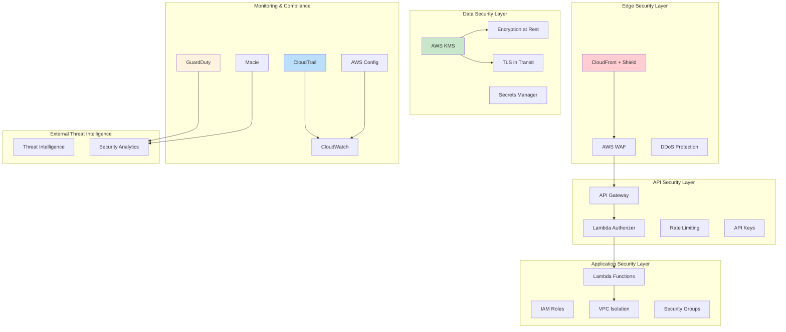

# Security Architecture - Enterprise-Grade Security Framework

## 🎯 Security-First Design Philosophy

La arquitectura de seguridad implementa un enfoque de **Defense in Depth** con múltiples capas de protección, asegurando la confidencialidad, integridad y disponibilidad de datos de conversaciones, cumplimiento regulatorio y protección contra amenazas avanzadas.

## 🛡️ Security Architecture Overview



## 🔐 Authentication & Authorization Framework

### Multi-Layer Authentication
```python
# Layer 1: WhatsApp Webhook Signature Validation
import hmac
import hashlib

class WhatsAppSignatureValidator:
    def __init__(self, webhook_secret):
        self.webhook_secret = webhook_secret
    
    def validate_signature(self, payload, signature_header):
        """Validate HMAC signature from WhatsApp"""
        
        # Extract signature from header
        if not signature_header or not signature_header.startswith('sha256='):
            raise SecurityException("Missing or invalid signature header")
        
        provided_signature = signature_header[7:]  # Remove 'sha256=' prefix
        
        # Compute expected signature
        expected_signature = hmac.new(
            self.webhook_secret.encode('utf-8'),
            payload.encode('utf-8'),
            hashlib.sha256
        ).hexdigest()
        
        # Constant-time comparison to prevent timing attacks
        if not hmac.compare_digest(provided_signature, expected_signature):
            raise SecurityException("Invalid webhook signature")
        
        return True

# Layer 2: Lambda Authorizer for Internal API Access
class LambdaAuthorizer:
    def __init__(self):
        self.jwt_secret = self.get_jwt_secret()
        self.rate_limiter = RateLimiter()
    
    def authorize_request(self, event, context):
        """Custom Lambda authorizer for API Gateway"""
        
        try:
            # Extract and validate API key
            api_key = event['headers'].get('x-api-key')
            if not self.validate_api_key(api_key):
                return self.generate_deny_policy('Invalid API key')
            
            # Rate limiting check
            client_ip = event['requestContext']['identity']['sourceIp']
            if not self.rate_limiter.is_allowed(client_ip):
                return self.generate_deny_policy('Rate limit exceeded')
            
            # JWT token validation (for internal services)
            token = event['headers'].get('authorization')
            if token and token.startswith('Bearer '):
                claims = self.validate_jwt_token(token[7:])
                principal_id = claims['sub']
            else:
                principal_id = api_key
            
            # Generate allow policy
            return self.generate_allow_policy(principal_id, event['methodArn'])
            
        except Exception as e:
            logger.error(f"Authorization error: {str(e)}")
            return self.generate_deny_policy('Authorization failed')
```

### IAM Security Model
```yaml
# Principle of Least Privilege IAM Roles
MessageIngestionRole:
  Version: '2012-10-17'
  Statement:
    - Effect: Allow
      Action:
        - sqs:SendMessage
        - sqs:GetQueueAttributes
      Resource: 
        - !GetAtt TextProcessingQueue.Arn
        - !GetAtt MediaProcessingQueue.Arn
    - Effect: Allow
      Action:
        - logs:CreateLogGroup
        - logs:CreateLogStream
        - logs:PutLogEvents
      Resource: !Sub 'arn:aws:logs:${AWS::Region}:${AWS::AccountId}:*'
    - Effect: Allow
      Action:
        - kms:Decrypt
      Resource: !Ref MessageEncryptionKey

AIProcessingRole:
  Version: '2012-10-17'
  Statement:
    - Effect: Allow
      Action:
        - bedrock:InvokeModel
        - bedrock:InvokeModelWithResponseStream
      Resource: 
        - 'arn:aws:bedrock:*::foundation-model/anthropic.claude-*'
        - 'arn:aws:bedrock:*::foundation-model/amazon.titan-*'
    - Effect: Allow
      Action:
        - dynamodb:GetItem
        - dynamodb:PutItem
        - dynamodb:UpdateItem
        - dynamodb:Query
      Resource: !GetAtt ConversationContextsTable.Arn
    - Effect: Allow
      Action:
        - elasticache:Describe*
      Resource: '*'
    - Effect: Deny
      Action:
        - dynamodb:Scan
        - dynamodb:DeleteItem
        - dynamodb:BatchWriteItem
      Resource: '*'
```

## 🔒 Data Protection & Encryption

### Encryption at Rest Strategy
```python
# KMS Key Management
class EncryptionManager:
    def __init__(self):
        self.kms_client = boto3.client('kms')
        self.conversation_key_id = os.environ['CONVERSATION_ENCRYPTION_KEY']
        self.media_key_id = os.environ['MEDIA_ENCRYPTION_KEY']
    
    def encrypt_conversation_data(self, conversation_data):
        """Encrypt sensitive conversation data"""
        
        # Identify PII fields for field-level encryption
        pii_fields = ['user_phone', 'personal_info', 'payment_details']
        
        encrypted_data = conversation_data.copy()
        
        for field in pii_fields:
            if field in conversation_data:
                # Encrypt specific fields
                response = self.kms_client.encrypt(
                    KeyId=self.conversation_key_id,
                    Plaintext=json.dumps(conversation_data[field])
                )
                encrypted_data[field] = base64.b64encode(
                    response['CiphertextBlob']
                ).decode('utf-8')
                encrypted_data[f'{field}_encrypted'] = True
        
        return encrypted_data
    
    def decrypt_conversation_data(self, encrypted_data):
        """Decrypt conversation data for authorized access"""
        
        decrypted_data = encrypted_data.copy()
        
        for key, value in encrypted_data.items():
            if key.endswith('_encrypted') and value:
                field_name = key.replace('_encrypted', '')
                if field_name in encrypted_data:
                    # Decrypt field
                    response = self.kms_client.decrypt(
                        CiphertextBlob=base64.b64decode(encrypted_data[field_name])
                    )
                    decrypted_data[field_name] = json.loads(response['Plaintext'])
                    del decrypted_data[key]  # Remove encryption flag
        
        return decrypted_data
```

### Transport Security (TLS/SSL)
```yaml
TLS Configuration:
  Minimum Version: TLS 1.3
  Cipher Suites:
    - TLS_AES_256_GCM_SHA384
    - TLS_CHACHA20_POLY1305_SHA256
    - TLS_AES_128_GCM_SHA256
  
  Certificate Management:
    - AWS Certificate Manager (ACM)
    - Automatic renewal
    - SNI support for multiple domains
  
  HSTS Headers:
    - max-age=31536000
    - includeSubDomains
    - preload

# CloudFront Security Headers
security_headers = {
    'Strict-Transport-Security': 'max-age=31536000; includeSubDomains; preload',
    'Content-Security-Policy': "default-src 'self'; script-src 'self' 'unsafe-inline'",
    'X-Content-Type-Options': 'nosniff',
    'X-Frame-Options': 'DENY',
    'X-XSS-Protection': '1; mode=block',
    'Referrer-Policy': 'strict-origin-when-cross-origin'
}
```

## 🛡️ Network Security & Access Control

### VPC Security Architecture
```python
# VPC Security Configuration
vpc_config = {
    "VpcId": "vpc-12345678",
    "Subnets": {
        "Public": [
            {"SubnetId": "subnet-pub1", "AvailabilityZone": "us-east-1a"},
            {"SubnetId": "subnet-pub2", "AvailabilityZone": "us-east-1b"}
        ],
        "Private": [
            {"SubnetId": "subnet-priv1", "AvailabilityZone": "us-east-1a"},
            {"SubnetId": "subnet-priv2", "AvailabilityZone": "us-east-1b"}
        ]
    },
    "SecurityGroups": {
        "LambdaSecurityGroup": {
            "GroupId": "sg-lambda-123",
            "Rules": {
                "Egress": [
                    {
                        "Protocol": "tcp",
                        "Port": 443,
                        "Destination": "0.0.0.0/0",
                        "Description": "HTTPS outbound for AWS services"
                    },
                    {
                        "Protocol": "tcp", 
                        "Port": 6379,
                        "Destination": "sg-elasticache-123",
                        "Description": "ElastiCache access"
                    }
                ]
            }
        },
        "ElastiCacheSecurityGroup": {
            "GroupId": "sg-elasticache-123",
            "Rules": {
                "Ingress": [
                    {
                        "Protocol": "tcp",
                        "Port": 6379,
                        "Source": "sg-lambda-123",
                        "Description": "Redis access from Lambda"
                    }
                ]
            }
        }
    }
}
```

### WAF Rules & Protection
```python
# AWS WAF Configuration
waf_rules = [
    {
        "Name": "RateLimitRule",
        "Priority": 1,
        "Statement": {
            "RateBasedStatement": {
                "Limit": 2000,  # 2000 requests per 5 minutes
                "AggregateKeyType": "IP"
            }
        },
        "Action": {"Block": {}},
        "VisibilityConfig": {
            "SampledRequestsEnabled": True,
            "CloudWatchMetricsEnabled": True,
            "MetricName": "RateLimitRule"
        }
    },
    {
        "Name": "GeoBlockingRule",
        "Priority": 2,
        "Statement": {
            "GeoMatchStatement": {
                "CountryCodes": ["CN", "RU", "KP"]  # Block specific countries
            }
        },
        "Action": {"Block": {}},
        "VisibilityConfig": {
            "SampledRequestsEnabled": True,
            "CloudWatchMetricsEnabled": True,
            "MetricName": "GeoBlockingRule"
        }
    },
    {
        "Name": "SQLInjectionRule",
        "Priority": 3,
        "Statement": {
            "ManagedRuleGroupStatement": {
                "VendorName": "AWS",
                "Name": "AWSManagedRulesKnownBadInputsRuleSet"
            }
        },
        "Action": {"Block": {}},
        "OverrideAction": {"None": {}}
    }
]

# Custom rule for WhatsApp webhook validation
custom_webhook_rule = {
    "Name": "WhatsAppWebhookValidation",
    "Priority": 0,
    "Statement": {
        "AndStatement": {
            "Statements": [
                {
                    "ByteMatchStatement": {
                        "SearchString": "/webhook",
                        "FieldToMatch": {"UriPath": {}},
                        "TextTransformations": [{"Priority": 0, "Type": "LOWERCASE"}],
                        "PositionalConstraint": "CONTAINS"
                    }
                },
                {
                    "ByteMatchStatement": {
                        "SearchString": "application/json",
                        "FieldToMatch": {"SingleHeader": {"Name": "content-type"}},
                        "TextTransformations": [{"Priority": 0, "Type": "LOWERCASE"}],
                        "PositionalConstraint": "CONTAINS"
                    }
                }
            ]
        }
    },
    "Action": {"Allow": {}},
    "VisibilityConfig": {
        "SampledRequestsEnabled": True,
        "CloudWatchMetricsEnabled": True,
        "MetricName": "WhatsAppWebhookRule"
    }
}
```

## 🔍 Security Monitoring & Threat Detection

### CloudTrail Security Audit
```python
class SecurityAuditManager:
    def __init__(self):
        self.cloudtrail_client = boto3.client('cloudtrail')
        self.sns_client = boto3.client('sns')
        self.security_topic_arn = os.environ['SECURITY_ALERTS_TOPIC']
    
    def audit_api_calls(self, start_time, end_time):
        """Audit all API calls for security violations"""
        
        # High-risk events to monitor
        high_risk_events = [
            'DeleteTrail',
            'StopLogging',
            'PutBucketPolicy',
            'CreateUser',
            'AttachRolePolicy',
            'CreateAccessKey'
        ]
        
        suspicious_events = []
        
        # Query CloudTrail
        response = self.cloudtrail_client.lookup_events(
            LookupAttributes=[
                {'AttributeKey': 'EventName', 'AttributeValue': event}
                for event in high_risk_events
            ],
            StartTime=start_time,
            EndTime=end_time
        )
        
        for event in response['Events']:
            # Analyze event for anomalies
            if self.is_suspicious_event(event):
                suspicious_events.append(event)
                self.send_security_alert(event)
        
        return suspicious_events
    
    def is_suspicious_event(self, event):
        """Determine if an event is suspicious"""
        
        suspicious_indicators = [
            # Unusual access patterns
            event.get('SourceIPAddress', '').startswith('10.'),  # Internal IP doing external actions
            
            # Off-hours access
            datetime.fromisoformat(event['EventTime'].replace('Z', '+00:00')).hour < 6,
            
            # Multiple failed attempts
            event.get('ErrorCode') in ['SigninFailure', 'AccessDenied'],
            
            # Root user activity
            event.get('UserIdentity', {}).get('type') == 'Root'
        ]
        
        return any(suspicious_indicators)
```

### GuardDuty Integration
```python
class ThreatDetectionManager:
    def __init__(self):
        self.guardduty_client = boto3.client('guardduty')
        self.detector_id = self.get_guardduty_detector_id()
    
    def process_guardduty_finding(self, finding):
        """Process GuardDuty security findings"""
        
        severity = finding['severity']
        finding_type = finding['type']
        
        # Categorize threats
        if severity >= 7.0:  # High severity
            self.handle_high_severity_threat(finding)
        elif 'Cryptocurrency' in finding_type:
            self.handle_crypto_mining_threat(finding)
        elif 'Backdoor' in finding_type:
            self.handle_backdoor_threat(finding)
        
    def handle_high_severity_threat(self, finding):
        """Automatic response to high severity threats"""
        
        affected_instances = finding.get('service', {}).get('remoteIpDetails', {})
        
        # Automatic isolation
        if affected_instances:
            self.isolate_compromised_resources(affected_instances)
        
        # Immediate notification
        alert_message = {
            'severity': 'CRITICAL',
            'finding_id': finding['id'],
            'description': finding['description'],
            'recommended_actions': [
                'Isolate affected resources',
                'Review access logs',
                'Change credentials',
                'Contact security team'
            ]
        }
        
        self.send_immediate_alert(alert_message)
```

## 🏛️ Compliance & Governance

### GDPR/LGPD Compliance Framework
```python
class ComplianceManager:
    def __init__(self):
        self.data_classification = {
            'PII': ['user_phone', 'name', 'email', 'address'],
            'SENSITIVE': ['payment_info', 'health_data', 'biometric_data'],
            'INTERNAL': ['session_id', 'conversation_id', 'metadata'],
            'PUBLIC': ['product_info', 'general_responses']
        }
    
    def classify_data(self, conversation_data):
        """Automatically classify data based on content"""
        
        classification = {
            'pii_detected': False,
            'sensitive_detected': False,
            'retention_period': 30,  # days
            'encryption_required': False,
            'access_restrictions': []
        }
        
        content = conversation_data.get('content', '').lower()
        
        # PII Detection patterns
        pii_patterns = [
            r'\b\d{3}-\d{2}-\d{4}\b',  # SSN
            r'\b\d{4}\s?\d{4}\s?\d{4}\s?\d{4}\b',  # Credit card
            r'\b[A-Za-z0-9._%+-]+@[A-Za-z0-9.-]+\.[A-Z|a-z]{2,}\b'  # Email
        ]
        
        for pattern in pii_patterns:
            if re.search(pattern, content):
                classification['pii_detected'] = True
                classification['encryption_required'] = True
                classification['retention_period'] = 7  # Shorter retention for PII
                classification['access_restrictions'].append('pii_access_role')
                break
        
        return classification
    
    def generate_privacy_report(self, user_id):
        """Generate privacy report for data subject requests"""
        
        user_data = self.collect_user_data(user_id)
        
        privacy_report = {
            'user_id': user_id,
            'report_date': datetime.now().isoformat(),
            'data_sources': {
                'conversations': len(user_data['conversations']),
                'media_files': len(user_data['media']),
                'profile_data': bool(user_data['profile'])
            },
            'data_retention': {
                'oldest_record': user_data['oldest_record'],
                'scheduled_deletion': user_data['deletion_date']
            },
            'processing_purposes': [
                'Customer service automation',
                'Conversation quality improvement',
                'Service analytics'
            ],
            'third_party_sharing': 'None',
            'user_rights': [
                'Right to access',
                'Right to rectification',
                'Right to erasure',
                'Right to data portability'
            ]
        }
        
        return privacy_report
```

### Security Audit Checklist
```yaml
Security Audit Framework:
  Authentication & Authorization:
    - ✓ Multi-factor authentication enabled
    - ✓ Principle of least privilege enforced
    - ✓ Regular access review process
    - ✓ API key rotation schedule
    
  Data Protection:
    - ✓ Encryption at rest (AES-256)
    - ✓ Encryption in transit (TLS 1.3)
    - ✓ Key rotation enabled
    - ✓ Field-level encryption for PII
    
  Network Security:
    - ✓ VPC isolation configured
    - ✓ Security groups properly configured
    - ✓ WAF rules active and updated
    - ✓ DDoS protection enabled
    
  Monitoring & Logging:
    - ✓ CloudTrail enabled
    - ✓ GuardDuty active
    - ✓ Config compliance monitoring
    - ✓ Real-time alerting configured
    
  Incident Response:
    - ✓ Incident response plan documented
    - ✓ Security team contact information
    - ✓ Automated isolation procedures
    - ✓ Backup and recovery procedures
```

## 🚨 Incident Response Framework

### Automated Incident Response
```python
class IncidentResponseSystem:
    def __init__(self):
        self.sns_client = boto3.client('sns')
        self.ec2_client = boto3.client('ec2')
        self.lambda_client = boto3.client('lambda')
    
    def respond_to_security_incident(self, incident_type, details):
        """Automated incident response based on threat type"""
        
        response_plan = {
            'COMPROMISED_CREDENTIALS': self.handle_credential_compromise,
            'MALWARE_DETECTED': self.handle_malware_incident,
            'DATA_EXFILTRATION': self.handle_data_exfiltration,
            'DDOS_ATTACK': self.handle_ddos_attack,
            'UNAUTHORIZED_ACCESS': self.handle_unauthorized_access
        }
        
        if incident_type in response_plan:
            return response_plan[incident_type](details)
        else:
            return self.generic_incident_response(incident_type, details)
    
    def handle_credential_compromise(self, details):
        """Automated response to credential compromise"""
        
        response_actions = []
        
        # 1. Immediately disable compromised credentials
        if 'access_key_id' in details:
            self.disable_access_key(details['access_key_id'])
            response_actions.append("Disabled compromised access key")
        
        # 2. Revoke active sessions
        if 'user_arn' in details:
            self.revoke_user_sessions(details['user_arn'])
            response_actions.append("Revoked active user sessions")
        
        # 3. Force password reset
        if 'username' in details:
            self.force_password_reset(details['username'])
            response_actions.append("Forced password reset")
        
        # 4. Notify security team
        self.send_incident_notification(
            severity='HIGH',
            incident_type='CREDENTIAL_COMPROMISE',
            details=details,
            actions_taken=response_actions
        )
        
        return {
            'status': 'CONTAINED',
            'actions_taken': response_actions,
            'next_steps': [
                'Review access logs for unauthorized activity',
                'Generate new credentials',
                'Update application configurations'
            ]
        }
    
    def isolate_compromised_resource(self, resource_id):
        """Isolate compromised EC2 instance or Lambda function"""
        
        # Create isolation security group
        isolation_sg = self.ec2_client.create_security_group(
            GroupName=f'isolation-{resource_id}-{int(time.time())}',
            Description='Emergency isolation security group',
            VpcId='vpc-12345678'
        )
        
        # Remove all rules (complete isolation)
        self.ec2_client.authorize_security_group_egress(
            GroupId=isolation_sg['GroupId'],
            IpPermissions=[]
        )
        
        # Apply to instance
        if resource_id.startswith('i-'):
            self.ec2_client.modify_instance_attribute(
                InstanceId=resource_id,
                Groups=[isolation_sg['GroupId']]
            )
        
        return isolation_sg['GroupId']
```

## 📊 Security Metrics & KPIs

### Security Dashboard Metrics
```yaml
Security Metrics:
  Authentication Metrics:
    - Failed authentication attempts per hour
    - Successful vs failed login ratio
    - Unusual geographic access patterns
    - API key usage statistics
    
  Network Security Metrics:
    - WAF blocked requests per hour
    - DDoS mitigation events
    - Suspicious IP addresses detected
    - Geographic request distribution
    
  Data Protection Metrics:
    - Encryption coverage percentage
    - KMS key usage statistics
    - Data classification compliance
    - Retention policy violations
    
  Threat Detection Metrics:
    - GuardDuty findings by severity
    - Mean time to detection (MTTD)
    - Mean time to response (MTTR)
    - False positive rate
    
  Compliance Metrics:
    - Config compliance score
    - Security audit findings
    - Privacy request response time
    - Data breach incidents
```

### Security ROI Analysis
```python
def calculate_security_roi():
    """Calculate return on investment for security measures"""
    
    security_costs = {
        'WAF': 60,  # per month
        'GuardDuty': 30,
        'KMS': 15,
        'CloudTrail': 25,
        'Config': 20,
        'Shield_Advanced': 3000,
        'Security_Team_Tools': 500
    }
    
    # Estimated costs of security incidents (prevented)
    prevented_costs = {
        'Data_Breach': 150000,  # Average cost
        'Downtime': 50000,      # Per hour
        'Compliance_Fines': 100000,
        'Reputation_Damage': 75000
    }
    
    monthly_security_cost = sum(security_costs.values())
    annual_security_cost = monthly_security_cost * 12
    
    # Assuming 99% prevention rate
    prevented_annual_cost = sum(prevented_costs.values()) * 0.99
    
    roi = (prevented_annual_cost - annual_security_cost) / annual_security_cost * 100
    
    return {
        'annual_security_investment': annual_security_cost,
        'prevented_costs': prevented_annual_cost,
        'roi_percentage': roi,
        'cost_benefit_ratio': prevented_annual_cost / annual_security_cost
    }
```

---

**Próximo**: Revisar la implementación práctica en [../02-implementation/phase1-foundation.md](../02-implementation/phase1-foundation.md) para comenzar con el desarrollo.