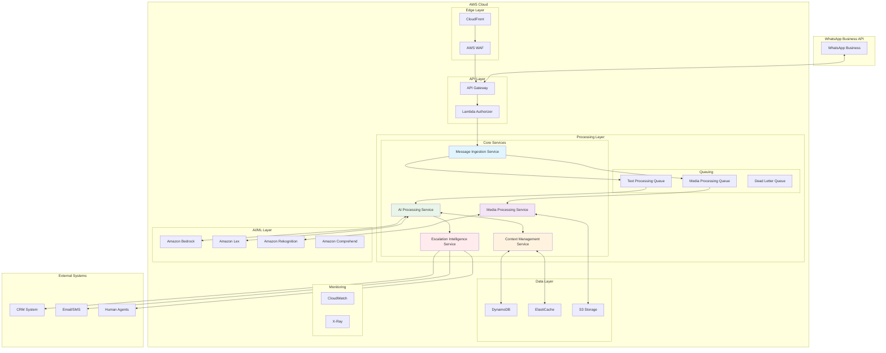

# System Overview - WhatsApp Business API + AWS AI Agents

## 🎯 Visión General del Sistema

Este sistema implementa una solución completa de agentes de IA para gestionar conversaciones automatizadas en WhatsApp Business API utilizando AWS Web Services. La arquitectura está diseñada para alta escalabilidad, seguridad enterprise y optimización de costos.

## 🏗️ Arquitectura de Alto Nivel



## 🔧 Componentes Principales

### 1. Message Ingestion Service
**Propósito**: Recibir, validar y enrutar mensajes de WhatsApp

**Responsabilidades**:
- Validación de webhooks de WhatsApp
- Verificación de firmas de seguridad
- Rate limiting y throttling
- Enrutamiento a colas especializadas

**Tecnologías**:
- AWS Lambda (Runtime: Python 3.9)
- API Gateway (REST API)
- SQS (Message queuing)

### 2. AI Processing Service
**Propósito**: Generar respuestas inteligentes usando modelos de IA

**Responsabilidades**:
- Procesamiento de texto con modelos LLM
- Gestión de contexto conversacional
- Selección de modelos apropiados
- Generación de respuestas contextualmente relevantes

**Tecnologías**:
- Amazon Bedrock (Claude, Llama, Titan)
- Amazon Lex (Structured conversations)
- Lambda Functions especializadas

### 3. Context Management Service
**Propósito**: Gestionar estado y contexto de conversaciones

**Responsabilidades**:
- Almacenamiento de historial de conversaciones
- Gestión de sesiones de usuario
- Contextualización inteligente
- TTL automático para limpieza de datos

**Tecnologías**:
- DynamoDB (NoSQL database)
- ElastiCache (Session caching)
- Lambda para lógica de contexto

### 4. Media Processing Service
**Propósito**: Procesar contenido multimedia (imágenes, documentos, audio)

**Responsabilidades**:
- Análisis de imágenes con AI
- Extracción de texto de documentos
- Procesamiento asíncrono de media
- Almacenamiento seguro de archivos

**Tecnologías**:
- Amazon Rekognition (Computer Vision)
- Amazon Textract (Document processing)
- S3 (File storage)
- Step Functions (Workflow orchestration)

### 5. Escalation Intelligence Service
**Propósito**: Decidir inteligentemente cuando escalar a agentes humanos

**Responsabilidades**:
- Análisis de sentimientos
- Detección de complejidad de consultas
- Enrutamiento a agentes especializados
- Notificaciones automáticas

**Tecnologías**:
- Amazon Comprehend (Sentiment analysis)
- SNS (Notifications)
- SES (Email alerts)
- Lambda para lógica de escalación

## 📊 Flujo de Datos Principal

### 1. Recepción de Mensajes
```
WhatsApp Business API → CloudFront → WAF → API Gateway → Lambda Authorizer → Message Ingestion Service
```

### 2. Procesamiento de Texto
```
Message Ingestion → SQS Text Queue → AI Processing Service → Bedrock/Lex → Context Management → Response
```

### 3. Procesamiento Multimedia
```
Message Ingestion → SQS Media Queue → Media Processing Service → Rekognition/Textract → S3 Storage → AI Processing
```

### 4. Escalación Inteligente
```
AI Processing → Escalation Intelligence → Sentiment Analysis → Human Routing → CRM Integration
```

## 🔀 Patrones Arquitectónicos Implementados

### Event-Driven Architecture
- **Ventajas**: Desacoplamiento, escalabilidad, resiliencia
- **Implementación**: SQS queues entre servicios
- **Beneficios**: Procesamiento asíncrono, mejor handling de picos de tráfico

### Microservices Pattern
- **Ventajas**: Desarrollo independiente, escalabilidad granular
- **Implementación**: Servicios especializados con responsabilidades únicas
- **Beneficios**: Mantenimiento simplificado, deployment independiente

### Circuit Breaker Pattern
- **Ventajas**: Prevención de fallos en cascada
- **Implementación**: En llamadas a servicios externos
- **Beneficios**: Mejor resilencia del sistema

### CQRS (Command Query Responsibility Segregation)
- **Ventajas**: Optimización de lectura vs escritura
- **Implementación**: Separación entre escritura de mensajes y consulta de contexto
- **Beneficios**: Mejor performance y escalabilidad

## ⚡ Características de Rendimiento

### Latency Targets
- **Respuesta de texto**: < 2 segundos
- **Procesamiento multimedia**: < 30 segundos
- **Escalación humana**: < 5 minutos

### Throughput Capacity
- **Mensajes concurrentes**: 1,000/minuto
- **Picos de tráfico**: 5,000/minuto (con auto-scaling)
- **Usuarios activos**: 10,000+ simultáneos

### Availability & Reliability
- **Uptime target**: 99.9%
- **Multi-AZ deployment**: Sí
- **Auto-recovery**: Habilitado
- **Backup strategy**: Point-in-time recovery

## 🔐 Consideraciones de Seguridad

### Defense in Depth
1. **Edge Security**: CloudFront + WAF
2. **API Security**: API Gateway + Lambda Authorizer
3. **Transport Security**: TLS 1.3 end-to-end
4. **Data Security**: KMS encryption at rest and in transit

### Authentication & Authorization
- **WhatsApp Webhook Validation**: HMAC signature verification
- **Internal Services**: IAM roles with least privilege
- **API Access**: API keys with rate limiting

### Data Protection
- **PII Encryption**: Field-level encryption for sensitive data
- **Data Retention**: Automated cleanup with TTL
- **Audit Logging**: CloudTrail for all API calls

## 💰 Modelo de Costos

### Costo Variable por Componente
```yaml
Processing Costs:
  - Lambda execution: $0.0001 per message
  - Bedrock inference: $0.01-0.05 per message
  - DynamoDB operations: $0.00001 per message
  - SQS messaging: $0.0000004 per message

Storage Costs:
  - Context storage: $0.001 per conversation/month
  - Media storage: $0.023 per GB/month
  - Log retention: $0.50 per GB/month

Network Costs:
  - Data transfer: $0.09 per GB
  - API Gateway: $3.50 per million requests
```

### Optimización de Costos
- **Reserved Capacity**: Para cargas predecibles
- **Spot Instances**: Para procesamiento no crítico
- **Intelligent Tiering**: Para almacenamiento S3
- **Lifecycle Policies**: Para limpieza automática

## 📈 Escalabilidad y Growth Planning

### Horizontal Scaling
- **Auto Scaling Groups**: Para instancias EC2 si requerido
- **Lambda Concurrency**: Auto-scaling automático
- **DynamoDB**: On-demand scaling
- **SQS**: Unlimited throughput

### Vertical Scaling Options
- **Lambda Memory**: 128MB - 10,240MB
- **DynamoDB Capacity**: Read/Write units adjustables
- **Cache Size**: ElastiCache node types escalables

### Growth Metrics Monitoring
- **Message volume trends**
- **Response time degradation**
- **Cost per conversation evolution**
- **Error rate patterns**

## 🔄 Integration Points

### External Systems
- **CRM Integration**: RESTful APIs
- **Email/SMS Providers**: SES, SNS
- **Analytics Platforms**: Custom webhooks
- **Monitoring Tools**: CloudWatch, DataDog

### Internal AWS Services
- **IAM**: Identity and access management
- **KMS**: Key management service
- **Systems Manager**: Parameter store
- **CloudFormation**: Infrastructure as code

## 📋 Próximos Pasos

1. **Revisar arquitectura detallada**: [microservices-design.md](microservices-design.md)
2. **Entender flujo de datos**: [data-architecture.md](data-architecture.md)
3. **Revisar seguridad**: [security-architecture.md](security-architecture.md)
4. **Comenzar implementación**: [../02-implementation/phase1-foundation.md](../02-implementation/phase1-foundation.md)

---

**Nota**: Esta arquitectura ha sido validada por expertos en sistemas distribuidos y optimizada para casos de uso de conversational AI a escala empresarial.