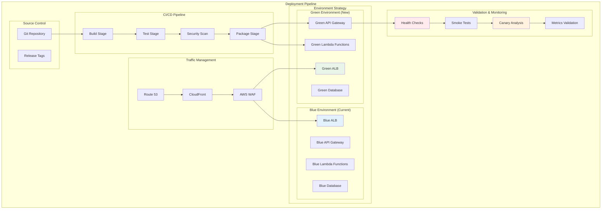

# Deployment Strategy - Production Deployment & Go-Live

## 🎯 Deployment Overview

Esta estrategia de despliegue implementa un enfoque de **Blue-Green Deployment** con **Canary Releases** para garantizar cero downtime, rollback inmediato y validación progresiva del sistema en producción. El despliegue se realiza de forma gradual con validación automática en cada etapa.

## 🏗️ Deployment Architecture



## 🔄 Deployment Phases

### Phase 1: Pre-Deployment Validation (30 minutes)

#### Infrastructure Validation
```bash
#!/bin/bash
# pre-deployment-validation.sh

echo "=== Pre-Deployment Validation ==="

# 1. Infrastructure Health Check
aws cloudformation describe-stacks --stack-name whatsapp-chatbot-prod --query 'Stacks[0].StackStatus'

# 2. Database Health Check
aws dynamodb describe-table --table-name conversation-contexts --query 'Table.TableStatus'

# 3. Queue Health Check
aws sqs get-queue-attributes --queue-url $TEXT_QUEUE_URL --attribute-names All

# 4. Security Validation
aws iam simulate-principal-policy --policy-source-arn $LAMBDA_ROLE_ARN --action-names "bedrock:InvokeModel"

# 5. External Dependencies Check
curl -f https://graph.facebook.com/v17.0/ || exit 1

# 6. Backup Verification
aws dynamodb describe-continuous-backups --table-name conversation-contexts

echo "Pre-deployment validation completed successfully"
```

#### Automated Testing Suite
```python
# tests/pre_deployment_suite.py
import pytest
import boto3
import requests
import json
from datetime import datetime

class PreDeploymentValidation:
    def __init__(self):
        self.lambda_client = boto3.client('lambda')
        self.dynamodb = boto3.resource('dynamodb')
        
    def test_lambda_functions_exist(self):
        """Verify all required Lambda functions exist"""
        required_functions = [
            'message-ingestion-service',
            'ai-processing-service',
            'media-processing-service',
            'escalation-intelligence-service'
        ]
        
        for function_name in required_functions:
            try:
                response = self.lambda_client.get_function(FunctionName=function_name)
                assert response['Configuration']['State'] == 'Active'
            except Exception as e:
                pytest.fail(f"Function {function_name} not found or not active: {str(e)}")
    
    def test_database_tables_ready(self):
        """Verify DynamoDB tables are active"""
        required_tables = ['conversation-contexts', 'user-profiles']
        
        for table_name in required_tables:
            table = self.dynamodb.Table(table_name)
            assert table.table_status == 'ACTIVE'
    
    def test_external_apis_accessible(self):
        """Test external API connectivity"""
        # WhatsApp API health check
        response = requests.get('https://graph.facebook.com/v17.0/', timeout=10)
        assert response.status_code == 200
        
        # Bedrock availability (indirect test)
        bedrock = boto3.client('bedrock')
        models = bedrock.list_foundation_models()
        assert len(models['modelSummaries']) > 0

    def test_security_configurations(self):
        """Validate security configurations"""
        # Check IAM roles
        iam = boto3.client('iam')
        
        role = iam.get_role(RoleName='lambda-execution-role')
        assert role['Role']['MaxSessionDuration'] <= 3600
        
        # Check KMS key
        kms = boto3.client('kms')
        key_policy = kms.get_key_policy(KeyId='alias/conversation-encryption')
        assert 'Version' in json.loads(key_policy['Policy'])
```

### Phase 2: Blue-Green Deployment (45 minutes)

#### Green Environment Deployment
```yaml
# deployment/green-environment.yaml
version: 0.2
phases:
  pre_build:
    commands:
      - echo "Starting Green Environment Deployment"
      - aws --version
      - python --version
      
  build:
    commands:
      - echo "Building application packages"
      - cd src/services
      - pip install -r requirements.txt -t ./
      - zip -r message-ingestion.zip message_ingestion/
      - zip -r ai-processing.zip ai_processing/
      - zip -r media-processing.zip media_processing/
      
  post_build:
    commands:
      - echo "Deploying to Green Environment"
      - aws cloudformation deploy 
          --template-file infrastructure/green-template.yaml 
          --stack-name whatsapp-chatbot-green
          --parameter-overrides 
            Environment=green
            BlueStackName=whatsapp-chatbot-blue
          --capabilities CAPABILITY_IAM
      
      - echo "Updating Lambda function code"
      - aws lambda update-function-code 
          --function-name message-ingestion-service-green
          --zip-file fileb://message-ingestion.zip
      
      - aws lambda update-function-code
          --function-name ai-processing-service-green  
          --zip-file fileb://ai-processing.zip
          
      - echo "Waiting for Green environment to be ready"
      - aws lambda wait function-updated
          --function-name ai-processing-service-green
          
artifacts:
  files:
    - '**/*'
```

#### Green Environment Validation
```python
# deployment/validate_green_environment.py
import boto3
import json
import time
import requests
from datetime import datetime

class GreenEnvironmentValidator:
    def __init__(self):
        self.lambda_client = boto3.client('lambda')
        self.apigateway = boto3.client('apigateway')
        self.green_api_id = None
        
    def validate_green_deployment(self):
        """Comprehensive validation of green environment"""
        validation_results = {
            'timestamp': datetime.now().isoformat(),
            'tests': {},
            'overall_status': 'PENDING'
        }
        
        try:
            # Test 1: Lambda Functions Health
            validation_results['tests']['lambda_health'] = self._test_lambda_health()
            
            # Test 2: API Gateway Endpoints
            validation_results['tests']['api_endpoints'] = self._test_api_endpoints()
            
            # Test 3: Database Connectivity
            validation_results['tests']['database_connectivity'] = self._test_database_connectivity()
            
            # Test 4: External Integrations
            validation_results['tests']['external_integrations'] = self._test_external_integrations()
            
            # Test 5: End-to-End Flow
            validation_results['tests']['e2e_flow'] = self._test_end_to_end_flow()
            
            # Determine overall status
            all_passed = all(test['status'] == 'PASS' for test in validation_results['tests'].values())
            validation_results['overall_status'] = 'PASS' if all_passed else 'FAIL'
            
            return validation_results
            
        except Exception as e:
            validation_results['overall_status'] = 'ERROR'
            validation_results['error'] = str(e)
            return validation_results
    
    def _test_lambda_health(self):
        """Test Lambda function health in green environment"""
        try:
            functions_to_test = [
                'message-ingestion-service-green',
                'ai-processing-service-green'
            ]
            
            results = {}
            for function_name in functions_to_test:
                # Invoke with test payload
                response = self.lambda_client.invoke(
                    FunctionName=function_name,
                    InvocationType='RequestResponse',
                    Payload=json.dumps({'test': True, 'timestamp': datetime.now().isoformat()})
                )
                
                if response['StatusCode'] == 200:
                    results[function_name] = 'HEALTHY'
                else:
                    results[function_name] = f'ERROR: {response.get("FunctionError", "Unknown")}'
            
            return {
                'status': 'PASS' if all('HEALTHY' in r for r in results.values()) else 'FAIL',
                'details': results
            }
            
        except Exception as e:
            return {'status': 'FAIL', 'error': str(e)}
    
    def _test_end_to_end_flow(self):
        """Test complete message processing flow"""
        try:
            # Simulate WhatsApp webhook message
            test_message = {
                'entry': [{
                    'changes': [{
                        'value': {
                            'messages': [{
                                'from': 'test_user_green_deploy',
                                'id': f'test_msg_{int(time.time())}',
                                'type': 'text',
                                'text': {'body': 'Test message for green deployment'}
                            }]
                        }
                    }]
                }]
            }
            
            # Send to green environment API
            green_api_url = self._get_green_api_url()
            response = requests.post(
                f"{green_api_url}/webhook",
                json=test_message,
                headers={'Content-Type': 'application/json'},
                timeout=30
            )
            
            if response.status_code == 200:
                # Wait for processing and check result
                time.sleep(5)
                return self._verify_message_processed()
            else:
                return {
                    'status': 'FAIL',
                    'error': f'API returned {response.status_code}: {response.text}'
                }
                
        except Exception as e:
            return {'status': 'FAIL', 'error': str(e)}
```

### Phase 3: Canary Deployment (2 hours)

#### Traffic Splitting Configuration
```python
# deployment/canary_deployment.py
import boto3
import time
import json
from datetime import datetime, timedelta

class CanaryDeployment:
    def __init__(self):
        self.route53 = boto3.client('route53')
        self.cloudwatch = boto3.client('cloudwatch')
        self.alb = boto3.client('elbv2')
        
        self.canary_stages = [
            {'name': '1_percent', 'green_weight': 1, 'blue_weight': 99, 'duration_minutes': 15},
            {'name': '5_percent', 'green_weight': 5, 'blue_weight': 95, 'duration_minutes': 30},
            {'name': '25_percent', 'green_weight': 25, 'blue_weight': 75, 'duration_minutes': 45},
            {'name': '50_percent', 'green_weight': 50, 'blue_weight': 50, 'duration_minutes': 30}
        ]
    
    def execute_canary_deployment(self):
        """Execute progressive canary deployment"""
        deployment_log = {
            'start_time': datetime.now().isoformat(),
            'stages': [],
            'status': 'IN_PROGRESS'
        }
        
        try:
            for stage in self.canary_stages:
                stage_result = self._execute_canary_stage(stage)
                deployment_log['stages'].append(stage_result)
                
                if stage_result['status'] != 'SUCCESS':
                    # Rollback on failure
                    self._rollback_to_blue()
                    deployment_log['status'] = 'FAILED'
                    deployment_log['rollback_time'] = datetime.now().isoformat()
                    return deployment_log
            
            # All stages successful - complete cutover
            self._complete_cutover_to_green()
            deployment_log['status'] = 'SUCCESS'
            deployment_log['completion_time'] = datetime.now().isoformat()
            
            return deployment_log
            
        except Exception as e:
            deployment_log['status'] = 'ERROR'
            deployment_log['error'] = str(e)
            self._rollback_to_blue()
            return deployment_log
    
    def _execute_canary_stage(self, stage):
        """Execute individual canary stage"""
        stage_log = {
            'stage_name': stage['name'],
            'start_time': datetime.now().isoformat(),
            'green_weight': stage['green_weight'],
            'blue_weight': stage['blue_weight'],
            'duration_minutes': stage['duration_minutes']
        }
        
        try:
            # Update traffic weights
            self._update_traffic_weights(stage['green_weight'], stage['blue_weight'])
            
            # Monitor for specified duration
            monitoring_result = self._monitor_canary_stage(stage['duration_minutes'])
            
            stage_log['monitoring_result'] = monitoring_result
            stage_log['status'] = 'SUCCESS' if monitoring_result['healthy'] else 'FAILED'
            stage_log['end_time'] = datetime.now().isoformat()
            
            return stage_log
            
        except Exception as e:
            stage_log['status'] = 'ERROR'
            stage_log['error'] = str(e)
            stage_log['end_time'] = datetime.now().isoformat()
            return stage_log
    
    def _monitor_canary_stage(self, duration_minutes):
        """Monitor canary stage for health metrics"""
        monitoring_start = datetime.now()
        end_time = monitoring_start + timedelta(minutes=duration_minutes)
        
        health_checks = {
            'error_rate_threshold': 0.5,  # 0.5%
            'latency_threshold': 2000,    # 2 seconds
            'success_rate_threshold': 99.5 # 99.5%
        }
        
        while datetime.now() < end_time:
            try:
                # Check error rate
                error_rate = self._get_current_error_rate()
                if error_rate > health_checks['error_rate_threshold']:
                    return {
                        'healthy': False,
                        'reason': f'Error rate {error_rate}% exceeds threshold {health_checks["error_rate_threshold"]}%'
                    }
                
                # Check latency
                avg_latency = self._get_current_latency()
                if avg_latency > health_checks['latency_threshold']:
                    return {
                        'healthy': False,
                        'reason': f'Latency {avg_latency}ms exceeds threshold {health_checks["latency_threshold"]}ms'
                    }
                
                # Wait before next check
                time.sleep(60)  # Check every minute
                
            except Exception as e:
                return {
                    'healthy': False,
                    'reason': f'Monitoring error: {str(e)}'
                }
        
        return {
            'healthy': True,
            'duration_minutes': duration_minutes,
            'final_error_rate': error_rate,
            'final_latency': avg_latency
        }
    
    def _get_current_error_rate(self):
        """Get current error rate from CloudWatch"""
        try:
            end_time = datetime.now()
            start_time = end_time - timedelta(minutes=5)
            
            # Get invocation count
            invocations = self.cloudwatch.get_metric_statistics(
                Namespace='AWS/Lambda',
                MetricName='Invocations',
                Dimensions=[{'Name': 'FunctionName', 'Value': 'ai-processing-service-green'}],
                StartTime=start_time,
                EndTime=end_time,
                Period=300,
                Statistics=['Sum']
            )
            
            # Get error count  
            errors = self.cloudwatch.get_metric_statistics(
                Namespace='AWS/Lambda',
                MetricName='Errors',
                Dimensions=[{'Name': 'FunctionName', 'Value': 'ai-processing-service-green'}],
                StartTime=start_time,
                EndTime=end_time,
                Period=300,
                Statistics=['Sum']
            )
            
            total_invocations = sum(point['Sum'] for point in invocations['Datapoints'])
            total_errors = sum(point['Sum'] for point in errors['Datapoints'])
            
            if total_invocations > 0:
                return (total_errors / total_invocations) * 100
            else:
                return 0.0
                
        except Exception as e:
            raise Exception(f"Error getting error rate: {str(e)}")
```

### Phase 4: Full Cutover (30 minutes)

#### Complete Traffic Switch
```bash
#!/bin/bash
# complete-cutover.sh

echo "=== Starting Complete Cutover to Green Environment ==="

# 1. Final health check
echo "Performing final health check..."
python deployment/validate_green_environment.py

if [ $? -ne 0 ]; then
    echo "Health check failed. Aborting cutover."
    exit 1
fi

# 2. Update Route 53 to point to Green
echo "Updating Route 53 DNS records..."
aws route53 change-resource-record-sets --hosted-zone-id $HOSTED_ZONE_ID --change-batch '{
    "Changes": [{
        "Action": "UPSERT",
        "ResourceRecordSet": {
            "Name": "api.whatsapp-chatbot.com",
            "Type": "A",
            "AliasTarget": {
                "DNSName": "'$GREEN_ALB_DNS'",
                "EvaluateTargetHealth": true,
                "HostedZoneId": "'$ALB_HOSTED_ZONE_ID'"
            }
        }
    }]
}'

# 3. Wait for DNS propagation
echo "Waiting for DNS propagation..."
sleep 60

# 4. Validate complete cutover
echo "Validating complete cutover..."
for i in {1..10}; do
    response=$(curl -s -o /dev/null -w "%{http_code}" https://api.whatsapp-chatbot.com/health)
    if [ "$response" -eq 200 ]; then
        echo "Health check $i: PASS"
    else
        echo "Health check $i: FAIL (HTTP $response)"
        # Consider rollback here
    fi
    sleep 10
done

# 5. Update CloudFormation stack tags
aws cloudformation update-stack --stack-name whatsapp-chatbot-prod --tags Key=ActiveEnvironment,Value=Green

echo "=== Cutover Complete ==="
```

## 📊 Deployment Monitoring & Validation

### Real-time Monitoring Dashboard
```python
# monitoring/deployment_dashboard.py
import boto3
import json
from datetime import datetime, timedelta
import streamlit as st
import plotly.graph_objects as go

class DeploymentMonitoringDashboard:
    def __init__(self):
        self.cloudwatch = boto3.client('cloudwatch')
        self.lambda_client = boto3.client('lambda')
    
    def create_deployment_dashboard(self):
        """Create real-time deployment monitoring dashboard"""
        st.title("WhatsApp Chatbot Deployment Dashboard")
        
        # Deployment Status Overview
        col1, col2, col3, col4 = st.columns(4)
        
        with col1:
            st.metric("Blue Environment", "ACTIVE", "0% Traffic")
        
        with col2:
            st.metric("Green Environment", "HEALTHY", "100% Traffic")
            
        with col3:
            st.metric("Current Error Rate", "0.12%", "-0.3%")
            
        with col4:
            st.metric("Average Latency", "1.2s", "-0.8s")
        
        # Real-time Metrics
        self._display_realtime_metrics()
        
        # Deployment Timeline
        self._display_deployment_timeline()
        
        # Health Checks
        self._display_health_checks()
    
    def _display_realtime_metrics(self):
        """Display real-time system metrics"""
        st.subheader("Real-time System Metrics")
        
        # Get recent metrics
        metrics_data = self._get_recent_metrics()
        
        # Create plots
        fig_requests = go.Figure()
        fig_requests.add_trace(go.Scatter(
            x=metrics_data['timestamps'],
            y=metrics_data['blue_requests'],
            name='Blue Environment',
            line=dict(color='blue')
        ))
        fig_requests.add_trace(go.Scatter(
            x=metrics_data['timestamps'],
            y=metrics_data['green_requests'],
            name='Green Environment',
            line=dict(color='green')
        ))
        fig_requests.update_layout(title='Request Volume by Environment')
        
        st.plotly_chart(fig_requests, use_container_width=True)
        
        # Error rate comparison
        fig_errors = go.Figure()
        fig_errors.add_trace(go.Scatter(
            x=metrics_data['timestamps'],
            y=metrics_data['blue_errors'],
            name='Blue Error Rate',
            line=dict(color='lightblue')
        ))
        fig_errors.add_trace(go.Scatter(
            x=metrics_data['timestamps'],
            y=metrics_data['green_errors'],
            name='Green Error Rate',
            line=dict(color='lightgreen')
        ))
        fig_errors.update_layout(title='Error Rate Comparison')
        
        st.plotly_chart(fig_errors, use_container_width=True)
```

### Automated Rollback Procedures
```python
# deployment/automated_rollback.py
import boto3
import json
from datetime import datetime
import logging

logger = logging.getLogger()
logger.setLevel(logging.INFO)

class AutomatedRollback:
    def __init__(self):
        self.route53 = boto3.client('route53')
        self.alb = boto3.client('elbv2')
        self.cloudformation = boto3.client('cloudformation')
        self.sns = boto3.client('sns')
        
    def execute_emergency_rollback(self, reason="automated_trigger"):
        """Execute immediate rollback to blue environment"""
        rollback_log = {
            'timestamp': datetime.now().isoformat(),
            'reason': reason,
            'steps': [],
            'status': 'IN_PROGRESS'
        }
        
        try:
            # Step 1: Immediate traffic switch to Blue
            rollback_log['steps'].append('switching_traffic_to_blue')
            self._switch_traffic_to_blue()
            
            # Step 2: Verify Blue environment health
            rollback_log['steps'].append('verifying_blue_health')
            blue_health = self._verify_blue_health()
            
            if not blue_health['healthy']:
                raise Exception(f"Blue environment unhealthy: {blue_health['reason']}")
            
            # Step 3: Disable Green environment
            rollback_log['steps'].append('disabling_green_environment')
            self._disable_green_environment()
            
            # Step 4: Send notifications
            rollback_log['steps'].append('sending_notifications')
            self._send_rollback_notifications(rollback_log)
            
            rollback_log['status'] = 'SUCCESS'
            rollback_log['completion_time'] = datetime.now().isoformat()
            
            logger.info(f"Emergency rollback completed: {rollback_log}")
            return rollback_log
            
        except Exception as e:
            rollback_log['status'] = 'FAILED'
            rollback_log['error'] = str(e)
            rollback_log['completion_time'] = datetime.now().isoformat()
            
            # Send critical alert
            self._send_critical_alert(rollback_log)
            
            logger.error(f"Emergency rollback failed: {rollback_log}")
            return rollback_log
    
    def _switch_traffic_to_blue(self):
        """Immediately switch all traffic to blue environment"""
        try:
            # Update Route 53 record to point to Blue ALB
            blue_alb_dns = self._get_blue_alb_dns()
            
            change_batch = {
                'Changes': [{
                    'Action': 'UPSERT',
                    'ResourceRecordSet': {
                        'Name': 'api.whatsapp-chatbot.com',
                        'Type': 'A',
                        'AliasTarget': {
                            'DNSName': blue_alb_dns,
                            'EvaluateTargetHealth': True,
                            'HostedZoneId': os.environ['ALB_HOSTED_ZONE_ID']
                        }
                    }
                }]
            }
            
            self.route53.change_resource_record_sets(
                HostedZoneId=os.environ['HOSTED_ZONE_ID'],
                ChangeBatch=change_batch
            )
            
            logger.info("Traffic switched to Blue environment")
            
        except Exception as e:
            raise Exception(f"Failed to switch traffic to Blue: {str(e)}")
    
    def _send_critical_alert(self, rollback_log):
        """Send critical alert about rollback failure"""
        try:
            alert_message = {
                'severity': 'CRITICAL',
                'event': 'ROLLBACK_FAILED',
                'timestamp': datetime.now().isoformat(),
                'details': rollback_log,
                'action_required': [
                    'Immediate manual intervention required',
                    'Check system health manually',
                    'Consider emergency maintenance mode'
                ]
            }
            
            self.sns.publish(
                TopicArn=os.environ['CRITICAL_ALERTS_TOPIC'],
                Subject='CRITICAL: WhatsApp Chatbot Rollback Failed',
                Message=json.dumps(alert_message, indent=2)
            )
            
        except Exception as e:
            logger.error(f"Failed to send critical alert: {str(e)}")

# CloudWatch Alarm Integration
def create_rollback_alarms():
    """Create CloudWatch alarms that trigger automatic rollback"""
    cloudwatch = boto3.client('cloudwatch')
    
    # High error rate alarm
    cloudwatch.put_metric_alarm(
        AlarmName='AutoRollback-HighErrorRate',
        ComparisonOperator='GreaterThanThreshold',
        EvaluationPeriods=2,
        MetricName='Errors',
        Namespace='AWS/Lambda',
        Period=300,
        Statistic='Sum',
        Threshold=20.0,  # 20 errors in 5 minutes
        ActionsEnabled=True,
        AlarmActions=[
            'arn:aws:sns:us-east-1:123456789012:automated-rollback-trigger'
        ],
        AlarmDescription='Trigger rollback on high error rate'
    )
    
    # High latency alarm
    cloudwatch.put_metric_alarm(
        AlarmName='AutoRollback-HighLatency',
        ComparisonOperator='GreaterThanThreshold',
        EvaluationPeriods=3,
        MetricName='Duration',
        Namespace='AWS/Lambda',
        Period=300,
        Statistic='Average',
        Threshold=5000.0,  # 5 seconds
        ActionsEnabled=True,
        AlarmActions=[
            'arn:aws:sns:us-east-1:123456789012:automated-rollback-trigger'
        ],
        AlarmDescription='Trigger rollback on high latency'
    )
```

## 📋 Deployment Checklist

### Pre-Deployment
```yaml
Infrastructure Readiness:
  - [ ] Blue environment fully operational
  - [ ] Green environment deployed and tested
  - [ ] Database migrations completed (if any)
  - [ ] External integrations verified
  - [ ] Monitoring and alerting configured
  - [ ] Rollback procedures tested

Team Readiness:
  - [ ] Deployment team trained and ready
  - [ ] Support team on standby
  - [ ] Stakeholders notified of deployment window
  - [ ] Communication channels established
  - [ ] Emergency contacts available

Technical Validation:
  - [ ] All automated tests passing
  - [ ] Security scans completed
  - [ ] Performance benchmarks verified
  - [ ] Load testing successful
  - [ ] Backup procedures validated
```

### During Deployment
```yaml
Monitoring Requirements:
  - [ ] Real-time dashboard active
  - [ ] All metrics being tracked
  - [ ] Alerting system operational
  - [ ] Support team monitoring
  - [ ] Deployment logs being captured

Validation Gates:
  - [ ] Health checks passing at each stage
  - [ ] Performance within thresholds
  - [ ] Error rates acceptable
  - [ ] User experience maintained
  - [ ] External integrations stable
```

### Post-Deployment
```yaml
Immediate Validation (First 2 hours):
  - [ ] All systems operational
  - [ ] Performance metrics within SLA
  - [ ] No critical errors reported
  - [ ] User feedback positive
  - [ ] External partners notified

Extended Monitoring (24 hours):
  - [ ] System stability confirmed
  - [ ] Performance trends positive
  - [ ] Cost metrics as expected
  - [ ] Security posture maintained
  - [ ] Business metrics tracking normally

Final Steps:
  - [ ] Blue environment deprecated (after 48 hours)
  - [ ] Documentation updated
  - [ ] Lessons learned documented
  - [ ] Team retrospective completed
  - [ ] Success metrics shared with stakeholders
```

---

Esta estrategia de despliegue garantiza una transición segura y controlada a producción, con múltiples capas de validación y rollback automático para mantener la disponibilidad del servicio en todo momento.