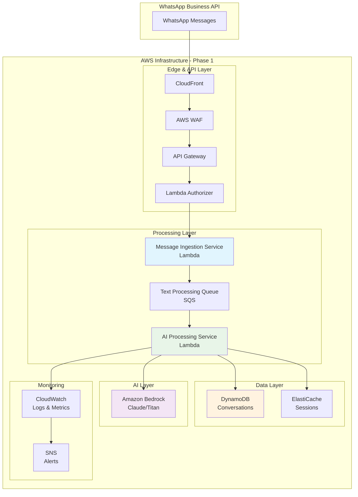

# Phase 1: Foundation & MVP Implementation

## 🎯 Phase Overview

La Fase 1 establece los fundamentos técnicos del sistema de agentes de IA para WhatsApp Business API. El objetivo es crear un MVP funcional que procese mensajes de texto básicos con respuestas de IA, implementando las bases de seguridad, monitoreo y escalabilidad.

**Duración**: 3 semanas  
**Objetivo**: MVP funcional procesando 1,000 mensajes/día con <2s response time

## 📅 Timeline Detallado

### Semana 1: Infrastructure Foundation

#### Días 1-2: AWS Account Setup & Security Baseline
```yaml
Tareas Críticas:
  - Setup AWS Organization y cuentas (dev/staging/prod)
  - Configuración IAM roles y políticas de seguridad
  - Habilitación de CloudTrail, Config, GuardDuty
  - Setup básico de monitoring con CloudWatch
  
Entregables:
  - AWS accounts configuradas
  - Security baseline implementada
  - Audit logging habilitado
  - Basic monitoring dashboard
```

#### Días 3-4: Infrastructure as Code (IaC)
```yaml
Tareas Críticas:
  - Desarrollo de CloudFormation/CDK templates
  - Setup de VPC, subnets, security groups
  - Configuración de DynamoDB tables
  - Setup de SQS queues
  
Entregables:
  - IaC templates funcionales
  - Red infrastructure desplegada
  - Database tables creadas
  - Message queues configuradas
```

#### Días 5-7: CI/CD Pipeline
```yaml
Tareas Críticas:
  - Setup de CodePipeline/GitHub Actions
  - Configuración de deployment environments
  - Testing framework básico
  - Deployment automation
  
Entregables:
  - CI/CD pipeline funcional
  - Automated testing en pipeline
  - Multi-environment deployment
  - Rollback capabilities
```

### Semana 2: Core Message Processing

#### Días 8-10: Message Ingestion Service
```yaml
Tareas Críticas:
  - Desarrollo de Lambda function para webhooks
  - Implementación de signature validation
  - Rate limiting y error handling
  - Integration con SQS queues
  
Entregables:
  - Webhook endpoint funcional
  - Security validation implementada
  - Message routing a queues
  - Error handling robusto
```

#### Días 11-13: AI Processing Service
```yaml
Tareas Críticas:
  - Integración con Amazon Bedrock
  - Desarrollo de context management básico
  - Response generation y formatting
  - Integration con WhatsApp API send
  
Entregables:
  - AI response generation funcional
  - Basic context awareness
  - WhatsApp message sending
  - Response quality validation
```

#### Día 14: Integration Testing
```yaml
Tareas Críticas:
  - End-to-end testing del flujo
  - Performance testing básico
  - Security validation testing
  - Bug fixes y optimizaciones
  
Entregables:
  - E2E tests pasando
  - Performance baseline establecido
  - Security tests pasando
  - System funcionando end-to-end
```

### Semana 3: Context Management & Optimization

#### Días 15-17: Context Management Service
```yaml
Tareas Críticas:
  - Implementación de DynamoDB context storage
  - ElastiCache integration para sessions
  - Context pruning y optimization
  - TTL y cleanup automation
  
Entregables:
  - Context persistence funcional
  - Session caching implementado
  - Context optimization working
  - Data cleanup automation
```

#### Días 18-20: Performance & Reliability
```yaml
Tareas Críticas:
  - Load testing y performance tuning
  - Error handling y retry logic
  - Health checks y monitoring
  - Auto-scaling configuration
  
Entregables:
  - Performance targets alcanzados
  - Robust error handling
  - Comprehensive monitoring
  - Auto-scaling funcional
```

#### Día 21: Go-Live Preparation
```yaml
Tareas Críticas:
  - Production deployment
  - Monitoring dashboard setup
  - Alert configuration
  - Documentation y handover
  
Entregables:
  - Production system live
  - Monitoring y alerting activo
  - Operations documentation
  - Team training completado
```

## 🏗️ Arquitectura de la Fase 1



## 🔧 Implementación Técnica Detallada

### 1. Infrastructure as Code (CloudFormation)

#### Master Template
```yaml
# infrastructure/master-template.yaml
AWSTemplateFormatVersion: '2010-09-09'
Description: 'WhatsApp AI Chatbot - Phase 1 Infrastructure'

Parameters:
  Environment:
    Type: String
    Default: dev
    AllowedValues: [dev, staging, prod]
  
  ProjectName:
    Type: String
    Default: whatsapp-ai-chatbot

Resources:
  # VPC Stack
  VPCStack:
    Type: AWS::CloudFormation::Stack
    Properties:
      TemplateURL: './network/vpc-template.yaml'
      Parameters:
        Environment: !Ref Environment
        ProjectName: !Ref ProjectName

  # Security Stack  
  SecurityStack:
    Type: AWS::CloudFormation::Stack
    Properties:
      TemplateURL: './security/security-template.yaml'
      Parameters:
        Environment: !Ref Environment
        VPCId: !GetAtt VPCStack.Outputs.VPCId

  # Data Stack
  DataStack:
    Type: AWS::CloudFormation::Stack
    Properties:
      TemplateURL: './data/data-template.yaml'
      Parameters:
        Environment: !Ref Environment
        KMSKeyId: !GetAtt SecurityStack.Outputs.ConversationKMSKey

  # Compute Stack
  ComputeStack:
    Type: AWS::CloudFormation::Stack
    Properties:
      TemplateURL: './compute/compute-template.yaml'
      Parameters:
        Environment: !Ref Environment
        VPCId: !GetAtt VPCStack.Outputs.VPCId
        PrivateSubnets: !GetAtt VPCStack.Outputs.PrivateSubnets
        ConversationTable: !GetAtt DataStack.Outputs.ConversationTableName
        CacheCluster: !GetAtt DataStack.Outputs.CacheClusterEndpoint

Outputs:
  APIGatewayURL:
    Description: API Gateway URL for webhooks
    Value: !GetAtt ComputeStack.Outputs.APIGatewayURL
    Export:
      Name: !Sub '${ProjectName}-${Environment}-api-url'
```

#### VPC Template
```yaml
# infrastructure/network/vpc-template.yaml
AWSTemplateFormatVersion: '2010-09-09'
Description: 'Network infrastructure for WhatsApp AI Chatbot'

Parameters:
  Environment:
    Type: String
  ProjectName:
    Type: String

Resources:
  VPC:
    Type: AWS::EC2::VPC
    Properties:
      CidrBlock: 10.0.0.0/16
      EnableDnsHostnames: true
      EnableDnsSupport: true
      Tags:
        - Key: Name
          Value: !Sub '${ProjectName}-${Environment}-vpc'

  InternetGateway:
    Type: AWS::EC2::InternetGateway
    Properties:
      Tags:
        - Key: Name
          Value: !Sub '${ProjectName}-${Environment}-igw'

  AttachGateway:
    Type: AWS::EC2::VPCGatewayAttachment
    Properties:
      VpcId: !Ref VPC
      InternetGatewayId: !Ref InternetGateway

  PublicSubnet1:
    Type: AWS::EC2::Subnet
    Properties:
      VpcId: !Ref VPC
      CidrBlock: 10.0.1.0/24
      AvailabilityZone: !Select [0, !GetAZs '']
      MapPublicIpOnLaunch: true
      Tags:
        - Key: Name
          Value: !Sub '${ProjectName}-${Environment}-public-1'

  PublicSubnet2:
    Type: AWS::EC2::Subnet
    Properties:
      VpcId: !Ref VPC
      CidrBlock: 10.0.2.0/24
      AvailabilityZone: !Select [1, !GetAZs '']
      MapPublicIpOnLaunch: true
      Tags:
        - Key: Name
          Value: !Sub '${ProjectName}-${Environment}-public-2'

  PrivateSubnet1:
    Type: AWS::EC2::Subnet
    Properties:
      VpcId: !Ref VPC
      CidrBlock: 10.0.3.0/24
      AvailabilityZone: !Select [0, !GetAZs '']
      Tags:
        - Key: Name
          Value: !Sub '${ProjectName}-${Environment}-private-1'

  PrivateSubnet2:
    Type: AWS::EC2::Subnet
    Properties:
      VpcId: !Ref VPC
      CidrBlock: 10.0.4.0/24
      AvailabilityZone: !Select [1, !GetAZs '']
      Tags:
        - Key: Name
          Value: !Sub '${ProjectName}-${Environment}-private-2'

Outputs:
  VPCId:
    Description: VPC ID
    Value: !Ref VPC
  
  PrivateSubnets:
    Description: Private subnet IDs
    Value: !Join [',', [!Ref PrivateSubnet1, !Ref PrivateSubnet2]]
```

### 2. Message Ingestion Service Implementation

```python
# src/services/message_ingestion/handler.py
import json
import os
import boto3
import hmac
import hashlib
from datetime import datetime
import logging

# Setup logging
logger = logging.getLogger()
logger.setLevel(logging.INFO)

# AWS clients
sqs = boto3.client('sqs')
ssm = boto3.client('ssm')

# Configuration
TEXT_QUEUE_URL = os.environ['TEXT_QUEUE_URL']
WEBHOOK_SECRET_PARAM = os.environ['WEBHOOK_SECRET_PARAM']

class MessageIngestionService:
    def __init__(self):
        self.webhook_secret = self._get_webhook_secret()
        
    def _get_webhook_secret(self):
        """Retrieve webhook secret from Systems Manager"""
        try:
            response = ssm.get_parameter(
                Name=WEBHOOK_SECRET_PARAM,
                WithDecryption=True
            )
            return response['Parameter']['Value']
        except Exception as e:
            logger.error(f"Failed to retrieve webhook secret: {str(e)}")
            raise

    def validate_signature(self, payload, signature_header):
        """Validate WhatsApp webhook signature"""
        if not signature_header or not signature_header.startswith('sha256='):
            raise ValueError("Invalid signature header")
        
        provided_signature = signature_header[7:]  # Remove 'sha256=' prefix
        
        expected_signature = hmac.new(
            self.webhook_secret.encode('utf-8'),
            payload.encode('utf-8'),
            hashlib.sha256
        ).hexdigest()
        
        if not hmac.compare_digest(provided_signature, expected_signature):
            raise ValueError("Invalid webhook signature")
        
        return True

    def process_webhook(self, event):
        """Process incoming WhatsApp webhook"""
        try:
            # Handle verification request
            query_params = event.get('queryStringParameters', {})
            if query_params and query_params.get('hub.mode') == 'subscribe':
                return self._handle_verification(query_params)
            
            # Validate signature for message webhooks
            signature = event.get('headers', {}).get('x-hub-signature-256')
            payload = event.get('body', '')
            
            self.validate_signature(payload, signature)
            
            # Parse webhook data
            webhook_data = json.loads(payload)
            
            # Process each entry
            for entry in webhook_data.get('entry', []):
                for change in entry.get('changes', []):
                    self._process_change(change)
            
            return {
                'statusCode': 200,
                'body': json.dumps({'status': 'success'})
            }
            
        except Exception as e:
            logger.error(f"Error processing webhook: {str(e)}")
            return {
                'statusCode': 500,
                'body': json.dumps({'error': 'Internal server error'})
            }

    def _handle_verification(self, query_params):
        """Handle WhatsApp webhook verification"""
        verify_token = os.environ.get('WEBHOOK_VERIFY_TOKEN')
        
        if query_params.get('hub.verify_token') == verify_token:
            return {
                'statusCode': 200,
                'body': query_params.get('hub.challenge')
            }
        else:
            return {
                'statusCode': 403,
                'body': 'Verification failed'
            }

    def _process_change(self, change):
        """Process individual webhook change"""
        value = change.get('value', {})
        messages = value.get('messages', [])
        
        for message in messages:
            message_event = {
                'timestamp': datetime.now().isoformat(),
                'from': message['from'],
                'message_id': message['id'],
                'type': message['type'],
                'data': message
            }
            
            # Route to appropriate queue based on message type
            if message['type'] == 'text':
                self._send_to_queue(TEXT_QUEUE_URL, message_event)
            else:
                logger.info(f"Unsupported message type in Phase 1: {message['type']}")

    def _send_to_queue(self, queue_url, message_event):
        """Send message to SQS queue"""
        try:
            sqs.send_message(
                QueueUrl=queue_url,
                MessageBody=json.dumps(message_event),
                MessageAttributes={
                    'MessageType': {
                        'StringValue': message_event['type'],
                        'DataType': 'String'
                    },
                    'UserId': {
                        'StringValue': message_event['from'],
                        'DataType': 'String'
                    }
                }
            )
            logger.info(f"Message sent to queue: {message_event['message_id']}")
        except Exception as e:
            logger.error(f"Failed to send message to queue: {str(e)}")
            raise

# Lambda handler
message_service = MessageIngestionService()

def lambda_handler(event, context):
    """AWS Lambda handler"""
    return message_service.process_webhook(event)
```

### 3. AI Processing Service Implementation

```python
# src/services/ai_processing/handler.py
import json
import os
import boto3
from datetime import datetime, timedelta
import logging
import redis
import requests

# Setup logging
logger = logging.getLogger()
logger.setLevel(logging.INFO)

# AWS clients
bedrock = boto3.client('bedrock-runtime')
dynamodb = boto3.resource('dynamodb')
ssm = boto3.client('ssm')

# Configuration
CONVERSATION_TABLE = os.environ['CONVERSATION_TABLE']
CACHE_ENDPOINT = os.environ['CACHE_ENDPOINT']
WHATSAPP_ACCESS_TOKEN_PARAM = os.environ['WHATSAPP_ACCESS_TOKEN_PARAM']

class AIProcessingService:
    def __init__(self):
        self.table = dynamodb.Table(CONVERSATION_TABLE)
        self.redis_client = redis.Redis(
            host=CACHE_ENDPOINT.split(':')[0],
            port=6379,
            decode_responses=True
        )
        self.whatsapp_token = self._get_whatsapp_token()
        
    def _get_whatsapp_token(self):
        """Retrieve WhatsApp access token"""
        try:
            response = ssm.get_parameter(
                Name=WHATSAPP_ACCESS_TOKEN_PARAM,
                WithDecryption=True
            )
            return response['Parameter']['Value']
        except Exception as e:
            logger.error(f"Failed to retrieve WhatsApp token: {str(e)}")
            raise

    def process_text_message(self, message_event):
        """Process text message with AI"""
        try:
            user_id = message_event['from']
            message_text = message_event['data']['text']['body']
            
            # Get conversation context
            context = self._get_conversation_context(user_id)
            
            # Generate AI response
            ai_response = self._generate_ai_response(message_text, context)
            
            # Store conversation
            self._store_conversation(user_id, message_text, ai_response, message_event)
            
            # Send response to WhatsApp
            # Note: For advanced typing simulation, see docs/03-advanced-features/whatsapp-typing-simulation.md
            self._send_whatsapp_message(user_id, ai_response)
            
            return {
                'status': 'success',
                'response': ai_response
            }
            
        except Exception as e:
            logger.error(f"Error processing text message: {str(e)}")
            raise

    def _get_conversation_context(self, user_id, limit=5):
        """Retrieve recent conversation context"""
        # Try cache first
        cache_key = f"context:{user_id}"
        cached_context = self.redis_client.get(cache_key)
        
        if cached_context:
            return json.loads(cached_context)
        
        # Query DynamoDB
        try:
            response = self.table.query(
                KeyConditionExpression='user_id = :user_id',
                ExpressionAttributeValues={':user_id': user_id},
                ScanIndexForward=False,
                Limit=limit,
                ProjectionExpression='#ts, #role, content',
                ExpressionAttributeNames={
                    '#ts': 'timestamp',
                    '#role': 'role'
                }
            )
            
            context = response.get('Items', [])
            
            # Cache for 30 minutes
            self.redis_client.setex(cache_key, 1800, json.dumps(context))
            
            return context
            
        except Exception as e:
            logger.error(f"Error retrieving context: {str(e)}")
            return []

    def _generate_ai_response(self, message, context):
        """Generate AI response using Amazon Bedrock"""
        try:
            # Build prompt with context
            prompt = self._build_prompt(message, context)
            
            # Call Bedrock API
            response = bedrock.invoke_model(
                modelId='anthropic.claude-v2',
                contentType='application/json',
                accept='application/json',
                body=json.dumps({
                    'prompt': f"\n\nHuman: {prompt}\n\nAssistant:",
                    'max_tokens_to_sample': 1000,
                    'temperature': 0.7,
                    'top_p': 0.9,
                    'stop_sequences': ["\n\nHuman:"]
                })
            )
            
            # Parse response
            response_body = json.loads(response['body'].read())
            ai_response = response_body['completion'].strip()
            
            # Validate response length for WhatsApp
            # Note: Message chunking strategies available in advanced features documentation
            if len(ai_response) > 4096:
                ai_response = ai_response[:4093] + "..."
            
            return ai_response
            
        except Exception as e:
            logger.error(f"Error generating AI response: {str(e)}")
            return "Lo siento, estoy teniendo problemas técnicos. Por favor intenta de nuevo en unos minutos."

    def _build_prompt(self, message, context):
        """Build AI prompt with conversation context"""
        system_prompt = """Eres un asistente virtual útil para atención al cliente. 
        Responde de manera amigable, profesional y concisa en español.
        Si no sabes algo, admítelo y ofrece ayuda alternativa."""
        
        context_text = ""
        if context:
            context_text = "\n\nContexto de la conversación reciente:\n"
            for item in reversed(context[-3:]):  # Last 3 interactions
                role = "Usuario" if item['role'] == 'user' else "Asistente"
                context_text += f"{role}: {item['content']}\n"
        
        prompt = f"{system_prompt}{context_text}\n\nUsuario: {message}"
        
        return prompt

    def _store_conversation(self, user_id, user_message, ai_response, message_event):
        """Store conversation in DynamoDB"""
        try:
            timestamp = datetime.now().isoformat()
            ttl = int((datetime.now() + timedelta(days=30)).timestamp())
            
            # Store user message
            self.table.put_item(
                Item={
                    'user_id': user_id,
                    'timestamp': timestamp + '_user',
                    'message_id': message_event['message_id'],
                    'role': 'user',
                    'content': user_message,
                    'message_type': 'text',
                    'ttl': ttl
                }
            )
            
            # Store AI response
            self.table.put_item(
                Item={
                    'user_id': user_id,
                    'timestamp': timestamp + '_assistant',
                    'message_id': f"ai_{message_event['message_id']}",
                    'role': 'assistant',
                    'content': ai_response,
                    'message_type': 'text',
                    'ai_model': 'anthropic.claude-v2',
                    'ttl': ttl
                }
            )
            
            # Update cache
            self._update_context_cache(user_id)
            
        except Exception as e:
            logger.error(f"Error storing conversation: {str(e)}")

    def _update_context_cache(self, user_id):
        """Update conversation context in cache"""
        try:
            # Invalidate cache - will be rebuilt on next request
            cache_key = f"context:{user_id}"
            self.redis_client.delete(cache_key)
        except Exception as e:
            logger.error(f"Error updating cache: {str(e)}")

    def _send_whatsapp_message(self, to_user, message):
        """Send message to WhatsApp user
        
        Note: This is a basic implementation. For human-like typing simulation,
        see the advanced typing features in docs/03-advanced-features/whatsapp-typing-simulation.md
        """
        try:
            url = f"https://graph.facebook.com/v17.0/{os.environ['WHATSAPP_PHONE_NUMBER_ID']}/messages"
            
            headers = {
                'Authorization': f'Bearer {self.whatsapp_token}',
                'Content-Type': 'application/json'
            }
            
            payload = {
                'messaging_product': 'whatsapp',
                'to': to_user,
                'type': 'text',
                'text': {'body': message}
            }
            
            response = requests.post(url, headers=headers, json=payload)
            response.raise_for_status()
            
            logger.info(f"WhatsApp message sent successfully to {to_user}")
            
        except Exception as e:
            logger.error(f"Error sending WhatsApp message: {str(e)}")
            raise

# Lambda handler for SQS messages
ai_service = AIProcessingService()

def lambda_handler(event, context):
    """AWS Lambda handler for SQS events"""
    try:
        for record in event['Records']:
            message_body = json.loads(record['body'])
            ai_service.process_text_message(message_body)
        
        return {'statusCode': 200, 'body': 'Success'}
        
    except Exception as e:
        logger.error(f"Lambda handler error: {str(e)}")
        return {'statusCode': 500, 'body': 'Error'}
```

## 📊 Success Criteria & KPIs

### Technical Metrics
```yaml
Performance Targets:
  Response Time:
    - Text messages: < 2 seconds (95th percentile)
    - Webhook processing: < 100ms
    - Context retrieval: < 50ms
    
  Throughput:
    - Peak messages: 1,000/hour
    - Concurrent users: 100
    - Queue processing: 10 messages/second
    
  Reliability:
    - Uptime: 99.5%
    - Error rate: < 0.5%
    - Message delivery: 99.9%

System Health Checks:
  - API Gateway health endpoint
  - Lambda function error rates
  - DynamoDB throttling metrics
  - SQS queue depth monitoring
```

### Business Metrics
```yaml
Conversation Quality:
  - AI response relevance: Manual review
  - Context awareness: Conversation flow analysis
  - User engagement: Response rates
  
Cost Efficiency:
  - Cost per conversation: < $0.10
  - AWS service costs: Within $300/month budget
  - Token usage optimization: Track Bedrock costs
```

## 🚀 Deployment Strategy

### Environment Progression
```bash
# Development Deployment
aws cloudformation deploy \
  --template-file infrastructure/master-template.yaml \
  --stack-name whatsapp-chatbot-dev \
  --parameter-overrides Environment=dev \
  --capabilities CAPABILITY_IAM

# Staging Deployment
aws cloudformation deploy \
  --template-file infrastructure/master-template.yaml \
  --stack-name whatsapp-chatbot-staging \
  --parameter-overrides Environment=staging \
  --capabilities CAPABILITY_IAM

# Production Deployment (with approval)
aws cloudformation deploy \
  --template-file infrastructure/master-template.yaml \
  --stack-name whatsapp-chatbot-prod \
  --parameter-overrides Environment=prod \
  --capabilities CAPABILITY_IAM
```

### Testing Strategy
```yaml
Unit Tests:
  - Message validation functions
  - AI response generation
  - Context management logic
  - Error handling scenarios

Integration Tests:
  - WhatsApp webhook simulation
  - End-to-end message flow
  - Database operations
  - Queue processing

Load Tests:
  - 1000 concurrent messages
  - Performance under load
  - Auto-scaling validation
  - Error recovery testing
```

## ⚠️ Risk Mitigation

### Technical Risks
```yaml
WhatsApp API Limits:
  Risk: Rate limiting or API changes
  Mitigation: 
    - Implement exponential backoff
    - Monitor rate limit headers
    - Queue messages during limits

AI Model Availability:
  Risk: Bedrock service interruptions
  Mitigation:
    - Implement fallback responses
    - Multiple model options
    - Circuit breaker pattern

Data Loss:
  Risk: Database or cache failures  
  Mitigation:
    - Point-in-time recovery enabled
    - Multi-AZ deployments
    - Regular backup validation
```

### Operational Risks
```yaml
Security Incidents:
  Risk: Unauthorized access
  Mitigation:
    - WAF and security monitoring
    - Encrypted data at rest/transit
    - Regular security audits

Cost Overruns:
  Risk: Unexpected high usage
  Mitigation:
    - Cost alerting at $200, $350
    - Resource quotas and limits
    - Usage monitoring dashboard
```

## 📋 Phase 1 Checklist

### Pre-Launch
- [ ] All infrastructure deployed successfully
- [ ] Security baseline implemented and validated
- [ ] WhatsApp Business API connected and verified
- [ ] AI integration working with sample conversations
- [ ] Monitoring and alerting configured
- [ ] Load testing completed successfully
- [ ] Security testing passed
- [ ] Documentation updated

### Go-Live
- [ ] Production deployment completed
- [ ] DNS configured (if applicable)
- [ ] Monitoring dashboards active
- [ ] On-call procedures documented
- [ ] Team training completed
- [ ] WhatsApp webhook configured in production

### Post-Launch (First 48 hours)
- [ ] Monitor error rates and performance
- [ ] Validate conversation flow quality
- [ ] Check cost accumulation
- [ ] Gather initial user feedback
- [ ] Document any issues or optimizations needed

---

**Próximo**: [Phase 2 - Intelligence & Media](phase2-intelligence.md) para añadir capacidades avanzadas de AI y procesamiento multimedia.