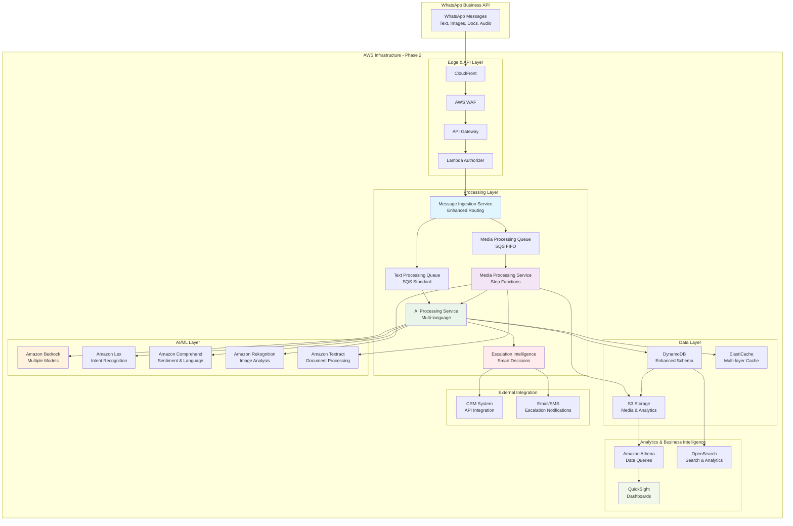

# Phase 2: Intelligence & Media Processing

> **💡 Tip**: Para funcionalidades avanzadas de simulación de typing y experiencias de conversación más humanas, consulta [WhatsApp Typing Simulation](../03-advanced-features/whatsapp-typing-simulation.md)

## 🎯 Phase Overview

La Fase 2 expande las capacidades del sistema agregando inteligencia avanzada, procesamiento multimedia y características empresariales. El objetivo es evolucionar de un chatbot básico a un asistente de IA sofisticado capaz de manejar múltiples tipos de contenido y proveer respuestas contextualmente ricas.

**Duración**: 3 semanas  
**Objetivo**: Manejar 10,000 mensajes/día con soporte multimedia y múltiples idiomas

## 📅 Timeline Detallado

### Semana 4: Media Processing Infrastructure

#### Días 22-24: Media Processing Service
```yaml
Tareas Críticas:
  - Setup S3 buckets para almacenamiento de media
  - Implementación de Step Functions workflows
  - Integración con Amazon Rekognition para imágenes
  - Integración con Amazon Textract para documentos
  
Entregables:
  - S3 storage configurado con lifecycle policies
  - Media processing workflows funcionales
  - Image analysis capabilities
  - Document text extraction
```

#### Días 25-27: Asynchronous Processing
```yaml
Tareas Críticas:
  - Implementación de SQS FIFO queues para media
  - Dead Letter Queue handling
  - Step Functions error handling y retry logic
  - Media processing status tracking
  
Entregables:
  - Robust async processing pipeline
  - Error handling y recovery
  - Processing status notifications
  - Performance monitoring for media
```

#### Día 28: Media Integration Testing
```yaml
Tareas Críticas:
  - End-to-end media processing tests
  - Performance testing con diferentes file sizes
  - Error scenario testing
  - Integration con AI processing
  
Entregables:
  - Media processing fully tested
  - Performance benchmarks established
  - Error handling validated
  - AI integration working with media context
```

### Semana 5: Advanced AI Features

#### Días 29-31: Multi-Language Support
```yaml
Tareas Críticas:
  - Amazon Comprehend integration para language detection
  - Multi-language prompt templates
  - Response localization logic
  - Language-specific model selection
  
Entregables:
  - Automatic language detection
  - Support para 5 idiomas (ES, EN, PT, FR, IT)
  - Localized response templates
  - Language-aware context management
```

#### Días 32-34: Sentiment Analysis & Intent Recognition
```yaml
Tareas Críticas:
  - Amazon Comprehend sentiment analysis integration
  - Amazon Lex intent classification
  - Custom intent training para business domains
  - Sentiment-aware response generation
  
Entregables:
  - Real-time sentiment analysis
  - Intent classification system
  - Business domain-specific intents
  - Sentiment-driven conversation flow
```

#### Día 35: Advanced Context Management
```yaml
Tareas Críticas:
  - Enhanced context pruning algorithms
  - Conversation topic tracking
  - Context summarization para long conversations
  - User preference learning
  
Entregables:
  - Intelligent context management
  - Topic continuity tracking
  - Automated context summarization
  - Personalized user experiences
```

### Semana 6: Escalation Intelligence

#### Días 36-38: Smart Escalation System
```yaml
Tareas Críticas:
  - Escalation decision engine development
  - CRM integration foundations
  - Human agent notification system
  - Escalation analytics tracking
  
Entregables:
  - Intelligent escalation triggers
  - Agent notification workflows
  - CRM integration framework
  - Escalation metrics dashboard
```

#### Días 39-41: Business Intelligence & Analytics
```yaml
Tareas Críticas:
  - Conversation analytics pipeline
  - Business metrics calculation
  - Real-time dashboards
  - Automated reporting
  
Entregables:
  - Comprehensive analytics pipeline
  - Business intelligence dashboards
  - Automated daily/weekly reports
  - Performance insights and recommendations
```

#### Día 42: Performance Optimization & Go-Live
```yaml
Tareas Críticas:
  - Load testing con new features
  - Performance optimization
  - Security validation
  - Production deployment
  
Entregables:
  - Optimized performance
  - Security compliance validated
  - Production deployment successful
  - Team training on new features
```

## 🏗️ Arquitectura Expandida - Fase 2



## 🔧 Implementación Técnica Detallada

### 1. Media Processing Service

#### Step Functions Workflow
```json
{
  "Comment": "Media Processing Workflow",
  "StartAt": "ValidateMediaType",
  "States": {
    "ValidateMediaType": {
      "Type": "Choice",
      "Choices": [
        {
          "Variable": "$.mediaType",
          "StringEquals": "image",
          "Next": "ProcessImage"
        },
        {
          "Variable": "$.mediaType",
          "StringEquals": "document", 
          "Next": "ProcessDocument"
        },
        {
          "Variable": "$.mediaType",
          "StringEquals": "audio",
          "Next": "ProcessAudio"
        }
      ],
      "Default": "UnsupportedMediaType"
    },
    "ProcessImage": {
      "Type": "Parallel",
      "Branches": [
        {
          "StartAt": "DetectLabels",
          "States": {
            "DetectLabels": {
              "Type": "Task",
              "Resource": "arn:aws:states:::aws-sdk:rekognition:detectLabels",
              "Parameters": {
                "Image": {
                  "S3Object": {
                    "Bucket": "whatsapp-media-bucket",
                    "Name.$": "$.s3Key"
                  }
                },
                "MaxLabels": 20,
                "MinConfidence": 80
              },
              "End": true
            }
          }
        },
        {
          "StartAt": "DetectText",
          "States": {
            "DetectText": {
              "Type": "Task",
              "Resource": "arn:aws:states:::aws-sdk:rekognition:detectText",
              "Parameters": {
                "Image": {
                  "S3Object": {
                    "Bucket": "whatsapp-media-bucket",
                    "Name.$": "$.s3Key"
                  }
                }
              },
              "End": true
            }
          }
        }
      ],
      "Next": "CombineImageResults"
    },
    "ProcessDocument": {
      "Type": "Task",
      "Resource": "arn:aws:states:::aws-sdk:textract:detectDocumentText",
      "Parameters": {
        "Document": {
          "S3Object": {
            "Bucket": "whatsapp-media-bucket",
            "Name.$": "$.s3Key"
          }
        }
      },
      "Next": "FormatDocumentText"
    },
    "CombineImageResults": {
      "Type": "Task",
      "Resource": "arn:aws:states:::lambda:invoke",
      "Parameters": {
        "FunctionName": "combine-image-analysis-results",
        "Payload.$": "$"
      },
      "Next": "UpdateConversationContext"
    },
    "FormatDocumentText": {
      "Type": "Task", 
      "Resource": "arn:aws:states:::lambda:invoke",
      "Parameters": {
        "FunctionName": "format-document-text",
        "Payload.$": "$"
      },
      "Next": "UpdateConversationContext"
    },
    "UpdateConversationContext": {
      "Type": "Task",
      "Resource": "arn:aws:states:::lambda:invoke",
      "Parameters": {
        "FunctionName": "update-conversation-context",
        "Payload.$": "$"
      },
      "Next": "SendToAIProcessing"
    },
    "SendToAIProcessing": {
      "Type": "Task",
      "Resource": "arn:aws:states:::sqs:sendMessage",
      "Parameters": {
        "QueueUrl": "${TextProcessingQueueUrl}",
        "MessageBody.$": "$"
      },
      "End": true
    },
    "UnsupportedMediaType": {
      "Type": "Fail",
      "Error": "UnsupportedMediaType",
      "Cause": "The media type is not supported"
    }
  }
}
```

#### Media Processing Lambda Function
```python
# src/services/media_processing/handler.py
import json
import os
import boto3
import requests
from datetime import datetime
import logging

logger = logging.getLogger()
logger.setLevel(logging.INFO)

# AWS clients
s3 = boto3.client('s3')
stepfunctions = boto3.client('stepfunctions')
ssm = boto3.client('ssm')

MEDIA_BUCKET = os.environ['MEDIA_BUCKET']
PROCESSING_STATE_MACHINE_ARN = os.environ['PROCESSING_STATE_MACHINE_ARN']

class MediaProcessingService:
    def __init__(self):
        self.whatsapp_token = self._get_whatsapp_token()
        
    def _get_whatsapp_token(self):
        """Retrieve WhatsApp access token"""
        try:
            response = ssm.get_parameter(
                Name=os.environ['WHATSAPP_ACCESS_TOKEN_PARAM'],
                WithDecryption=True
            )
            return response['Parameter']['Value']
        except Exception as e:
            logger.error(f"Failed to retrieve WhatsApp token: {str(e)}")
            raise

    def process_media_message(self, message_event):
        """Process media message from WhatsApp"""
        try:
            message_data = message_event['data']
            media_type = message_data['type']
            
            # Download media from WhatsApp
            media_url = message_data[media_type]['id']
            local_file_path = self._download_media_from_whatsapp(media_url, message_data['id'])
            
            # Upload to S3
            s3_key = f"media/{message_data['from']}/{datetime.now().strftime('%Y/%m/%d')}/{message_data['id']}.{self._get_file_extension(media_type)}"
            
            with open(local_file_path, 'rb') as file_data:
                s3.put_object(
                    Bucket=MEDIA_BUCKET,
                    Key=s3_key,
                    Body=file_data,
                    Metadata={
                        'user_id': message_data['from'],
                        'message_id': message_data['id'],
                        'media_type': media_type,
                        'timestamp': message_event['timestamp']
                    },
                    ServerSideEncryption='aws:kms'
                )
            
            # Start Step Functions workflow
            workflow_input = {
                'messageId': message_data['id'],
                'userId': message_data['from'],
                'mediaType': media_type,
                's3Bucket': MEDIA_BUCKET,
                's3Key': s3_key,
                'timestamp': message_event['timestamp']
            }
            
            response = stepfunctions.start_execution(
                stateMachineArn=PROCESSING_STATE_MACHINE_ARN,
                name=f"media-{message_data['id']}-{int(datetime.now().timestamp())}",
                input=json.dumps(workflow_input)
            )
            
            logger.info(f"Started media processing workflow: {response['executionArn']}")
            
            # Clean up local file
            os.remove(local_file_path)
            
            return {
                'status': 'processing_started',
                'execution_arn': response['executionArn'],
                's3_location': f"s3://{MEDIA_BUCKET}/{s3_key}"
            }
            
        except Exception as e:
            logger.error(f"Error processing media message: {str(e)}")
            raise

    def _download_media_from_whatsapp(self, media_id, message_id):
        """Download media file from WhatsApp"""
        try:
            # Get media URL from WhatsApp API
            media_url_response = requests.get(
                f"https://graph.facebook.com/v17.0/{media_id}",
                headers={'Authorization': f'Bearer {self.whatsapp_token}'}
            )
            media_url_response.raise_for_status()
            media_info = media_url_response.json()
            
            # Download the actual media file
            media_response = requests.get(
                media_info['url'],
                headers={'Authorization': f'Bearer {self.whatsapp_token}'}
            )
            media_response.raise_for_status()
            
            # Save to temporary file
            temp_file_path = f"/tmp/{message_id}"
            with open(temp_file_path, 'wb') as f:
                f.write(media_response.content)
            
            return temp_file_path
            
        except Exception as e:
            logger.error(f"Error downloading media: {str(e)}")
            raise

    def _get_file_extension(self, media_type):
        """Get appropriate file extension for media type"""
        extension_map = {
            'image': 'jpg',
            'document': 'pdf',
            'audio': 'mp3',
            'video': 'mp4'
        }
        return extension_map.get(media_type, 'bin')

# Lambda handlers for different Step Functions states
media_service = MediaProcessingService()

def lambda_handler(event, context):
    """Main Lambda handler for SQS media messages"""
    try:
        for record in event['Records']:
            message_body = json.loads(record['body'])
            result = media_service.process_media_message(message_body)
            logger.info(f"Media processing result: {result}")
        
        return {'statusCode': 200, 'body': 'Success'}
        
    except Exception as e:
        logger.error(f"Lambda handler error: {str(e)}")
        return {'statusCode': 500, 'body': str(e)}

def combine_image_results_handler(event, context):
    """Combine Rekognition results for images"""
    try:
        labels_result = event[0]  # Labels branch result
        text_result = event[1]   # Text detection branch result
        
        # Extract labels
        labels = [label['Name'] for label in labels_result.get('Labels', [])]
        
        # Extract detected text
        detected_text = ""
        for text_detection in text_result.get('TextDetections', []):
            if text_detection['Type'] == 'LINE':
                detected_text += text_detection['DetectedText'] + " "
        
        # Create description
        description = f"Imagen que contiene: {', '.join(labels[:5])}"
        if detected_text.strip():
            description += f". Texto detectado: {detected_text.strip()}"
        
        return {
            'analysis_result': {
                'labels': labels,
                'detected_text': detected_text.strip(),
                'description': description
            },
            'messageId': event.get('messageId'),
            'userId': event.get('userId'),
            's3Key': event.get('s3Key')
        }
        
    except Exception as e:
        logger.error(f"Error combining image results: {str(e)}")
        raise
```

### 2. Enhanced AI Processing with Multi-Language

```python
# src/services/ai_processing/enhanced_handler.py
import json
import os
import boto3
from datetime import datetime, timedelta
import logging

logger = logging.getLogger()
logger.setLevel(logging.INFO)

# AWS clients
bedrock = boto3.client('bedrock-runtime')
comprehend = boto3.client('comprehend')
lex = boto3.client('lexv2-runtime')

class EnhancedAIProcessingService:
    def __init__(self):
        self.supported_languages = {
            'es': 'Spanish',
            'en': 'English', 
            'pt': 'Portuguese',
            'fr': 'French',
            'it': 'Italian'
        }
        
        self.language_prompts = {
            'es': {
                'system': "Eres un asistente virtual profesional. Responde en español de manera amigable y útil.",
                'escalation': "Te conectaré con uno de nuestros agentes especializados."
            },
            'en': {
                'system': "You are a professional virtual assistant. Respond in English in a friendly and helpful manner.",
                'escalation': "I'll connect you with one of our specialized agents."
            },
            'pt': {
                'system': "Você é um assistente virtual profissional. Responda em português de forma amigável e útil.",
                'escalation": "Vou conectá-lo com um de nossos agentes especializados."
            }
        }

    def process_enhanced_message(self, message_event):
        """Process message with enhanced AI capabilities"""
        try:
            user_id = message_event['from']
            message_content = self._extract_message_content(message_event)
            
            # Detect language
            language = self._detect_language(message_content)
            
            # Analyze sentiment
            sentiment = self._analyze_sentiment(message_content, language)
            
            # Classify intent
            intent = self._classify_intent(message_content, language)
            
            # Get conversation context
            context = self._get_enhanced_context(user_id, language)
            
            # Generate AI response
            ai_response = self._generate_enhanced_response(
                message_content, context, language, sentiment, intent
            )
            
            # Check for escalation
            should_escalate = self._should_escalate(message_content, sentiment, intent, context)
            
            if should_escalate:
                escalation_response = self._handle_escalation(user_id, context, language)
                ai_response = escalation_response
            
            # Store enhanced conversation data
            self._store_enhanced_conversation(
                user_id, message_content, ai_response, 
                language, sentiment, intent, should_escalate, message_event
            )
            
            # Send response (with optional typing simulation)
            # For human-like conversation flow, consider enabling typing simulation
            # See: docs/03-advanced-features/whatsapp-typing-simulation.md
            self._send_whatsapp_message(user_id, ai_response)
            
            return {
                'status': 'success',
                'language': language,
                'sentiment': sentiment['Sentiment'],
                'intent': intent,
                'escalated': should_escalate,
                'response': ai_response
            }
            
        except Exception as e:
            logger.error(f"Error in enhanced processing: {str(e)}")
            raise

    def _detect_language(self, text):
        """Detect language using Amazon Comprehend"""
        try:
            response = comprehend.detect_dominant_language(Text=text)
            
            # Get the most confident language
            dominant_language = response['Languages'][0]
            
            if dominant_language['Score'] > 0.7:
                lang_code = dominant_language['LanguageCode']
                return lang_code if lang_code in self.supported_languages else 'es'
            
            return 'es'  # Default to Spanish
            
        except Exception as e:
            logger.error(f"Error detecting language: {str(e)}")
            return 'es'

    def _analyze_sentiment(self, text, language):
        """Analyze sentiment using Amazon Comprehend"""
        try:
            response = comprehend.detect_sentiment(
                Text=text,
                LanguageCode=language
            )
            return response
            
        except Exception as e:
            logger.error(f"Error analyzing sentiment: {str(e)}")
            return {
                'Sentiment': 'NEUTRAL',
                'SentimentScore': {
                    'Positive': 0.5,
                    'Negative': 0.25,
                    'Neutral': 0.25,
                    'Mixed': 0.0
                }
            }

    def _classify_intent(self, text, language):
        """Classify user intent using Amazon Lex"""
        try:
            bot_id = os.environ.get(f'LEX_BOT_ID_{language.upper()}', os.environ['LEX_BOT_ID'])
            
            response = lex.recognize_text(
                botId=bot_id,
                botAliasId=os.environ['LEX_BOT_ALIAS_ID'],
                localeId=f'{language}_' + ('ES' if language == 'es' else 'US'),
                sessionId=f"session_{hash(text) % 10000}",
                text=text
            )
            
            intent_name = response.get('sessionState', {}).get('intent', {}).get('name', 'Unknown')
            confidence = response.get('sessionState', {}).get('intent', {}).get('confirmationState', 'None')
            
            return {
                'name': intent_name,
                'confidence': confidence,
                'slots': response.get('sessionState', {}).get('intent', {}).get('slots', {})
            }
            
        except Exception as e:
            logger.error(f"Error classifying intent: {str(e)}")
            return {'name': 'Unknown', 'confidence': 'None', 'slots': {}}

    def _generate_enhanced_response(self, message, context, language, sentiment, intent):
        """Generate enhanced AI response with context awareness"""
        try:
            # Select appropriate model based on complexity
            model_id = self._select_ai_model(intent, sentiment)
            
            # Build enhanced prompt
            prompt = self._build_enhanced_prompt(message, context, language, sentiment, intent)
            
            # Model-specific parameters
            if 'claude' in model_id:
                response = bedrock.invoke_model(
                    modelId=model_id,
                    contentType='application/json',
                    accept='application/json',
                    body=json.dumps({
                        'prompt': f"\n\nHuman: {prompt}\n\nAssistant:",
                        'max_tokens_to_sample': 1000,
                        'temperature': 0.7,
                        'top_p': 0.9,
                        'stop_sequences': ["\n\nHuman:"]
                    })
                )
                
                response_body = json.loads(response['body'].read())
                ai_response = response_body['completion'].strip()
                
            elif 'titan' in model_id:
                response = bedrock.invoke_model(
                    modelId=model_id,
                    contentType='application/json',
                    accept='application/json',
                    body=json.dumps({
                        'inputText': prompt,
                        'textGenerationConfig': {
                            'maxTokenCount': 1000,
                            'temperature': 0.7,
                            'topP': 0.9
                        }
                    })
                )
                
                response_body = json.loads(response['body'].read())
                ai_response = response_body['results'][0]['outputText'].strip()
            
            # Validate response appropriateness
            ai_response = self._validate_response(ai_response, sentiment, language)
            
            return ai_response
            
        except Exception as e:
            logger.error(f"Error generating enhanced response: {str(e)}")
            # Fallback response based on language
            fallback_messages = {
                'es': "Disculpa, tengo problemas técnicos. ¿Podrías intentar de nuevo?",
                'en': "Sorry, I'm having technical issues. Could you try again?",
                'pt': "Desculpe, estou com problemas técnicos. Você poderia tentar novamente?"
            }
            return fallback_messages.get(language, fallback_messages['es'])

    def _select_ai_model(self, intent, sentiment):
        """Select appropriate AI model based on context"""
        # High-emotion situations need more empathetic models
        if sentiment['Sentiment'] in ['NEGATIVE'] and sentiment['SentimentScore']['Negative'] > 0.8:
            return 'anthropic.claude-v2'  # Best for empathetic responses
        
        # Complex intents need reasoning capability
        complex_intents = ['technical_support', 'billing_inquiry', 'product_configuration']
        if intent['name'] in complex_intents:
            return 'anthropic.claude-v2'
        
        # Standard conversations can use cost-effective models
        return 'amazon.titan-text-express-v1'

    def _should_escalate(self, message, sentiment, intent, context):
        """Determine if conversation should be escalated"""
        escalation_score = 0
        
        # Sentiment-based escalation
        if sentiment['Sentiment'] == 'NEGATIVE' and sentiment['SentimentScore']['Negative'] > 0.8:
            escalation_score += 30
        
        # Intent-based escalation
        escalation_intents = ['cancel_service', 'billing_dispute', 'technical_issue', 'complaint']
        if intent['name'] in escalation_intents:
            escalation_score += 25
        
        # Conversation length
        if len(context) > 12:  # More than 6 back-and-forth exchanges
            escalation_score += 20
        
        # Escalation keywords
        escalation_keywords = ['manager', 'supervisor', 'human', 'person', 'agent']
        if any(keyword in message.lower() for keyword in escalation_keywords):
            escalation_score += 35
        
        # Repeated negative sentiment
        recent_sentiments = [item.get('sentiment', 'NEUTRAL') for item in context[-6:]]
        negative_count = recent_sentiments.count('NEGATIVE')
        if negative_count >= 3:
            escalation_score += 25
        
        return escalation_score >= 50

    def _handle_escalation(self, user_id, context, language):
        """Handle escalation to human agents"""
        try:
            # Send escalation notification
            escalation_data = {
                'user_id': user_id,
                'language': language,
                'context_summary': self._summarize_context(context),
                'escalation_time': datetime.now().isoformat(),
                'priority': 'high' if len(context) > 15 else 'normal'
            }
            
            # Send to SNS topic for agent notifications
            sns = boto3.client('sns')
            sns.publish(
                TopicArn=os.environ['ESCALATION_TOPIC_ARN'],
                Message=json.dumps(escalation_data),
                Subject=f'WhatsApp Escalation - User {user_id}'
            )
            
            # Return appropriate message in user's language
            return self.language_prompts[language]['escalation']
            
        except Exception as e:
            logger.error(f"Error handling escalation: {str(e)}")
            return "I'll connect you with our support team shortly."

    def _extract_message_content(self, message_event):
        """Extract message content from various message types"""
        data = message_event['data']
        message_type = data['type']
        
        if message_type == 'text':
            return data['text']['body']
        elif message_type == 'image' and 'analysis_result' in data:
            return f"Usuario envió imagen: {data['analysis_result']['description']}"
        elif message_type == 'document' and 'extracted_text' in data:
            return f"Usuario envió documento con texto: {data['extracted_text'][:500]}"
        else:
            return f"Usuario envió {message_type}"

# Lambda handler
enhanced_ai_service = EnhancedAIProcessingService()

def lambda_handler(event, context):
    """AWS Lambda handler for enhanced AI processing"""
    try:
        for record in event['Records']:
            message_body = json.loads(record['body'])
            result = enhanced_ai_service.process_enhanced_message(message_body)
            logger.info(f"Enhanced processing result: {result}")
        
        return {'statusCode': 200, 'body': 'Success'}
        
    except Exception as e:
        logger.error(f"Enhanced Lambda handler error: {str(e)}")
        return {'statusCode': 500, 'body': str(e)}
```

### 3. Business Intelligence & Analytics Pipeline

```python
# src/analytics/conversation_analytics.py
import json
import boto3
import pandas as pd
from datetime import datetime, timedelta
import logging

logger = logging.getLogger()
logger.setLevel(logging.INFO)

class ConversationAnalytics:
    def __init__(self):
        self.dynamodb = boto3.resource('dynamodb')
        self.s3 = boto3.client('s3')
        self.quicksight = boto3.client('quicksight')
        self.opensearch = boto3.client('es')
        
    def generate_daily_analytics(self, date):
        """Generate comprehensive daily analytics"""
        try:
            # Query conversation data
            conversations = self._get_conversations_for_date(date)
            
            # Calculate metrics
            metrics = {
                'date': date.isoformat(),
                'total_conversations': len(conversations),
                'unique_users': len(set(c['user_id'] for c in conversations)),
                'total_messages': sum(c.get('message_count', 1) for c in conversations),
                'average_response_time': self._calculate_avg_response_time(conversations),
                'sentiment_distribution': self._analyze_sentiment_distribution(conversations),
                'language_distribution': self._analyze_language_distribution(conversations),
                'intent_distribution': self._analyze_intent_distribution(conversations),
                'escalation_rate': self._calculate_escalation_rate(conversations),
                'ai_confidence_score': self._calculate_avg_ai_confidence(conversations),
                'peak_hours': self._analyze_peak_hours(conversations),
                'conversation_topics': self._extract_top_topics(conversations),
                'user_satisfaction': self._estimate_user_satisfaction(conversations)
            }
            
            # Store metrics in S3
            self._store_daily_metrics(metrics, date)
            
            # Update real-time dashboard
            self._update_dashboard_metrics(metrics)
            
            return metrics
            
        except Exception as e:
            logger.error(f"Error generating daily analytics: {str(e)}")
            raise

    def _analyze_sentiment_distribution(self, conversations):
        """Analyze sentiment distribution across conversations"""
        sentiments = [c.get('sentiment', 'NEUTRAL') for c in conversations if 'sentiment' in c]
        
        if not sentiments:
            return {'POSITIVE': 0, 'NEGATIVE': 0, 'NEUTRAL': 100, 'MIXED': 0}
        
        total = len(sentiments)
        distribution = {
            'POSITIVE': round((sentiments.count('POSITIVE') / total) * 100, 2),
            'NEGATIVE': round((sentiments.count('NEGATIVE') / total) * 100, 2),
            'NEUTRAL': round((sentiments.count('NEUTRAL') / total) * 100, 2),
            'MIXED': round((sentiments.count('MIXED') / total) * 100, 2)
        }
        
        return distribution

    def _analyze_language_distribution(self, conversations):
        """Analyze language usage distribution"""
        languages = [c.get('language', 'es') for c in conversations if 'language' in c]
        
        if not languages:
            return {'es': 100}
        
        total = len(languages)
        language_counts = {}
        
        for lang in set(languages):
            count = languages.count(lang)
            language_counts[lang] = round((count / total) * 100, 2)
        
        return language_counts

    def _extract_top_topics(self, conversations):
        """Extract top conversation topics using NLP"""
        try:
            # Collect all message content
            all_messages = []
            for conv in conversations:
                if 'messages' in conv:
                    all_messages.extend([msg['content'] for msg in conv['messages']])
            
            if not all_messages:
                return []
            
            # Use Comprehend to extract key phrases
            comprehend = boto3.client('comprehend')
            
            # Process in batches (Comprehend has text limits)
            key_phrases = []
            batch_size = 5000  # Character limit
            
            current_batch = ""
            for message in all_messages:
                if len(current_batch + message) < batch_size:
                    current_batch += " " + message
                else:
                    if current_batch:
                        response = comprehend.detect_key_phrases(
                            Text=current_batch,
                            LanguageCode='es'
                        )
                        key_phrases.extend([kp['Text'] for kp in response['KeyPhrases']])
                    current_batch = message
            
            # Process final batch
            if current_batch:
                response = comprehend.detect_key_phrases(
                    Text=current_batch,
                    LanguageCode='es'
                )
                key_phrases.extend([kp['Text'] for kp in response['KeyPhrases']])
            
            # Count and rank topics
            topic_counts = {}
            for phrase in key_phrases:
                topic_counts[phrase] = topic_counts.get(phrase, 0) + 1
            
            # Return top 10 topics
            top_topics = sorted(topic_counts.items(), key=lambda x: x[1], reverse=True)[:10]
            
            return [{'topic': topic, 'count': count} for topic, count in top_topics]
            
        except Exception as e:
            logger.error(f"Error extracting topics: {str(e)}")
            return []

    def create_business_intelligence_dashboard(self):
        """Create QuickSight dashboard for business intelligence"""
        try:
            account_id = boto3.client('sts').get_caller_identity()['Account']
            
            # Create data source
            data_source_response = self.quicksight.create_data_source(
                AwsAccountId=account_id,
                DataSourceId='whatsapp-conversations-datasource',
                Name='WhatsApp Conversations Data Source',
                Type='ATHENA',
                DataSourceParameters={
                    'AthenaParameters': {
                        'WorkGroup': 'whatsapp-analytics-workgroup'
                    }
                }
            )
            
            # Create dataset
            dataset_response = self.quicksight.create_data_set(
                AwsAccountId=account_id,
                DataSetId='whatsapp-conversations-dataset',
                Name='WhatsApp Conversations Dataset',
                PhysicalTableMap={
                    'conversations-table': {
                        'RelationalTable': {
                            'DataSourceArn': data_source_response['Arn'],
                            'Name': 'conversations',
                            'InputColumns': [
                                {'Name': 'user_id', 'Type': 'STRING'},
                                {'Name': 'timestamp', 'Type': 'DATETIME'},
                                {'Name': 'sentiment', 'Type': 'STRING'},
                                {'Name': 'language', 'Type': 'STRING'},
                                {'Name': 'intent', 'Type': 'STRING'},
                                {'Name': 'escalated', 'Type': 'BOOLEAN'},
                                {'Name': 'response_time', 'Type': 'DECIMAL'}
                            ]
                        }
                    }
                }
            )
            
            # Create dashboard
            dashboard_response = self.quicksight.create_dashboard(
                AwsAccountId=account_id,
                DashboardId='whatsapp-business-intelligence',
                Name='WhatsApp Business Intelligence Dashboard',
                Definition={
                    'DataSetIdentifierDeclarations': [
                        {
                            'DataSetArn': dataset_response['Arn'],
                            'Identifier': 'conversations'
                        }
                    ],
                    'Sheets': [
                        {
                            'SheetId': 'overview-sheet',
                            'Name': 'Overview',
                            'Visuals': [
                                {
                                    'BarChartVisual': {
                                        'VisualId': 'sentiment-distribution',
                                        'Title': {'Visibility': 'VISIBLE', 'Label': 'Sentiment Distribution'},
                                        'FieldWells': {
                                            'BarChartAggregatedFieldWells': {
                                                'Category': [{'CategoricalDimensionField': {'FieldId': 'sentiment', 'Column': {'DataSetIdentifier': 'conversations', 'ColumnName': 'sentiment'}}}],
                                                'Values': [{'NumericalMeasureField': {'FieldId': 'count', 'Column': {'DataSetIdentifier': 'conversations', 'ColumnName': 'user_id'}, 'AggregationFunction': {'SimpleNumericalAggregation': 'COUNT'}}}]
                                            }
                                        }
                                    }
                                }
                            ]
                        }
                    ]
                }
            )
            
            return dashboard_response
            
        except Exception as e:
            logger.error(f"Error creating BI dashboard: {str(e)}")
            raise
```

## 📊 Success Criteria & KPIs - Phase 2

### Enhanced Technical Metrics
```yaml
Performance Targets:
  Message Processing:
    - Text messages: < 2 seconds (maintained)
    - Image processing: < 30 seconds 
    - Document processing: < 60 seconds
    - Audio processing: < 90 seconds
    
  AI Capabilities:
    - Language detection accuracy: > 95%
    - Sentiment analysis accuracy: > 90%
    - Intent classification accuracy: > 85%
    - Multi-language response quality: Manual review
    
  System Reliability:
    - Media processing success rate: > 99%
    - Step Functions workflow success: > 99.5%
    - Escalation system responsiveness: < 30 seconds

Business Intelligence Metrics:
  Analytics Pipeline:
    - Daily analytics generation: < 10 minutes
    - Real-time dashboard updates: < 5 minutes
    - Data freshness: < 1 hour lag
    
  Escalation Intelligence:
    - False positive escalation rate: < 15%
    - Average escalation response time: < 5 minutes
    - Customer satisfaction post-escalation: > 80%
```

### Advanced Business Metrics
```yaml
Conversation Quality:
  Multi-language Support:
    - Supported languages: 5 (ES, EN, PT, FR, IT)
    - Language detection accuracy: > 95%
    - Response quality per language: Consistent
    
  Content Understanding:
    - Image description accuracy: > 80%
    - Document text extraction accuracy: > 95%
    - Context retention across media types: Validated
    
  User Experience:
    - Average conversation resolution time: < 3 interactions
    - User satisfaction score: > 4.2/5
    - Repeat question rate: < 20%
```

## 🔄 Testing Strategy - Phase 2

### Media Processing Tests
```python
# Test scenarios for media processing
test_scenarios = {
    'image_processing': {
        'test_files': ['sample_product.jpg', 'document_screenshot.png', 'text_heavy_image.jpg'],
        'expected_results': ['product labels detected', 'text extraction successful', 'OCR accuracy > 90%']
    },
    'document_processing': {
        'test_files': ['invoice.pdf', 'contract.docx', 'receipt.jpg'],
        'expected_results': ['key information extracted', 'text formatting preserved', 'data fields identified']
    },
    'multi_language_processing': {
        'test_messages': [
            'Hola, necesito ayuda con mi pedido',
            'Hello, I need help with my order', 
            'Olá, preciso de ajuda com meu pedido',
            'Bonjour, j\'ai besoin d\'aide avec ma commande',
            'Ciao, ho bisogno di aiuto con il mio ordine'
        ],
        'expected_results': ['correct language detection', 'appropriate response language', 'cultural context awareness']
    }
}
```

### Load Testing Scenarios
```yaml
Load Test Scenarios:
  Concurrent Media Processing:
    - 50 images processed simultaneously
    - 20 documents processed simultaneously
    - Mixed media types under load
    
  Multi-language Conversations:
    - 100 concurrent conversations in 5 languages
    - Language switching within conversations
    - Cross-language context retention
    
  Escalation System:
    - 20 simultaneous escalation triggers
    - Agent notification delivery validation
    - CRM integration under load
```

---

**Próximo**: [Phase 3 - Production Excellence](phase3-production.md) para optimización final y características enterprise.