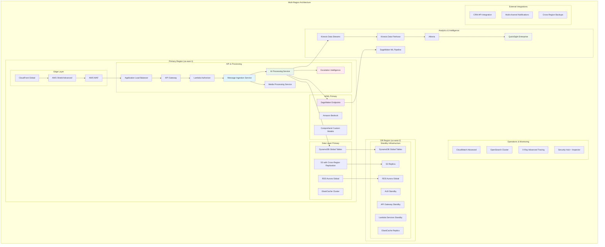

# Phase 3: Production Excellence

## 🎯 Phase Overview

La Fase 3 transforma el sistema en una solución enterprise-ready con características avanzadas de producción: auto-scaling inteligente, disaster recovery, security compliance, advanced analytics y optimización de performance. El objetivo es alcanzar la excelencia operacional para manejar escalas empresariales.

**Duración**: 2 semanas  
**Objetivo**: Sistema enterprise-ready manejando 50,000+ mensajes/día con 99.9% uptime

## 📅 Timeline Detallado

### Semana 7: Performance & Reliability Excellence

#### Días 43-45: Advanced Auto-Scaling & Performance
```yaml
Tareas Críticas:
  - Implementación de auto-scaling predictivo
  - Performance optimization avanzada
  - Connection pooling y caching optimization
  - Lambda provisioned concurrency setup
  
Entregables:
  - Auto-scaling basado en métricas predictivas
  - Performance optimized para >50k mensajes/día
  - Cold start mitigation implementado
  - Resource utilization optimizado
```

#### Días 46-47: Disaster Recovery & High Availability
```yaml
Tareas Críticas:
  - Multi-region disaster recovery setup
  - Cross-region data replication
  - Automated failover procedures
  - Disaster recovery testing
  
Entregables:
  - DR solution con RTO < 15 minutes
  - Cross-region backup strategy
  - Automated failover mechanisms
  - DR procedures documented y tested
```

#### Día 48: Advanced Security & Compliance
```yaml
Tareas Críticas:
  - Security compliance validation (SOC2, ISO27001)
  - Advanced threat detection implementation
  - Data encryption enhancements
  - Penetration testing
  
Entregables:
  - Security compliance certification ready
  - Advanced threat detection active
  - Enhanced encryption strategy
  - Security assessment completed
```

### Semana 8: Advanced Analytics & Operations Excellence

#### Días 49-50: Advanced Business Intelligence
```yaml
Tareas Críticas:
  - Machine learning model para conversation insights
  - Predictive analytics implementation
  - Advanced dashboard creation
  - Real-time business intelligence
  
Entregables:
  - ML-powered conversation insights
  - Predictive analytics dashboard
  - Business intelligence reports
  - Real-time decision support system
```

#### Días 51-52: Operations Excellence & Automation
```yaml
Tareas Críticas:
  - Automated operations workflows
  - Self-healing system implementation
  - Advanced monitoring y alerting
  - Automated incident response
  
Entregables:
  - Full operational automation
  - Self-healing capabilities
  - Proactive monitoring system
  - Automated incident response
```

#### Días 53-56: Final Optimization & Production Launch
```yaml
Tareas Críticas:
  - Final performance optimization
  - Cost optimization implementation
  - Production deployment
  - Team training y handover
  
Entregables:
  - Production system optimized
  - Cost targets achieved
  - Team fully trained
  - Production launch successful
```

## 🏗️ Arquitectura Enterprise - Fase 3



## 🔧 Advanced Implementation Details

### 1. Predictive Auto-Scaling System

```python
# src/operations/predictive_scaling.py
import json
import boto3
import pandas as pd
from datetime import datetime, timedelta
import numpy as np
from sklearn.linear_model import LinearRegression
import logging

logger = logging.getLogger()
logger.setLevel(logging.INFO)

class PredictiveAutoScaling:
    def __init__(self):
        self.cloudwatch = boto3.client('cloudwatch')
        self.application_autoscaling = boto3.client('application-autoscaling')
        self.lambda_client = boto3.client('lambda')
        
    def analyze_traffic_patterns(self, days_back=30):
        """Analyze historical traffic patterns for prediction"""
        try:
            end_time = datetime.now()
            start_time = end_time - timedelta(days=days_back)
            
            # Get historical metrics
            metrics_response = self.cloudwatch.get_metric_statistics(
                Namespace='AWS/Lambda',
                MetricName='Invocations',
                Dimensions=[
                    {'Name': 'FunctionName', 'Value': 'ai-processing-service'}
                ],
                StartTime=start_time,
                EndTime=end_time,
                Period=3600,  # Hourly data
                Statistics=['Sum']
            )
            
            # Convert to DataFrame for analysis
            data = []
            for datapoint in metrics_response['Datapoints']:
                data.append({
                    'timestamp': datapoint['Timestamp'],
                    'hour': datapoint['Timestamp'].hour,
                    'day_of_week': datapoint['Timestamp'].weekday(),
                    'invocations': datapoint['Sum']
                })
            
            df = pd.DataFrame(data)
            
            if df.empty:
                logger.warning("No historical data available for prediction")
                return None
            
            # Analyze patterns
            patterns = {
                'hourly_avg': df.groupby('hour')['invocations'].mean().to_dict(),
                'daily_avg': df.groupby('day_of_week')['invocations'].mean().to_dict(),
                'peak_hours': df.groupby('hour')['invocations'].mean().nlargest(3).index.tolist(),
                'peak_days': df.groupby('day_of_week')['invocations'].mean().nlargest(2).index.tolist()
            }
            
            return patterns
            
        except Exception as e:
            logger.error(f"Error analyzing traffic patterns: {str(e)}")
            return None

    def predict_traffic_load(self, hours_ahead=24):
        """Predict traffic load for the next N hours"""
        try:
            patterns = self.analyze_traffic_patterns()
            if not patterns:
                return None
            
            current_time = datetime.now()
            predictions = []
            
            for i in range(hours_ahead):
                future_time = current_time + timedelta(hours=i)
                hour = future_time.hour
                day_of_week = future_time.weekday()
                
                # Base prediction on historical patterns
                hourly_factor = patterns['hourly_avg'].get(hour, 100)
                daily_factor = patterns['daily_avg'].get(day_of_week, 100)
                
                # Weighted average with trend adjustment
                predicted_load = (hourly_factor * 0.6) + (daily_factor * 0.4)
                
                # Adjust for peak hours/days
                if hour in patterns['peak_hours']:
                    predicted_load *= 1.5
                if day_of_week in patterns['peak_days']:
                    predicted_load *= 1.2
                
                predictions.append({
                    'timestamp': future_time,
                    'predicted_invocations': int(predicted_load),
                    'confidence': self._calculate_prediction_confidence(patterns, hour, day_of_week)
                })
            
            return predictions
            
        except Exception as e:
            logger.error(f"Error predicting traffic load: {str(e)}")
            return None

    def implement_predictive_scaling(self):
        """Implement predictive scaling based on traffic predictions"""
        try:
            predictions = self.predict_traffic_load(hours_ahead=6)
            if not predictions:
                return
            
            # Find peak predicted load in next 6 hours
            peak_prediction = max(predictions, key=lambda x: x['predicted_invocations'])
            
            # Calculate required provisioned concurrency
            base_concurrency = 10  # Minimum
            predicted_concurrent = int(peak_prediction['predicted_invocations'] / 3600 * 60)  # Per minute
            required_concurrency = max(base_concurrency, min(predicted_concurrent, 1000))  # Cap at 1000
            
            # Check current provisioned concurrency
            current_config = self.lambda_client.get_provisioned_concurrency_config(
                FunctionName='ai-processing-service'
            )
            
            current_concurrency = current_config.get('AllocatedConcurrencyExecutions', 0)
            
            # Adjust if significant difference
            if abs(required_concurrency - current_concurrency) > 5:
                self.lambda_client.put_provisioned_concurrency_config(
                    FunctionName='ai-processing-service',
                    AllocatedConcurrencyExecutions=required_concurrency
                )
                
                logger.info(f"Adjusted provisioned concurrency from {current_concurrency} to {required_concurrency}")
                
                # Send notification about scaling adjustment
                self._send_scaling_notification(current_concurrency, required_concurrency, peak_prediction)
            
        except Exception as e:
            logger.error(f"Error implementing predictive scaling: {str(e)}")

    def _calculate_prediction_confidence(self, patterns, hour, day_of_week):
        """Calculate confidence score for prediction"""
        # Higher confidence for hours/days with more data points
        hourly_samples = len([h for h in patterns['hourly_avg'] if h == hour])
        daily_samples = len([d for d in patterns['daily_avg'] if d == day_of_week])
        
        confidence = min(0.95, (hourly_samples + daily_samples) / 60)
        return round(confidence, 2)

# Lambda handler for predictive scaling
predictive_scaler = PredictiveAutoScaling()

def lambda_handler(event, context):
    """Lambda handler for predictive scaling (run every 30 minutes)"""
    try:
        predictive_scaler.implement_predictive_scaling()
        return {'statusCode': 200, 'body': 'Predictive scaling completed'}
    except Exception as e:
        logger.error(f"Predictive scaling error: {str(e)}")
        return {'statusCode': 500, 'body': str(e)}
```

### 2. Disaster Recovery & High Availability

```python
# src/operations/disaster_recovery.py
import json
import boto3
from datetime import datetime
import logging

logger = logging.getLogger()
logger.setLevel(logging.INFO)

class DisasterRecoveryManager:
    def __init__(self):
        self.route53 = boto3.client('route53')
        self.cloudformation = boto3.client('cloudformation')
        self.s3 = boto3.client('s3')
        self.primary_region = 'us-east-1'
        self.dr_region = 'us-west-2'
        
    def setup_cross_region_replication(self):
        """Setup cross-region replication for critical data"""
        try:
            # DynamoDB Global Tables setup
            dynamodb_primary = boto3.client('dynamodb', region_name=self.primary_region)
            dynamodb_dr = boto3.client('dynamodb', region_name=self.dr_region)
            
            tables_to_replicate = ['conversation-contexts', 'user-profiles', 'analytics-data']
            
            for table_name in tables_to_replicate:
                # Enable streams on primary table
                try:
                    dynamodb_primary.update_table(
                        TableName=table_name,
                        StreamSpecification={
                            'StreamEnabled': True,
                            'StreamViewType': 'NEW_AND_OLD_IMAGES'
                        }
                    )
                    logger.info(f"Enabled DynamoDB streams for {table_name}")
                except Exception as e:
                    logger.warning(f"Streams already enabled for {table_name}: {str(e)}")
                
                # Create global table
                try:
                    response = dynamodb_primary.create_global_table(
                        GlobalTableName=table_name,
                        ReplicationGroup=[
                            {'RegionName': self.primary_region},
                            {'RegionName': self.dr_region}
                        ]
                    )
                    logger.info(f"Created global table for {table_name}")
                except Exception as e:
                    logger.warning(f"Global table may already exist for {table_name}: {str(e)}")
            
            # S3 Cross-Region Replication
            replication_config = {
                'Role': f'arn:aws:iam::{boto3.client("sts").get_caller_identity()["Account"]}:role/s3-replication-role',
                'Rules': [
                    {
                        'ID': 'ReplicateAll',
                        'Status': 'Enabled',
                        'Prefix': '',
                        'Destination': {
                            'Bucket': f'arn:aws:s3:::whatsapp-media-backup-{self.dr_region}',
                            'StorageClass': 'STANDARD_IA'
                        }
                    }
                ]
            }
            
            self.s3.put_bucket_replication(
                Bucket='whatsapp-media-bucket',
                ReplicationConfiguration=replication_config
            )
            
            logger.info("S3 cross-region replication configured")
            
        except Exception as e:
            logger.error(f"Error setting up cross-region replication: {str(e)}")
            raise

    def test_disaster_recovery(self):
        """Test disaster recovery procedures"""
        try:
            test_results = {
                'timestamp': datetime.now().isoformat(),
                'tests_performed': [],
                'results': {}
            }
            
            # Test 1: Database failover
            test_results['tests_performed'].append('database_failover')
            db_test = self._test_database_failover()
            test_results['results']['database_failover'] = db_test
            
            # Test 2: Application failover
            test_results['tests_performed'].append('application_failover')
            app_test = self._test_application_failover()
            test_results['results']['application_failover'] = app_test
            
            # Test 3: Data consistency check
            test_results['tests_performed'].append('data_consistency')
            consistency_test = self._test_data_consistency()
            test_results['results']['data_consistency'] = consistency_test
            
            # Test 4: Recovery time measurement
            test_results['tests_performed'].append('recovery_time')
            recovery_test = self._test_recovery_time()
            test_results['results']['recovery_time'] = recovery_test
            
            # Store test results
            self._store_dr_test_results(test_results)
            
            # Send notification if any tests failed
            if any(not result['passed'] for result in test_results['results'].values()):
                self._send_dr_alert(test_results)
            
            return test_results
            
        except Exception as e:
            logger.error(f"Error testing disaster recovery: {str(e)}")
            raise

    def initiate_failover(self, reason="manual"):
        """Initiate failover to disaster recovery region"""
        try:
            failover_log = {
                'timestamp': datetime.now().isoformat(),
                'reason': reason,
                'steps': []
            }
            
            # Step 1: Update Route 53 health checks
            failover_log['steps'].append('updating_route53')
            self._update_route53_failover()
            
            # Step 2: Activate DR Lambda functions
            failover_log['steps'].append('activating_dr_functions')
            self._activate_dr_functions()
            
            # Step 3: Verify data replication
            failover_log['steps'].append('verifying_data_sync')
            sync_status = self._verify_data_sync()
            
            if not sync_status['success']:
                raise Exception(f"Data sync verification failed: {sync_status['error']}")
            
            # Step 4: Update application configuration
            failover_log['steps'].append('updating_app_config')
            self._update_app_config_for_dr()
            
            # Step 5: Send notifications
            failover_log['steps'].append('sending_notifications')
            self._send_failover_notifications(failover_log)
            
            logger.info("Disaster recovery failover completed successfully")
            return {'status': 'success', 'log': failover_log}
            
        except Exception as e:
            logger.error(f"Error during failover: {str(e)}")
            self._send_failover_error_notification(str(e))
            raise

    def _test_database_failover(self):
        """Test database failover capabilities"""
        try:
            # Test writing to primary and reading from secondary
            dynamodb_primary = boto3.resource('dynamodb', region_name=self.primary_region)
            dynamodb_dr = boto3.resource('dynamodb', region_name=self.dr_region)
            
            test_table_primary = dynamodb_primary.Table('conversation-contexts')
            test_table_dr = dynamodb_dr.Table('conversation-contexts')
            
            # Write test record to primary
            test_record = {
                'user_id': 'DR_TEST_USER',
                'timestamp': datetime.now().isoformat(),
                'role': 'test',
                'content': 'DR test message'
            }
            
            test_table_primary.put_item(Item=test_record)
            
            # Wait for replication (up to 30 seconds)
            import time
            max_wait = 30
            wait_time = 0
            
            while wait_time < max_wait:
                try:
                    response = test_table_dr.get_item(
                        Key={'user_id': test_record['user_id'], 'timestamp': test_record['timestamp']}
                    )
                    if 'Item' in response:
                        break
                except:
                    pass
                
                time.sleep(1)
                wait_time += 1
            
            # Cleanup
            test_table_primary.delete_item(
                Key={'user_id': test_record['user_id'], 'timestamp': test_record['timestamp']}
            )
            
            return {
                'passed': wait_time < max_wait,
                'replication_time_seconds': wait_time,
                'details': f"Replication completed in {wait_time} seconds"
            }
            
        except Exception as e:
            return {
                'passed': False,
                'error': str(e),
                'details': "Database failover test failed"
            }
```

### 3. Advanced Machine Learning Analytics

```python
# src/analytics/ml_conversation_insights.py
import json
import boto3
import pandas as pd
import numpy as np
from datetime import datetime, timedelta
from sklearn.cluster import KMeans
from sklearn.feature_extraction.text import TfidfVectorizer
from sklearn.metrics.pairwise import cosine_similarity
import logging

logger = logging.getLogger()
logger.setLevel(logging.INFO)

class MLConversationInsights:
    def __init__(self):
        self.sagemaker = boto3.client('sagemaker')
        self.sagemaker_runtime = boto3.client('sagemaker-runtime')
        self.s3 = boto3.client('s3')
        self.comprehend = boto3.client('comprehend')
        
    def analyze_conversation_clusters(self, days_back=7):
        """Analyze conversation patterns using ML clustering"""
        try:
            # Get conversation data
            conversations = self._get_conversation_data(days_back)
            
            if len(conversations) < 10:
                logger.warning("Insufficient data for clustering analysis")
                return None
            
            # Prepare text data
            conversation_texts = []
            for conv in conversations:
                # Combine user messages for clustering
                user_messages = [msg['content'] for msg in conv.get('messages', []) 
                               if msg.get('role') == 'user']
                conversation_texts.append(' '.join(user_messages))
            
            # Vectorize text data
            vectorizer = TfidfVectorizer(
                max_features=1000,
                stop_words='spanish',
                ngram_range=(1, 2)
            )
            
            text_vectors = vectorizer.fit_transform(conversation_texts)
            
            # Perform clustering
            n_clusters = min(8, len(conversations) // 3)  # Dynamic cluster count
            kmeans = KMeans(n_clusters=n_clusters, random_state=42)
            cluster_labels = kmeans.fit_predict(text_vectors)
            
            # Analyze clusters
            clusters = {}
            for i in range(n_clusters):
                cluster_conversations = [conv for j, conv in enumerate(conversations) if cluster_labels[j] == i]
                cluster_texts = [text for j, text in enumerate(conversation_texts) if cluster_labels[j] == i]
                
                # Extract cluster characteristics
                cluster_info = self._analyze_cluster_characteristics(cluster_conversations, cluster_texts, vectorizer)
                clusters[f'cluster_{i}'] = cluster_info
            
            # Generate insights
            insights = self._generate_cluster_insights(clusters, conversations)
            
            return {
                'clusters': clusters,
                'insights': insights,
                'total_conversations': len(conversations),
                'analysis_date': datetime.now().isoformat()
            }
            
        except Exception as e:
            logger.error(f"Error in conversation clustering: {str(e)}")
            return None

    def predict_user_intent_evolution(self, user_id):
        """Predict how a user's intent might evolve in the conversation"""
        try:
            # Get user's conversation history
            user_conversations = self._get_user_conversation_history(user_id)
            
            if len(user_conversations) < 3:
                return None  # Not enough data
            
            # Extract intent progression patterns
            intent_sequence = []
            sentiment_sequence = []
            
            for conv in user_conversations:
                intents = [msg.get('intent', 'unknown') for msg in conv.get('messages', [])]
                sentiments = [msg.get('sentiment', 'NEUTRAL') for msg in conv.get('messages', [])]
                
                intent_sequence.extend(intents)
                sentiment_sequence.extend(sentiments)
            
            # Analyze patterns
            intent_transitions = self._analyze_intent_transitions(intent_sequence)
            sentiment_trends = self._analyze_sentiment_trends(sentiment_sequence)
            
            # Predict next likely intent
            current_intent = intent_sequence[-1] if intent_sequence else 'unknown'
            predicted_intents = self._predict_next_intents(current_intent, intent_transitions)
            
            # Calculate user satisfaction trajectory
            satisfaction_trend = self._calculate_satisfaction_trend(sentiment_sequence)
            
            return {
                'user_id': user_id,
                'current_intent': current_intent,
                'predicted_intents': predicted_intents,
                'intent_transitions': intent_transitions,
                'satisfaction_trend': satisfaction_trend,
                'recommendations': self._generate_user_recommendations(predicted_intents, satisfaction_trend)
            }
            
        except Exception as e:
            logger.error(f"Error predicting user intent evolution: {str(e)}")
            return None

    def generate_business_intelligence_insights(self):
        """Generate comprehensive business intelligence insights"""
        try:
            insights = {
                'timestamp': datetime.now().isoformat(),
                'conversation_analytics': {},
                'user_behavior_insights': {},
                'operational_insights': {},
                'recommendations': []
            }
            
            # Conversation Analytics
            conversation_data = self._get_conversation_data(days_back=30)
            insights['conversation_analytics'] = {
                'total_conversations': len(conversation_data),
                'average_conversation_length': self._calculate_avg_conversation_length(conversation_data),
                'resolution_rate': self._calculate_resolution_rate(conversation_data),
                'top_topics': self._extract_trending_topics(conversation_data),
                'response_quality_score': self._calculate_response_quality(conversation_data)
            }
            
            # User Behavior Insights
            user_patterns = self._analyze_user_behavior_patterns(conversation_data)
            insights['user_behavior_insights'] = {
                'active_users': len(set(conv['user_id'] for conv in conversation_data)),
                'user_segments': user_patterns['segments'],
                'engagement_patterns': user_patterns['engagement'],
                'churn_indicators': user_patterns['churn_risk']
            }
            
            # Operational Insights
            operational_data = self._get_operational_metrics()
            insights['operational_insights'] = {
                'system_performance': operational_data['performance'],
                'cost_analysis': operational_data['costs'],
                'capacity_utilization': operational_data['capacity'],
                'error_analysis': operational_data['errors']
            }
            
            # Generate Recommendations
            insights['recommendations'] = self._generate_business_recommendations(insights)
            
            # Store insights
            self._store_business_insights(insights)
            
            # Create alerts for critical issues
            self._check_and_create_alerts(insights)
            
            return insights
            
        except Exception as e:
            logger.error(f"Error generating business insights: {str(e)}")
            return None

    def _analyze_cluster_characteristics(self, conversations, texts, vectorizer):
        """Analyze characteristics of a conversation cluster"""
        try:
            # Extract key terms
            feature_names = vectorizer.get_feature_names_out()
            tfidf_matrix = vectorizer.transform(texts)
            mean_scores = np.mean(tfidf_matrix.toarray(), axis=0)
            
            # Get top terms
            top_indices = np.argsort(mean_scores)[-10:]
            top_terms = [feature_names[i] for i in top_indices[::-1]]
            
            # Calculate cluster statistics
            cluster_stats = {
                'size': len(conversations),
                'top_terms': top_terms,
                'avg_conversation_length': np.mean([len(conv.get('messages', [])) for conv in conversations]),
                'avg_escalation_rate': np.mean([conv.get('escalated', False) for conv in conversations]),
                'dominant_sentiment': self._get_dominant_sentiment(conversations),
                'common_intents': self._get_common_intents(conversations)
            }
            
            return cluster_stats
            
        except Exception as e:
            logger.error(f"Error analyzing cluster characteristics: {str(e)}")
            return {}

    def create_predictive_models(self):
        """Create and train predictive models for various business metrics"""
        try:
            models_created = []
            
            # Model 1: Escalation Prediction
            escalation_model = self._create_escalation_prediction_model()
            if escalation_model:
                models_created.append('escalation_prediction')
            
            # Model 2: User Satisfaction Prediction
            satisfaction_model = self._create_satisfaction_prediction_model()
            if satisfaction_model:
                models_created.append('satisfaction_prediction')
            
            # Model 3: Conversation Resolution Prediction
            resolution_model = self._create_resolution_prediction_model()
            if resolution_model:
                models_created.append('resolution_prediction')
            
            # Deploy models to SageMaker endpoints
            deployed_endpoints = self._deploy_models_to_endpoints(models_created)
            
            return {
                'models_created': models_created,
                'deployed_endpoints': deployed_endpoints,
                'creation_timestamp': datetime.now().isoformat()
            }
            
        except Exception as e:
            logger.error(f"Error creating predictive models: {str(e)}")
            return None

# Lambda handler for ML insights
ml_insights = MLConversationInsights()

def lambda_handler(event, context):
    """Lambda handler for ML conversation insights (daily execution)"""
    try:
        # Generate daily insights
        insights = ml_insights.generate_business_intelligence_insights()
        
        # Perform cluster analysis
        cluster_analysis = ml_insights.analyze_conversation_clusters()
        
        # Update predictive models (weekly)
        current_day = datetime.now().weekday()
        if current_day == 0:  # Monday
            model_updates = ml_insights.create_predictive_models()
            insights['model_updates'] = model_updates
        
        return {
            'statusCode': 200,
            'body': json.dumps({
                'insights_generated': bool(insights),
                'clusters_analyzed': bool(cluster_analysis),
                'timestamp': datetime.now().isoformat()
            })
        }
        
    except Exception as e:
        logger.error(f"ML insights Lambda error: {str(e)}")
        return {'statusCode': 500, 'body': str(e)}
```

### 4. Self-Healing System Implementation

```python
# src/operations/self_healing.py
import json
import boto3
from datetime import datetime, timedelta
import logging

logger = logging.getLogger()
logger.setLevel(logging.INFO)

class SelfHealingSystem:
    def __init__(self):
        self.cloudwatch = boto3.client('cloudwatch')
        self.lambda_client = boto3.client('lambda')
        self.ecs = boto3.client('ecs')
        self.autoscaling = boto3.client('application-autoscaling')
        self.sns = boto3.client('sns')
        
        self.healing_actions = {
            'high_error_rate': self._heal_high_error_rate,
            'high_latency': self._heal_high_latency,
            'memory_pressure': self._heal_memory_pressure,
            'connection_errors': self._heal_connection_errors,
            'queue_backlog': self._heal_queue_backlog
        }

    def monitor_and_heal(self):
        """Main monitoring and healing function"""
        try:
            healing_actions_taken = []
            
            # Check various health indicators
            health_checks = {
                'error_rate': self._check_error_rate(),
                'latency': self._check_latency(),
                'memory_usage': self._check_memory_usage(),
                'connection_health': self._check_connection_health(),
                'queue_depth': self._check_queue_depth()
            }
            
            # Take healing actions based on issues found
            for check_name, check_result in health_checks.items():
                if check_result['needs_healing']:
                    action_taken = self._execute_healing_action(check_name, check_result)
                    if action_taken:
                        healing_actions_taken.append({
                            'issue': check_name,
                            'action': action_taken,
                            'timestamp': datetime.now().isoformat()
                        })
            
            # Log healing actions
            if healing_actions_taken:
                logger.info(f"Self-healing actions taken: {healing_actions_taken}")
                self._send_healing_notification(healing_actions_taken)
            
            return {
                'health_checks': health_checks,
                'healing_actions': healing_actions_taken,
                'timestamp': datetime.now().isoformat()
            }
            
        except Exception as e:
            logger.error(f"Error in self-healing system: {str(e)}")
            return None

    def _check_error_rate(self):
        """Check Lambda function error rates"""
        try:
            # Check error rate for last 15 minutes
            end_time = datetime.now()
            start_time = end_time - timedelta(minutes=15)
            
            # Get invocation count
            invocations = self.cloudwatch.get_metric_statistics(
                Namespace='AWS/Lambda',
                MetricName='Invocations',
                Dimensions=[{'Name': 'FunctionName', 'Value': 'ai-processing-service'}],
                StartTime=start_time,
                EndTime=end_time,
                Period=300,
                Statistics=['Sum']
            )
            
            # Get error count
            errors = self.cloudwatch.get_metric_statistics(
                Namespace='AWS/Lambda',
                MetricName='Errors',
                Dimensions=[{'Name': 'FunctionName', 'Value': 'ai-processing-service'}],
                StartTime=start_time,
                EndTime=end_time,
                Period=300,
                Statistics=['Sum']
            )
            
            total_invocations = sum(point['Sum'] for point in invocations['Datapoints'])
            total_errors = sum(point['Sum'] for point in errors['Datapoints'])
            
            if total_invocations > 0:
                error_rate = (total_errors / total_invocations) * 100
            else:
                error_rate = 0
            
            return {
                'error_rate': error_rate,
                'threshold': 5.0,  # 5% error rate threshold
                'needs_healing': error_rate > 5.0,
                'details': f"Error rate: {error_rate:.2f}% ({total_errors}/{total_invocations})"
            }
            
        except Exception as e:
            logger.error(f"Error checking error rate: {str(e)}")
            return {'error_rate': 0, 'needs_healing': False, 'error': str(e)}

    def _heal_high_error_rate(self, check_result):
        """Healing action for high error rate"""
        try:
            actions_taken = []
            
            # Action 1: Restart Lambda functions with provisioned concurrency
            try:
                self.lambda_client.put_provisioned_concurrency_config(
                    FunctionName='ai-processing-service',
                    AllocatedConcurrencyExecutions=20
                )
                actions_taken.append("Increased provisioned concurrency")
            except Exception as e:
                logger.warning(f"Could not adjust provisioned concurrency: {str(e)}")
            
            # Action 2: Enable X-Ray tracing for better debugging
            try:
                self.lambda_client.update_function_configuration(
                    FunctionName='ai-processing-service',
                    TracingConfig={'Mode': 'Active'}
                )
                actions_taken.append("Enabled X-Ray tracing")
            except Exception as e:
                logger.warning(f"Could not enable X-Ray tracing: {str(e)}")
            
            # Action 3: Create CloudWatch alarm for monitoring
            try:
                self.cloudwatch.put_metric_alarm(
                    AlarmName='HighErrorRateHealing',
                    ComparisonOperator='GreaterThanThreshold',
                    EvaluationPeriods=2,
                    MetricName='Errors',
                    Namespace='AWS/Lambda',
                    Period=300,
                    Statistic='Sum',
                    Threshold=10.0,
                    ActionsEnabled=True,
                    AlarmActions=[os.environ.get('ALERT_TOPIC_ARN')],
                    AlarmDescription='High error rate detected by self-healing system'
                )
                actions_taken.append("Created error monitoring alarm")
            except Exception as e:
                logger.warning(f"Could not create alarm: {str(e)}")
            
            return f"High error rate healing: {', '.join(actions_taken)}"
            
        except Exception as e:
            logger.error(f"Error in high error rate healing: {str(e)}")
            return None

    def _heal_high_latency(self, check_result):
        """Healing action for high latency"""
        try:
            actions_taken = []
            
            # Action 1: Increase Lambda memory allocation
            current_config = self.lambda_client.get_function_configuration(
                FunctionName='ai-processing-service'
            )
            
            current_memory = current_config['MemorySize']
            new_memory = min(current_memory * 2, 10240)  # Max 10GB
            
            if new_memory > current_memory:
                self.lambda_client.update_function_configuration(
                    FunctionName='ai-processing-service',
                    MemorySize=new_memory
                )
                actions_taken.append(f"Increased memory from {current_memory}MB to {new_memory}MB")
            
            # Action 2: Warm up Lambda functions
            try:
                # Invoke function to warm up
                self.lambda_client.invoke(
                    FunctionName='ai-processing-service',
                    InvocationType='Event',
                    Payload=json.dumps({'warmup': True})
                )
                actions_taken.append("Initiated Lambda warmup")
            except Exception as e:
                logger.warning(f"Could not warm up Lambda: {str(e)}")
            
            return f"High latency healing: {', '.join(actions_taken)}"
            
        except Exception as e:
            logger.error(f"Error in high latency healing: {str(e)}")
            return None

    def _heal_queue_backlog(self, check_result):
        """Healing action for queue backlog"""
        try:
            actions_taken = []
            queue_depth = check_result['queue_depth']
            
            # Action 1: Increase Lambda concurrency temporarily
            if queue_depth > 1000:
                try:
                    self.lambda_client.put_provisioned_concurrency_config(
                        FunctionName='ai-processing-service',
                        AllocatedConcurrencyExecutions=50
                    )
                    actions_taken.append("Increased Lambda concurrency to 50")
                except Exception as e:
                    logger.warning(f"Could not increase concurrency: {str(e)}")
            
            # Action 2: Enable batch processing if not already enabled
            try:
                # Update event source mapping to process more messages per batch
                event_mappings = self.lambda_client.list_event_source_mappings(
                    FunctionName='ai-processing-service'
                )
                
                for mapping in event_mappings['EventSourceMappings']:
                    if mapping['BatchSize'] < 10:
                        self.lambda_client.update_event_source_mapping(
                            UUID=mapping['UUID'],
                            BatchSize=10
                        )
                        actions_taken.append("Increased batch size to 10")
            except Exception as e:
                logger.warning(f"Could not update batch size: {str(e)}")
            
            # Action 3: Alert operations team for very high backlogs
            if queue_depth > 5000:
                self._send_critical_alert(
                    f"Critical queue backlog: {queue_depth} messages",
                    check_result
                )
                actions_taken.append("Sent critical alert to operations team")
            
            return f"Queue backlog healing: {', '.join(actions_taken)}"
            
        except Exception as e:
            logger.error(f"Error in queue backlog healing: {str(e)}")
            return None

# Lambda handler for self-healing
self_healing_system = SelfHealingSystem()

def lambda_handler(event, context):
    """Lambda handler for self-healing system (runs every 5 minutes)"""
    try:
        result = self_healing_system.monitor_and_heal()
        
        return {
            'statusCode': 200,
            'body': json.dumps({
                'healing_completed': bool(result),
                'actions_taken': len(result.get('healing_actions', [])) if result else 0,
                'timestamp': datetime.now().isoformat()
            })
        }
        
    except Exception as e:
        logger.error(f"Self-healing Lambda error: {str(e)}")
        return {'statusCode': 500, 'body': str(e)}
```

## 📊 Success Criteria & KPIs - Phase 3

### Enterprise Performance Metrics
```yaml
Production Excellence Targets:
  Throughput:
    - Peak messages: 50,000/day
    - Concurrent users: 1,000+
    - Processing rate: 100 messages/second
    - Auto-scaling response: < 30 seconds
    
  Reliability:
    - Uptime: 99.9% (43.2 minutes downtime/month max)
    - Error rate: < 0.1%
    - Data consistency: 99.99%
    - Disaster recovery RTO: < 15 minutes
    - Disaster recovery RPO: < 5 minutes
    
  Performance:
    - Text processing: < 1.5 seconds (99th percentile)
    - Media processing: < 20 seconds average
    - Context retrieval: < 100ms
    - Dashboard load time: < 3 seconds

AI & Analytics Excellence:
  Intelligence Metrics:
    - Intent classification accuracy: > 90%
    - Sentiment analysis accuracy: > 92%
    - Conversation clustering effectiveness: > 85%
    - Predictive model accuracy: > 80%
    
  Business Intelligence:
    - Real-time dashboard updates: < 30 seconds
    - Daily insights generation: < 5 minutes
    - ML model training time: < 2 hours
    - Business report accuracy: > 95%
```

### Operational Excellence Metrics
```yaml
Self-Healing System:
  Detection Speed:
    - Issue detection time: < 2 minutes
    - Healing action initiation: < 30 seconds
    - Full recovery time: < 5 minutes
    - False positive rate: < 5%
    
  Automation Coverage:
    - Automated issue resolution: > 80%
    - Manual intervention required: < 20%
    - Successful healing actions: > 95%
    
Security & Compliance:
  Security Metrics:
    - Security scan compliance: 100%
    - Vulnerability response time: < 4 hours
    - Data encryption coverage: 100%
    - Access audit compliance: 100%
    
Cost Optimization:
  Financial Targets:
    - Cost per conversation: < $0.05
    - Total monthly cost: < $2,000 for 50k messages
    - Cost reduction from Phase 2: 15%
    - Resource utilization: > 75%
```

## 🚀 Production Launch Strategy

### Pre-Production Checklist
```yaml
Infrastructure Validation:
  - [ ] Multi-region setup verified
  - [ ] Disaster recovery tested successfully
  - [ ] Auto-scaling validated under load
  - [ ] Security compliance certified
  - [ ] Performance benchmarks achieved
  - [ ] Monitoring and alerting comprehensive

Business Readiness:
  - [ ] SLA agreements defined and approved
  - [ ] Support procedures documented
  - [ ] Team training completed
  - [ ] Escalation processes tested
  - [ ] Business continuity plan approved

Technical Validation:
  - [ ] Load testing passed (50k messages/day)
  - [ ] Failover testing successful
  - [ ] Security penetration testing passed
  - [ ] Data backup and recovery validated
  - [ ] Integration testing with all external systems
```

### Launch Phases
```yaml
Phase A (Week 8, Days 1-2):
  - Soft launch with 10% traffic
  - Monitor all metrics closely
  - Validate performance and stability
  
Phase B (Week 8, Days 3-4):
  - Increase to 50% traffic
  - Test auto-scaling under real load
  - Validate business intelligence dashboards
  
Phase C (Week 8, Days 5-7):
  - Full production traffic (100%)
  - Complete monitoring of all systems
  - Final optimization and tuning
  - Post-launch review and documentation
```

### Success Validation
```yaml
24-Hour Post-Launch Validation:
  - [ ] All systems operating within SLA
  - [ ] Error rates below thresholds
  - [ ] Performance metrics achieved
  - [ ] No security incidents
  - [ ] Customer satisfaction maintained

7-Day Post-Launch Review:
  - [ ] Full disaster recovery test
  - [ ] Cost analysis and optimization
  - [ ] Performance optimization opportunities
  - [ ] Team feedback and improvements
  - [ ] Business stakeholder satisfaction
```

---

**Próximo**: [Deployment Strategy](deployment-strategy.md) para detalles específicos de despliegue y go-live procedures.