# Integración de AI Actions con Typing Simulation en Bird.com

## 📋 Resumen de Integración

Las AI Actions de Bird.com pueden ser utilizadas para crear una integración más sofisticada del typing simulation, permitiendo procesamiento personalizado, análisis de contexto avanzado y optimización dinámica de delays directamente dentro del flujo de conversación.

### 🎯 Objetivos de la Integración

**Capacidades Avanzadas:**
- ✅ Cálculo de delays en tiempo real dentro de Bird.com
- ✅ Análisis de contexto conversacional avanzado
- ✅ Personalización de timing basada en perfil de usuario
- ✅ Integración seamless con AI Employee workflows
- ✅ Optimización automática de delays mediante ML
- ✅ Fallbacks inteligentes para situaciones de error

---

## 🏗️ Arquitectura de AI Actions para Typing

### Diagrama de Flujo

```mermaid
graph TD
    A[Usuario envía mensaje] -->|WhatsApp| B[Bird.com AI Employee]
    B -->|Genera respuesta| C[AI Action: Typing Calculator]
    C -->|Analiza contexto| D[Delay Calculation API]
    D -->|Retorna delay óptimo| C
    C -->|Configura timing| E[AI Action: Queue Manager]
    E -->|Programa envío| F[AI Action: Message Scheduler]
    F -->|Delay aplicado| G[WhatsApp Business API]
    G -->|Mensaje con timing| A
    
    C --> H[AI Action: Analytics Collector]
    H --> I[Metrics Database]
    
    style C fill:#ff9999
    style E fill:#99ccff  
    style F fill:#99ff99
    style H fill:#ffcc99
```



### AI Actions Requeridas

```yaml
AI Actions Architecture:
  Core Actions:
    - typing_delay_calculator: Cálculo inteligente de delays
    - conversation_analyzer: Análisis de contexto conversacional
    - user_profiler: Perfilado de comportamiento de usuario
    - message_scheduler: Programación de envío con timing
    - queue_manager: Gestión de cola de mensajes
    - analytics_collector: Recolección de métricas
    
  Support Actions:
    - cultural_adapter: Adaptación cultural de timing
    - complexity_analyzer: Análisis de complejidad de respuesta
    - performance_optimizer: Optimización basada en métricas
    - fallback_handler: Manejo de errores y fallbacks
```

---

## 🔧 Implementación de AI Actions

### AI Action 1: Typing Delay Calculator

#### Configuración en Bird.com

```yaml
# En Bird.com Dashboard: AI Actions → Create New Action

Action Name: "typing_delay_calculator"
Display Name: "Calculadora de Delay de Typing"
Description: "Calcula el delay óptimo para simular typing natural basado en contexto"

Trigger Configuration:
  Event Types: 
    - ai.response.generated
    - message.about_to_send
  
  Conditions:
    - conversation.channel == "whatsapp"
    - message.type == "text"
    - typing_simulation.enabled == true

Parameters:
  Input Parameters:
    - message_content (string, required): Contenido del mensaje a enviar
    - conversation_context (object, required): Contexto de la conversación
    - user_profile (object, optional): Perfil del usuario
    - ai_employee (string, required): Tipo de AI Employee
  
  Output Parameters:
    - calculated_delay (integer): Delay en milisegundos
    - complexity_score (string): Nivel de complejidad detectado
    - confidence_level (float): Confianza en el cálculo
    - fallback_delay (integer): Delay de respaldo
```

#### Implementación del Endpoint

```javascript
// typing-delay-calculator-action.js
const express = require('express');
const app = express();

class TypingDelayCalculatorAction {
  constructor(config) {
    this.config = config;
    this.culturalProfiles = {
      colombia: { wpm: 35, patience: 'medium', formality: 'informal' },
      mexico: { wpm: 40, patience: 'high', formality: 'semi_formal' },
      default: { wpm: 35, patience: 'medium', formality: 'neutral' }
    };
    
    this.setupRoutes();
  }

  setupRoutes() {
    app.post('/bird-actions/typing-delay-calculator', this.handleDelayCalculation.bind(this));
    app.get('/bird-actions/typing-delay-calculator/health', this.healthCheck.bind(this));
  }

  async handleDelayCalculation(req, res) {
    try {
      const {
        message_content,
        conversation_context,
        user_profile,
        ai_employee
      } = req.body;

      // Validar parámetros requeridos
      if (!message_content || !conversation_context) {
        return res.status(400).json({
          success: false,
          error: 'Missing required parameters'
        });
      }

      // Análizar complejidad del mensaje
      const complexity = this.analyzeMessageComplexity(message_content, conversation_context);
      
      // Obtener perfil cultural
      const cultural = this.getCulturalProfile(user_profile);
      
      // Calcular delay base
      const baseDelay = this.calculateBaseDelay(message_content, cultural);
      
      // Aplicar multiplicadores de contexto
      const contextMultiplier = this.getContextMultiplier(conversation_context, ai_employee);
      
      // Calcular delay final
      const calculatedDelay = this.finalizeDelay(baseDelay, complexity, contextMultiplier);
      
      // Calcular confianza basada en datos disponibles
      const confidence = this.calculateConfidence(user_profile, conversation_context);
      
      // Generar respuesta
      const response = {
        success: true,
        calculated_delay: calculatedDelay,
        complexity_score: complexity,
        confidence_level: confidence,
        fallback_delay: this.config.default_delay || 2000,
        metadata: {
          cultural_profile: cultural,
          base_delay: baseDelay,
          context_multiplier: contextMultiplier,
          calculation_timestamp: new Date().toISOString()
        }
      };

      // Logging para análisis posterior
      this.logDelayCalculation(req.body, response);

      res.json(response);
      
    } catch (error) {
      console.error('Error in typing delay calculation:', error);
      
      res.status(500).json({
        success: false,
        error: 'Calculation failed',
        calculated_delay: this.config.default_delay || 2000,
        complexity_score: 'medium',
        confidence_level: 0.1,
        fallback_delay: this.config.default_delay || 2000
      });
    }
  }

  analyzeMessageComplexity(message, context) {
    let complexityScore = 0;
    
    // Análisis de longitud
    const words = message.split(' ').length;
    if (words < 5) complexityScore += 1;
    else if (words < 15) complexityScore += 2;
    else if (words < 30) complexityScore += 3;
    else complexityScore += 4;
    
    // Análisis de contenido técnico
    const technicalTerms = [
      'especificación', 'configuración', 'instalación', 'talla',
      'medidas', 'material', 'composición', 'precio', 'disponibilidad'
    ];
    
    const technicalCount = technicalTerms.reduce((count, term) => {
      return count + (message.toLowerCase().includes(term) ? 1 : 0);
    }, 0);
    
    complexityScore += technicalCount;
    
    // Análisis de preguntas
    const questionCount = (message.match(/\?/g) || []).length;
    complexityScore += questionCount * 0.5;
    
    // Análisis de contexto conversacional
    if (context.conversation_stage === 'product_search') complexityScore += 1;
    if (context.conversation_stage === 'detailed_inquiry') complexityScore += 2;
    if (context.actions_executed && context.actions_executed.length > 0) {
      complexityScore += context.actions_executed.length * 0.8;
    }
    
    // Mapear a categorías
    if (complexityScore <= 3) return 'simple';
    if (complexityScore <= 6) return 'medium';
    if (complexityScore <= 9) return 'complex';
    return 'technical';
  }

  getCulturalProfile(userProfile) {
    if (!userProfile || !userProfile.metadata) {
      return this.culturalProfiles.default;
    }
    
    const country = userProfile.metadata.country?.toLowerCase() ||
                   userProfile.metadata.location?.toLowerCase() ||
                   'default';
                   
    return this.culturalProfiles[country] || this.culturalProfiles.default;
  }

  calculateBaseDelay(message, culturalProfile) {
    const words = message.split(' ').length;
    const characters = message.length;
    
    // Cálculo basado en WPM (palabras por minuto)
    const typingTime = (words / culturalProfile.wpm) * 60 * 1000;
    
    // Factor de corrección para mensajes muy cortos o largos
    let correctionFactor = 1.0;
    if (words < 3) correctionFactor = 1.5; // Mensajes muy cortos
    if (words > 40) correctionFactor = 0.8; // Mensajes largos fluyen mejor
    
    return typingTime * correctionFactor;
  }

  getContextMultiplier(context, aiEmployee) {
    let multiplier = 1.0;
    
    // Multiplicador por tipo de AI Employee
    const employeeMultipliers = {
      'sales_specialist': 0.9,      // Ventas: respuestas ágiles
      'support_specialist': 1.1,    // Soporte: más cuidadoso
      'info_specialist': 1.0,       // Info: neutral
      'booking_agent': 0.8,         // Reservas: eficiente
      'orchestrator': 0.7           // Orquestador: rápido
    };
    
    multiplier *= employeeMultipliers[aiEmployee] || 1.0;
    
    // Multiplicador por etapa de conversación
    const stageMultipliers = {
      'greeting': 0.8,
      'product_search': 1.2,
      'detailed_inquiry': 1.3,
      'purchase': 1.0,
      'support': 1.1,
      'escalation': 0.6  // Urgente
    };
    
    multiplier *= stageMultipliers[context.conversation_stage] || 1.0;
    
    // Multiplicador por hora del día
    const hour = new Date().getHours();
    if (hour >= 9 && hour <= 18) {
      multiplier *= 0.9; // Horario laboral: más rápido
    }
    
    // Multiplicador por urgencia detectada
    if (context.urgency_detected) {
      multiplier *= 0.5; // Muy rápido para urgencias
    }
    
    return multiplier;
  }

  finalizeDelay(baseDelay, complexity, contextMultiplier) {
    // Multiplicadores por complejidad
    const complexityMultipliers = {
      'simple': 0.7,
      'medium': 1.0,
      'complex': 1.4,
      'technical': 1.8
    };
    
    // Tiempo de "pensamiento" adicional
    const thinkingTime = {
      'simple': 500,
      'medium': 1200,
      'complex': 2500,
      'technical': 4000
    };
    
    let finalDelay = (baseDelay * contextMultiplier * complexityMultipliers[complexity]) + thinkingTime[complexity];
    
    // Aplicar límites
    finalDelay = Math.max(finalDelay, this.config.min_delay || 800);
    finalDelay = Math.min(finalDelay, this.config.max_delay || 25000);
    
    // Variación natural
    const variation = (Math.random() - 0.5) * 0.3 + 1; // ±15%
    finalDelay *= variation;
    
    return Math.round(finalDelay);
  }

  calculateConfidence(userProfile, context) {
    let confidence = 0.5; // Base confidence
    
    // Incrementar confianza basado en datos disponibles
    if (userProfile && userProfile.metadata) confidence += 0.2;
    if (context.conversation_stage) confidence += 0.1;
    if (context.intent_confidence > 0.8) confidence += 0.1;
    if (context.actions_executed && context.actions_executed.length > 0) confidence += 0.1;
    
    return Math.min(confidence, 1.0);
  }

  logDelayCalculation(request, response) {
    const logEntry = {
      timestamp: new Date().toISOString(),
      conversation_id: request.conversation_context?.conversation_id,
      user_id: request.user_profile?.id,
      message_length: request.message_content?.length,
      calculated_delay: response.calculated_delay,
      complexity: response.complexity_score,
      confidence: response.confidence_level,
      ai_employee: request.ai_employee
    };
    
    // Enviar a sistema de logging/analytics
    console.log('Delay calculation:', JSON.stringify(logEntry));
  }

  healthCheck(req, res) {
    res.json({
      status: 'healthy',
      service: 'typing-delay-calculator',
      timestamp: new Date().toISOString(),
      version: '1.0.0'
    });
  }
}

// Inicializar el servicio
const config = {
  min_delay: parseInt(process.env.MIN_DELAY) || 800,
  max_delay: parseInt(process.env.MAX_DELAY) || 25000,
  default_delay: parseInt(process.env.DEFAULT_DELAY) || 2000
};

new TypingDelayCalculatorAction(config);

app.listen(process.env.PORT || 3001, () => {
  console.log('Typing Delay Calculator Action running on port', process.env.PORT || 3001);
});
```

### AI Action 2: Message Scheduler

#### Configuración en Bird.com

```yaml
Action Name: "message_scheduler"
Display Name: "Programador de Mensajes con Timing"
Description: "Programa el envío de mensajes con el delay calculado para typing simulation"

Trigger Configuration:
  Event Types:
    - typing_delay.calculated
    - message.ready_to_send

Parameters:
  Input Parameters:
    - message_content (string, required)
    - recipient_phone (string, required)  
    - calculated_delay (integer, required)
    - conversation_id (string, required)
    - priority (string, optional): urgent|high|normal|low
  
  Output Parameters:
    - scheduled (boolean): Si se programó correctamente
    - estimated_send_time (string): Tiempo estimado de envío
    - queue_position (integer): Posición en cola
    - scheduler_id (string): ID del trabajo programado
```

#### Implementación del Scheduler

```javascript
// message-scheduler-action.js
const Queue = require('bull');
const Redis = require('redis');

class MessageSchedulerAction {
  constructor(config) {
    this.config = config;
    this.redis = Redis.createClient(config.redis_url);
    
    // Crear colas por prioridad
    this.queues = {
      urgent: new Queue('urgent_messages', { redis: config.redis_url }),
      high: new Queue('high_messages', { redis: config.redis_url }),
      normal: new Queue('normal_messages', { redis: config.redis_url }),
      low: new Queue('low_messages', { redis: config.redis_url })
    };
    
    this.setupQueueProcessors();
    this.setupRoutes();
  }

  setupRoutes() {
    app.post('/bird-actions/message-scheduler', this.handleScheduleMessage.bind(this));
    app.get('/bird-actions/message-scheduler/stats', this.getQueueStats.bind(this));
  }

  async handleScheduleMessage(req, res) {
    try {
      const {
        message_content,
        recipient_phone,
        calculated_delay,
        conversation_id,
        priority = 'normal'
      } = req.body;

      // Validaciones
      if (!message_content || !recipient_phone || !calculated_delay) {
        return res.status(400).json({
          success: false,
          error: 'Missing required parameters'
        });
      }

      // Seleccionar cola apropiada
      const queue = this.queues[priority] || this.queues.normal;
      
      // Configurar opciones del job
      const jobOptions = {
        delay: calculated_delay,
        attempts: 3,
        backoff: {
          type: 'exponential',
          delay: 2000
        },
        removeOnComplete: 100,
        removeOnFail: 50
      };

      // Crear job data
      const jobData = {
        message_content,
        recipient_phone,
        conversation_id,
        original_delay: calculated_delay,
        scheduled_at: new Date().toISOString(),
        estimated_send_time: new Date(Date.now() + calculated_delay).toISOString()
      };

      // Agregar a cola
      const job = await queue.add('send_whatsapp_message', jobData, jobOptions);
      
      // Obtener posición en cola
      const queuePosition = await this.getQueuePosition(queue, job.id);

      const response = {
        success: true,
        scheduled: true,
        estimated_send_time: jobData.estimated_send_time,
        queue_position: queuePosition,
        scheduler_id: job.id,
        priority: priority,
        delay_applied: calculated_delay
      };

      res.json(response);
      
    } catch (error) {
      console.error('Error scheduling message:', error);
      
      res.status(500).json({
        success: false,
        scheduled: false,
        error: 'Scheduling failed'
      });
    }
  }

  setupQueueProcessors() {
    // Configurar procesadores para cada cola
    Object.entries(this.queues).forEach(([priority, queue]) => {
      const concurrency = priority === 'urgent' ? 20 : priority === 'high' ? 15 : 10;
      
      queue.process('send_whatsapp_message', concurrency, async (job) => {
        return await this.processMessageJob(job);
      });
      
      // Event listeners
      queue.on('completed', (job, result) => {
        console.log(`Message sent successfully: ${job.id}`, result);
      });
      
      queue.on('failed', (job, err) => {
        console.error(`Message sending failed: ${job.id}`, err);
      });
    });
  }

  async processMessageJob(job) {
    const { message_content, recipient_phone, conversation_id } = job.data;
    
    try {
      // Llamar a AI Action de envío de WhatsApp
      const sendResult = await this.sendViaWhatsAppAction({
        to: recipient_phone,
        message: message_content,
        conversation_id: conversation_id
      });

      return {
        success: true,
        whatsapp_message_id: sendResult.message_id,
        sent_at: new Date().toISOString(),
        actual_delay: Date.now() - job.timestamp
      };
      
    } catch (error) {
      console.error('Error sending WhatsApp message:', error);
      throw error;
    }
  }

  async sendViaWhatsAppAction(messageData) {
    // Llamar a otra AI Action o directamente a WhatsApp API
    const response = await fetch(`${this.config.whatsapp_sender_url}/send`, {
      method: 'POST',
      headers: {
        'Content-Type': 'application/json',
        'Authorization': `Bearer ${this.config.bird_api_key}`
      },
      body: JSON.stringify(messageData)
    });

    if (!response.ok) {
      throw new Error(`WhatsApp sending failed: ${response.status}`);
    }

    return await response.json();
  }

  async getQueuePosition(queue, jobId) {
    const waiting = await queue.getWaiting();
    const delayed = await queue.getDelayed();
    
    let position = waiting.findIndex(job => job.id === jobId);
    if (position === -1) {
      position = delayed.findIndex(job => job.id === jobId);
      if (position !== -1) {
        position += waiting.length; // Add waiting jobs before delayed ones
      }
    }
    
    return position === -1 ? null : position + 1;
  }

  async getQueueStats(req, res) {
    try {
      const stats = {};
      
      for (const [priority, queue] of Object.entries(this.queues)) {
        const waiting = await queue.getWaiting();
        const active = await queue.getActive();
        const delayed = await queue.getDelayed();
        const completed = await queue.getCompleted();
        const failed = await queue.getFailed();
        
        stats[priority] = {
          waiting: waiting.length,
          active: active.length,
          delayed: delayed.length,
          completed: completed.length,
          failed: failed.length,
          total: waiting.length + active.length + delayed.length
        };
      }
      
      res.json({
        success: true,
        queue_stats: stats,
        timestamp: new Date().toISOString()
      });
      
    } catch (error) {
      res.status(500).json({
        success: false,
        error: error.message
      });
    }
  }
}
```

### AI Action 3: Analytics Collector

#### Configuración en Bird.com

```yaml
Action Name: "typing_analytics_collector"
Display Name: "Recolector de Analytics de Typing"
Description: "Recolecta métricas de efectividad del typing simulation"

Trigger Configuration:
  Event Types:
    - message.sent_with_delay
    - conversation.ended
    - user.satisfaction_feedback
    
Parameters:
  Input Parameters:
    - event_type (string, required)
    - conversation_id (string, required)
    - metrics_data (object, required)
    - user_feedback (object, optional)
  
  Output Parameters:
    - recorded (boolean)
    - analytics_id (string)
    - insights (object): Insights generados
```

#### Implementación del Analytics Collector

```javascript
// typing-analytics-collector-action.js
class TypingAnalyticsCollectorAction {
  constructor(config) {
    this.config = config;
    this.setupRoutes();
  }

  setupRoutes() {
    app.post('/bird-actions/typing-analytics-collector', this.collectAnalytics.bind(this));
    app.get('/bird-actions/typing-analytics-collector/insights', this.generateInsights.bind(this));
  }

  async collectAnalytics(req, res) {
    try {
      const {
        event_type,
        conversation_id,
        metrics_data,
        user_feedback
      } = req.body;

      // Procesar según tipo de evento
      let analysisResult;
      
      switch (event_type) {
        case 'message.sent_with_delay':
          analysisResult = await this.analyzeMessageDelay(conversation_id, metrics_data);
          break;
          
        case 'conversation.ended':
          analysisResult = await this.analyzeConversationCompletion(conversation_id, metrics_data);
          break;
          
        case 'user.satisfaction_feedback':
          analysisResult = await this.analyzeUserSatisfaction(conversation_id, user_feedback);
          break;
          
        default:
          analysisResult = await this.analyzeGenericEvent(event_type, metrics_data);
      }

      // Almacenar métricas
      const analyticsId = await this.storeMetrics({
        event_type,
        conversation_id,
        metrics_data,
        user_feedback,
        analysis_result: analysisResult,
        recorded_at: new Date().toISOString()
      });

      // Generar insights en tiempo real
      const insights = await this.generateRealTimeInsights(conversation_id, analysisResult);

      res.json({
        success: true,
        recorded: true,
        analytics_id: analyticsId,
        insights: insights,
        analysis_result: analysisResult
      });
      
    } catch (error) {
      console.error('Error collecting analytics:', error);
      
      res.status(500).json({
        success: false,
        recorded: false,
        error: error.message
      });
    }
  }

  async analyzeMessageDelay(conversationId, metricsData) {
    const {
      calculated_delay,
      actual_delay,
      complexity,
      user_response_time,
      message_length
    } = metricsData;

    // Calcular efectividad del delay
    const delayAccuracy = Math.abs(calculated_delay - actual_delay) / calculated_delay;
    const effectiveness = delayAccuracy < 0.1 ? 'high' : delayAccuracy < 0.3 ? 'medium' : 'low';

    // Analizar tiempo de respuesta del usuario (indicador de engagement)
    let engagementScore = 0.5;
    if (user_response_time < 10000) engagementScore = 0.8; // Respuesta rápida = alta engagement
    else if (user_response_time < 30000) engagementScore = 0.6;
    else if (user_response_time > 120000) engagementScore = 0.2; // Respuesta muy lenta

    return {
      delay_effectiveness: effectiveness,
      engagement_score: engagementScore,
      timing_accuracy: 1 - delayAccuracy,
      complexity_match: this.evaluateComplexityMatch(complexity, message_length),
      recommendations: this.generateDelayRecommendations(metricsData)
    };
  }

  async analyzeConversationCompletion(conversationId, metricsData) {
    const {
      total_messages,
      total_delay_applied,
      conversation_duration,
      completion_status,
      user_satisfaction_score
    } = metricsData;

    const avgDelayPerMessage = total_delay_applied / total_messages;
    const conversationEfficiency = total_messages / (conversation_duration / 60000); // mensajes por minuto

    return {
      conversation_efficiency: conversationEfficiency,
      avg_delay_effectiveness: this.calculateDelayEffectiveness(avgDelayPerMessage),
      completion_success: completion_status === 'completed',
      user_satisfaction_impact: user_satisfaction_score || 0.5,
      typing_simulation_roi: this.calculateROI(metricsData)
    };
  }

  async generateRealTimeInsights(conversationId, analysisResult) {
    // Generar insights específicos para optimización
    const insights = {
      immediate_actions: [],
      optimization_opportunities: [],
      performance_trends: []
    };

    // Acciones inmediatas basadas en análisis
    if (analysisResult.engagement_score < 0.3) {
      insights.immediate_actions.push({
        type: 'reduce_delays',
        message: 'Usuario muestra baja engagement, reducir delays',
        suggested_adjustment: -0.3 // Reducir delays 30%
      });
    }

    if (analysisResult.delay_effectiveness === 'low') {
      insights.immediate_actions.push({
        type: 'recalibrate_timing',
        message: 'Precisión de timing baja, recalibrar algoritmos',
        suggested_action: 'review_calculation_parameters'
      });
    }

    // Oportunidades de optimización
    if (analysisResult.timing_accuracy > 0.8) {
      insights.optimization_opportunities.push({
        type: 'increase_complexity',
        message: 'Alta precisión de timing, puede manejar cálculos más complejos',
        opportunity_score: 0.7
      });
    }

    return insights;
  }

  generateDelayRecommendations(metricsData) {
    const recommendations = [];
    
    const { calculated_delay, user_response_time, complexity } = metricsData;
    
    // Recomendaciones basadas en tiempo de respuesta del usuario
    if (user_response_time < 5000 && calculated_delay > 5000) {
      recommendations.push({
        type: 'reduce_delay',
        reason: 'Usuario impaciente detectado',
        suggested_delay_range: [800, 3000]
      });
    }
    
    if (user_response_time > 60000 && calculated_delay < 3000) {
      recommendations.push({
        type: 'increase_delay',
        reason: 'Usuario paciente, puede manejar delays más naturales',
        suggested_delay_range: [3000, 8000]
      });
    }
    
    return recommendations;
  }

  async storeMetrics(metricsData) {
    // En implementación real, almacenar en base de datos
    const analyticsId = `analytics_${Date.now()}_${Math.random().toString(36).substr(2, 9)}`;
    
    // Simulación de almacenamiento
    console.log('Storing analytics:', {
      id: analyticsId,
      data: metricsData
    });
    
    return analyticsId;
  }
}
```

---

## 🔗 Configuración de Actions en Bird.com

### Configuración de Workflow

```yaml
# En Bird.com Dashboard: AI Employees → [Your Employee] → Workflow

Workflow Name: "Typing Simulation Enhanced"

Steps:
  1. Message Processing:
     - Trigger: ai.response.generated
     - Action: typing_delay_calculator
     - Input Mapping:
       - message_content: "{{generated_response.text}}"
       - conversation_context: "{{conversation.context}}"
       - user_profile: "{{contact.profile}}"
       - ai_employee: "{{employee.type}}"

  2. Message Scheduling:
     - Trigger: typing_delay.calculated
     - Action: message_scheduler
     - Input Mapping:
       - message_content: "{{step1.message_content}}"
       - recipient_phone: "{{contact.phone}}"
       - calculated_delay: "{{step1.calculated_delay}}"
       - conversation_id: "{{conversation.id}}"
       - priority: "{{step1.priority || 'normal'}}"

  3. Analytics Collection:
     - Trigger: message.sent_with_delay
     - Action: typing_analytics_collector
     - Input Mapping:
       - event_type: "message.sent_with_delay"
       - conversation_id: "{{conversation.id}}"
       - metrics_data: "{{step2.scheduling_result}}"

Conditions:
  - Execute only if: typing_simulation.enabled == true
  - Skip if: message.type != "text"
  - Priority: high for urgent messages, normal otherwise
```

### Variables de Configuración

```yaml
# Variables globales en Bird.com
Typing Simulation Variables:
  TYPING_SIMULATION_ENABLED: true
  MIN_TYPING_DELAY: 800
  MAX_TYPING_DELAY: 25000
  DEFAULT_CULTURAL_PROFILE: "colombia"
  ANALYTICS_SAMPLING_RATE: 1.0  # 100% de mensajes
  FALLBACK_DELAY: 2000

# URLs de Actions
Action Endpoints:
  TYPING_DELAY_CALCULATOR_URL: "https://tu-dominio.com/bird-actions/typing-delay-calculator"
  MESSAGE_SCHEDULER_URL: "https://tu-dominio.com/bird-actions/message-scheduler"  
  ANALYTICS_COLLECTOR_URL: "https://tu-dominio.com/bird-actions/typing-analytics-collector"

# Autenticación
Action Authentication:
  TYPE: "API_KEY"
  HEADER: "Authorization"
  VALUE: "Bearer {{BIRD_ACTIONS_API_KEY}}"
```

---

## 🧪 Testing de AI Actions

### Test de Integración

```javascript
// tests/ai-actions-integration.test.js
const { BirdActionsClient } = require('../src/bird-actions-client');

describe('Bird AI Actions Integration', () => {
  let actionsClient;
  
  beforeEach(() => {
    actionsClient = new BirdActionsClient({
      baseUrl: 'http://localhost:3001',
      apiKey: process.env.TEST_API_KEY
    });
  });

  test('should calculate typing delay correctly', async () => {
    const request = {
      message_content: 'Hola, encontré 3 vestidos perfectos para ti',
      conversation_context: {
        conversation_stage: 'product_search',
        ai_employee: 'sales_specialist',
        actions_executed: ['search_products']
      },
      user_profile: {
        metadata: {
          country: 'colombia',
          segment: 'regular'
        }
      }
    };

    const response = await actionsClient.callAction('typing_delay_calculator', request);
    
    expect(response.success).toBe(true);
    expect(response.calculated_delay).toBeGreaterThan(800);
    expect(response.calculated_delay).toBeLessThan(25000);
    expect(response.complexity_score).toBeOneOf(['simple', 'medium', 'complex', 'technical']);
    expect(response.confidence_level).toBeGreaterThan(0);
    expect(response.confidence_level).toBeLessThanOrEqual(1);
  });

  test('should schedule message with correct timing', async () => {
    const request = {
      message_content: 'Tu pedido está listo para envío',
      recipient_phone: '+573001234567',
      calculated_delay: 3500,
      conversation_id: 'conv_test_123',
      priority: 'high'
    };

    const response = await actionsClient.callAction('message_scheduler', request);
    
    expect(response.success).toBe(true);
    expect(response.scheduled).toBe(true);
    expect(response.scheduler_id).toBeDefined();
    expect(response.estimated_send_time).toBeDefined();
    
    // Verificar que el tiempo estimado es aproximadamente correcto
    const estimatedTime = new Date(response.estimated_send_time);
    const expectedTime = new Date(Date.now() + 3500);
    const timeDiff = Math.abs(estimatedTime - expectedTime);
    expect(timeDiff).toBeLessThan(1000); // Dentro de 1 segundo
  });

  test('should collect analytics correctly', async () => {
    const request = {
      event_type: 'message.sent_with_delay',
      conversation_id: 'conv_test_123',
      metrics_data: {
        calculated_delay: 3000,
        actual_delay: 3100,
        complexity: 'medium',
        user_response_time: 15000,
        message_length: 45
      }
    };

    const response = await actionsClient.callAction('typing_analytics_collector', request);
    
    expect(response.success).toBe(true);
    expect(response.recorded).toBe(true);
    expect(response.analytics_id).toBeDefined();
    expect(response.insights).toBeDefined();
    expect(response.analysis_result.delay_effectiveness).toBeOneOf(['low', 'medium', 'high']);
  });
});
```

### Test de Performance

```javascript
// tests/performance.test.js
describe('AI Actions Performance', () => {
  test('typing delay calculation should complete within 500ms', async () => {
    const start = Date.now();
    
    await actionsClient.callAction('typing_delay_calculator', sampleRequest);
    
    const duration = Date.now() - start;
    expect(duration).toBeLessThan(500);
  });

  test('should handle concurrent requests', async () => {
    const requests = Array(50).fill().map((_, i) => 
      actionsClient.callAction('typing_delay_calculator', {
        ...sampleRequest,
        conversation_context: {
          ...sampleRequest.conversation_context,
          conversation_id: `conv_${i}`
        }
      })
    );

    const responses = await Promise.all(requests);
    
    responses.forEach(response => {
      expect(response.success).toBe(true);
    });
  });
});
```

---

## 📊 Monitoreo de AI Actions

### Dashboard de Métricas

```javascript
// AI Actions monitoring dashboard
const actionMetrics = {
  typing_delay_calculator: {
    total_calls: 1250,
    avg_response_time: 120, // ms
    success_rate: 99.2,
    avg_delay_calculated: 4500,
    complexity_distribution: {
      simple: 35,
      medium: 45,
      complex: 15,
      technical: 5
    }
  },
  
  message_scheduler: {
    total_scheduled: 1180,
    total_sent: 1165,
    avg_queue_time: 150, // ms
    success_rate: 98.7,
    priority_distribution: {
      urgent: 5,
      high: 20,
      normal: 65,
      low: 10
    }
  },
  
  analytics_collector: {
    events_processed: 2800,
    insights_generated: 1200,
    avg_processing_time: 80, // ms
    success_rate: 99.8
  }
};
```

Esta implementación de AI Actions para Bird.com proporciona una integración profunda y sofisticada del typing simulation, aprovechando al máximo las capacidades nativas de la plataforma mientras añade funcionalidades avanzadas de personalización y optimización.

---

**🤖 Generado con [Claude Code](https://claude.ai/code)**  
**📅 Fecha**: Septiembre 2024  
**🔄 Versión**: 1.0.0