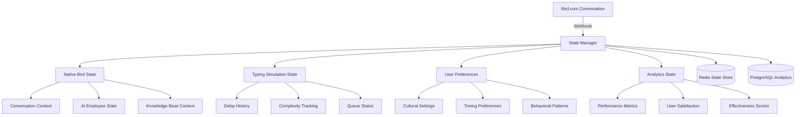

# Sistema de Gestión de Estado Conversacional para Bird.com Typing Simulation

## 📋 Resumen del Sistema

El sistema de gestión de estado conversacional mantiene el contexto completo de las interacciones mientras integra seamlessly con Bird.com AI Employees, preservando tanto el estado nativo de Bird.com como el estado específico para typing simulation.

### 🎯 Objetivos del Sistema

**Funcionalidades Clave:**
- ✅ Preservar contexto completo de Bird.com
- ✅ Mantener métricas de typing simulation
- ✅ Gestionar preferencias de usuario
- ✅ Optimizar delays basado en comportamiento
- ✅ Sincronizar estado entre sistemas
- ✅ Escalabilidad para múltiples conversaciones concurrentes

---

## 🏗️ Arquitectura del Estado Conversacional

### Diagrama de Estados



### Estructura de Estado

```typescript
interface ConversationState {
  // Identificación
  conversation_id: string;
  user_id: string;
  created_at: string;
  last_updated: string;
  
  // Estado Bird.com (Preservado)
  bird_native_state: {
    ai_employee: string;
    conversation_stage: string;
    knowledge_context: any[];
    intent_history: Intent[];
    action_history: Action[];
    escalation_status: string;
  };
  
  // Estado Typing Simulation
  typing_state: {
    total_messages: number;
    total_delay_applied: number;
    avg_complexity: string;
    last_delay: number;
    delay_effectiveness: number;
    queue_position?: number;
  };
  
  // Perfil del Usuario
  user_profile: {
    phone: string;
    name?: string;
    segment: string;
    cultural_profile: CulturalProfile;
    behavioral_patterns: BehavioralPatterns;
    preferences: TypingPreferences;
  };
  
  // Métricas de Rendimiento
  performance_metrics: {
    avg_response_time: number;
    satisfaction_score: number;
    engagement_level: number;
    conversation_completion_rate: number;
    typing_detection_rate: number;
  };
  
  // Estado de Sesión
  session_state: {
    is_active: boolean;
    last_user_message: string;
    last_ai_response: string;
    message_queue: QueuedMessage[];
    current_flow: string;
  };
}
```

---

## 🔧 Implementación del State Manager

### Clase Principal StateManager

```javascript
// src/components/StateManager.js
const Redis = require('redis');
const { Pool } = require('pg');
const { logger } = require('../utils/logger');

class ConversationStateManager {
  constructor(config) {
    this.config = config;
    
    // Redis para estado en tiempo real (TTL 24 horas)
    this.redis = Redis.createClient(config.redis_url);
    
    // PostgreSQL para persistencia de analytics
    this.pg = new Pool(config.postgres);
    
    this.defaultTTL = config.state_ttl || 86400; // 24 horas
    this.syncInterval = config.sync_interval || 300000; // 5 minutos
    
    this.startPeriodicSync();
  }

  async getOrCreateState(conversationId, userData) {
    try {
      // Intentar obtener estado existente
      const existingState = await this.getState(conversationId);
      
      if (existingState) {
        // Actualizar last_updated
        existingState.last_updated = new Date().toISOString();
        await this.saveState(conversationId, existingState);
        return existingState;
      }
      
      // Crear nuevo estado
      const newState = this.createInitialState(conversationId, userData);
      await this.saveState(conversationId, newState);
      
      logger.info('New conversation state created', {
        conversation_id: conversationId,
        user_id: newState.user_id
      });
      
      return newState;
      
    } catch (error) {
      logger.error('Error getting/creating state', {
        conversation_id: conversationId,
        error: error.message
      });
      
      // Fallback a estado básico
      return this.createBasicState(conversationId, userData);
    }
  }

  async getState(conversationId) {
    try {
      const stateData = await this.redis.get(`conv_state:${conversationId}`);
      
      if (!stateData) {
        return null;
      }
      
      const state = JSON.parse(stateData);
      
      // Verificar si el estado no ha expirado
      const lastUpdated = new Date(state.last_updated);
      const now = new Date();
      const hoursSinceUpdate = (now - lastUpdated) / (1000 * 60 * 60);
      
      if (hoursSinceUpdate > 24) {
        // Estado expirado, eliminarlo
        await this.deleteState(conversationId);
        return null;
      }
      
      return state;
      
    } catch (error) {
      logger.error('Error retrieving state from Redis', {
        conversation_id: conversationId,
        error: error.message
      });
      return null;
    }
  }

  async saveState(conversationId, state) {
    try {
      // Actualizar timestamp
      state.last_updated = new Date().toISOString();
      
      // Guardar en Redis con TTL
      await this.redis.setex(
        `conv_state:${conversationId}`,
        this.defaultTTL,
        JSON.stringify(state)
      );
      
      // Programar sincronización con PostgreSQL
      await this.scheduleSync(conversationId, state);
      
      return true;
      
    } catch (error) {
      logger.error('Error saving state to Redis', {
        conversation_id: conversationId,
        error: error.message
      });
      throw error;
    }
  }

  createInitialState(conversationId, userData) {
    return {
      conversation_id: conversationId,
      user_id: userData.id,
      created_at: new Date().toISOString(),
      last_updated: new Date().toISOString(),
      
      bird_native_state: {
        ai_employee: 'unknown',
        conversation_stage: 'greeting',
        knowledge_context: [],
        intent_history: [],
        action_history: [],
        escalation_status: 'none'
      },
      
      typing_state: {
        total_messages: 0,
        total_delay_applied: 0,
        avg_complexity: 'medium',
        last_delay: 0,
        delay_effectiveness: 0.5,
        queue_position: null
      },
      
      user_profile: {
        phone: userData.phone,
        name: userData.name || null,
        segment: userData.metadata?.segment || 'regular',
        cultural_profile: this.determineCulturalProfile(userData),
        behavioral_patterns: this.initializeBehavioralPatterns(),
        preferences: this.getDefaultTypingPreferences()
      },
      
      performance_metrics: {
        avg_response_time: 0,
        satisfaction_score: 0.5,
        engagement_level: 0.5,
        conversation_completion_rate: 0,
        typing_detection_rate: 0
      },
      
      session_state: {
        is_active: true,
        last_user_message: '',
        last_ai_response: '',
        message_queue: [],
        current_flow: 'initial'
      }
    };
  }

  determineCulturalProfile(userData) {
    // Determinar perfil cultural basado en datos del usuario
    const country = userData.metadata?.country?.toLowerCase() || 
                   userData.metadata?.location?.toLowerCase() ||
                   this.inferCountryFromPhone(userData.phone) ||
                   'colombia';

    const culturalProfiles = {
      colombia: {
        country: 'colombia',
        typical_wpm: 35,
        patience_level: 'medium',
        formality_preference: 'informal_friendly',
        emoji_tolerance: 'high',
        time_sensitivity: 'medium'
      },
      mexico: {
        country: 'mexico',
        typical_wpm: 40,
        patience_level: 'high',
        formality_preference: 'semi_formal',
        emoji_tolerance: 'medium',
        time_sensitivity: 'low'
      },
      default: {
        country: 'default',
        typical_wpm: 35,
        patience_level: 'medium',
        formality_preference: 'neutral',
        emoji_tolerance: 'medium',
        time_sensitivity: 'medium'
      }
    };

    return culturalProfiles[country] || culturalProfiles.default;
  }

  initializeBehavioralPatterns() {
    return {
      avg_user_response_time: null,
      message_frequency: 'normal',
      conversation_length_preference: 'medium',
      urgency_indicators: [],
      patience_score: 0.5,
      engagement_patterns: []
    };
  }

  getDefaultTypingPreferences() {
    return {
      preferred_delay_range: { min: 1000, max: 15000 },
      complexity_tolerance: 'medium',
      natural_variation: true,
      cultural_adaptation: true,
      time_of_day_adaptation: true
    };
  }

  // Actualización de estado basada en webhooks de Bird.com
  async updateFromBirdWebhook(conversationId, webhookData) {
    try {
      const state = await this.getOrCreateState(conversationId, webhookData.user || {});
      
      // Actualizar estado nativo de Bird.com
      if (webhookData.context) {
        state.bird_native_state = {
          ...state.bird_native_state,
          ai_employee: webhookData.context.ai_employee || state.bird_native_state.ai_employee,
          conversation_stage: webhookData.context.conversation_stage || state.bird_native_state.conversation_stage,
          knowledge_context: webhookData.context.knowledge_context || state.bird_native_state.knowledge_context
        };
      }

      // Agregar intents al historial
      if (webhookData.intent) {
        state.bird_native_state.intent_history.push({
          intent: webhookData.intent.name,
          confidence: webhookData.intent.confidence,
          timestamp: new Date().toISOString()
        });

        // Mantener solo los últimos 10 intents
        if (state.bird_native_state.intent_history.length > 10) {
          state.bird_native_state.intent_history = state.bird_native_state.intent_history.slice(-10);
        }
      }

      // Agregar acciones al historial
      if (webhookData.actions_executed) {
        webhookData.actions_executed.forEach(action => {
          state.bird_native_state.action_history.push({
            action: action.name,
            result: action.result,
            timestamp: new Date().toISOString()
          });
        });

        // Mantener solo las últimas 20 acciones
        if (state.bird_native_state.action_history.length > 20) {
          state.bird_native_state.action_history = state.bird_native_state.action_history.slice(-20);
        }
      }

      await this.saveState(conversationId, state);
      return state;
      
    } catch (error) {
      logger.error('Error updating state from Bird webhook', {
        conversation_id: conversationId,
        error: error.message
      });
      throw error;
    }
  }

  // Actualización de estado por typing simulation
  async updateTypingState(conversationId, typingData) {
    try {
      const state = await this.getState(conversationId);
      if (!state) {
        logger.warn('State not found for typing update', { conversation_id: conversationId });
        return;
      }

      // Actualizar métricas de typing
      state.typing_state.total_messages++;
      state.typing_state.total_delay_applied += typingData.delay;
      state.typing_state.last_delay = typingData.delay;
      
      // Calcular promedio de complejidad
      const currentAvg = state.typing_state.avg_complexity;
      const complexityScores = { simple: 1, medium: 2, complex: 3, technical: 4 };
      const newScore = complexityScores[typingData.complexity] || 2;
      const currentScore = complexityScores[currentAvg] || 2;
      
      const avgScore = ((currentScore * (state.typing_state.total_messages - 1)) + newScore) / state.typing_state.total_messages;
      const complexityKeys = Object.keys(complexityScores);
      state.typing_state.avg_complexity = complexityKeys.find(key => complexityScores[key] >= avgScore) || 'medium';

      // Actualizar posición en cola si disponible
      if (typingData.queue_position !== undefined) {
        state.typing_state.queue_position = typingData.queue_position;
      }

      await this.saveState(conversationId, state);
      
      logger.debug('Typing state updated', {
        conversation_id: conversationId,
        total_messages: state.typing_state.total_messages,
        avg_delay: state.typing_state.total_delay_applied / state.typing_state.total_messages
      });

      return state;
      
    } catch (error) {
      logger.error('Error updating typing state', {
        conversation_id: conversationId,
        error: error.message
      });
    }
  }

  // Actualización de patrones comportamentales
  async updateBehavioralPatterns(conversationId, behaviorData) {
    try {
      const state = await this.getState(conversationId);
      if (!state) return;

      const patterns = state.user_profile.behavioral_patterns;

      // Actualizar tiempo de respuesta promedio
      if (behaviorData.user_response_time) {
        if (patterns.avg_user_response_time === null) {
          patterns.avg_user_response_time = behaviorData.user_response_time;
        } else {
          patterns.avg_user_response_time = 
            (patterns.avg_user_response_time * 0.8) + (behaviorData.user_response_time * 0.2);
        }
      }

      // Determinar frecuencia de mensajes
      const messageCount = state.typing_state.total_messages;
      const conversationAge = Date.now() - new Date(state.created_at).getTime();
      const messagesPerHour = (messageCount / conversationAge) * 3600000;
      
      if (messagesPerHour > 20) patterns.message_frequency = 'high';
      else if (messagesPerHour > 10) patterns.message_frequency = 'normal';
      else patterns.message_frequency = 'low';

      // Calcular score de paciencia
      if (patterns.avg_user_response_time) {
        if (patterns.avg_user_response_time < 5000) patterns.patience_score = 0.2; // Impaciente
        else if (patterns.avg_user_response_time < 15000) patterns.patience_score = 0.5; // Normal
        else if (patterns.avg_user_response_time < 60000) patterns.patience_score = 0.8; // Paciente
        else patterns.patience_score = 1.0; // Muy paciente
      }

      // Detectar indicadores de urgencia
      if (behaviorData.urgency_detected) {
        patterns.urgency_indicators.push({
          type: behaviorData.urgency_type,
          timestamp: new Date().toISOString()
        });

        // Mantener solo los últimos 5 indicadores
        if (patterns.urgency_indicators.length > 5) {
          patterns.urgency_indicators = patterns.urgency_indicators.slice(-5);
        }
      }

      await this.saveState(conversationId, state);
      return state;
      
    } catch (error) {
      logger.error('Error updating behavioral patterns', {
        conversation_id: conversationId,
        error: error.message
      });
    }
  }

  // Actualización de métricas de rendimiento
  async updatePerformanceMetrics(conversationId, performanceData) {
    try {
      const state = await this.getState(conversationId);
      if (!state) return;

      const metrics = state.performance_metrics;

      // Actualizar métricas con promedio móvil
      if (performanceData.response_time) {
        metrics.avg_response_time = metrics.avg_response_time === 0 
          ? performanceData.response_time
          : (metrics.avg_response_time * 0.7) + (performanceData.response_time * 0.3);
      }

      if (performanceData.satisfaction_score) {
        metrics.satisfaction_score = (metrics.satisfaction_score * 0.8) + (performanceData.satisfaction_score * 0.2);
      }

      if (performanceData.engagement_level) {
        metrics.engagement_level = (metrics.engagement_level * 0.8) + (performanceData.engagement_level * 0.2);
      }

      // Calcular tasa de finalización de conversación
      if (performanceData.conversation_completed !== undefined) {
        const currentRate = metrics.conversation_completion_rate;
        const totalConversations = state.typing_state.total_messages; // Proxy
        metrics.conversation_completion_rate = 
          ((currentRate * (totalConversations - 1)) + (performanceData.conversation_completed ? 1 : 0)) / totalConversations;
      }

      // Actualizar tasa de detección de typing
      if (performanceData.typing_detected !== undefined) {
        const currentRate = metrics.typing_detection_rate;
        const sampleSize = 10; // Tamaño de muestra para detección
        metrics.typing_detection_rate = 
          ((currentRate * (sampleSize - 1)) + (performanceData.typing_detected ? 1 : 0)) / sampleSize;
      }

      await this.saveState(conversationId, state);
      return state;
      
    } catch (error) {
      logger.error('Error updating performance metrics', {
        conversation_id: conversationId,
        error: error.message
      });
    }
  }

  // Gestión de cola de mensajes en sesión
  async addToMessageQueue(conversationId, messageData) {
    try {
      const state = await this.getState(conversationId);
      if (!state) return;

      state.session_state.message_queue.push({
        ...messageData,
        queued_at: new Date().toISOString()
      });

      // Mantener solo los últimos 5 mensajes en cola
      if (state.session_state.message_queue.length > 5) {
        state.session_state.message_queue = state.session_state.message_queue.slice(-5);
      }

      await this.saveState(conversationId, state);
      return state;
      
    } catch (error) {
      logger.error('Error adding to message queue', {
        conversation_id: conversationId,
        error: error.message
      });
    }
  }

  async removeFromMessageQueue(conversationId, messageId) {
    try {
      const state = await this.getState(conversationId);
      if (!state) return;

      state.session_state.message_queue = state.session_state.message_queue.filter(
        msg => msg.id !== messageId
      );

      await this.saveState(conversationId, state);
      return state;
      
    } catch (error) {
      logger.error('Error removing from message queue', {
        conversation_id: conversationId,
        error: error.message
      });
    }
  }

  // Sincronización periódica con PostgreSQL
  async scheduleSync(conversationId, state) {
    // Usar un simple flag para evitar múltiples sync del mismo estado
    const syncKey = `sync_scheduled:${conversationId}`;
    const alreadyScheduled = await this.redis.exists(syncKey);
    
    if (!alreadyScheduled) {
      await this.redis.setex(syncKey, 300, '1'); // 5 minutos
      
      // Programar sync asíncrono
      setTimeout(async () => {
        await this.syncToPostgreSQL(conversationId, state);
      }, 1000);
    }
  }

  async syncToPostgreSQL(conversationId, state) {
    try {
      const client = await this.pg.connect();
      
      await client.query(`
        INSERT INTO conversation_states (
          conversation_id, user_id, created_at, last_updated,
          bird_state, typing_state, user_profile, performance_metrics,
          raw_state
        ) VALUES ($1, $2, $3, $4, $5, $6, $7, $8, $9)
        ON CONFLICT (conversation_id) DO UPDATE SET
          last_updated = EXCLUDED.last_updated,
          bird_state = EXCLUDED.bird_state,
          typing_state = EXCLUDED.typing_state,
          user_profile = EXCLUDED.user_profile,
          performance_metrics = EXCLUDED.performance_metrics,
          raw_state = EXCLUDED.raw_state
      `, [
        conversationId,
        state.user_id,
        state.created_at,
        state.last_updated,
        JSON.stringify(state.bird_native_state),
        JSON.stringify(state.typing_state),
        JSON.stringify(state.user_profile),
        JSON.stringify(state.performance_metrics),
        JSON.stringify(state)
      ]);

      client.release();

      logger.debug('State synced to PostgreSQL', { conversation_id: conversationId });
      
    } catch (error) {
      logger.error('Error syncing to PostgreSQL', {
        conversation_id: conversationId,
        error: error.message
      });
    }
  }

  startPeriodicSync() {
    setInterval(async () => {
      try {
        // Obtener todas las conversaciones activas
        const activeKeys = await this.redis.keys('conv_state:*');
        
        logger.info('Starting periodic sync', { active_conversations: activeKeys.length });
        
        // Sync en batches para no sobrecargar
        const batchSize = 10;
        for (let i = 0; i < activeKeys.length; i += batchSize) {
          const batch = activeKeys.slice(i, i + batchSize);
          
          await Promise.all(batch.map(async (key) => {
            const conversationId = key.replace('conv_state:', '');
            const state = await this.getState(conversationId);
            
            if (state) {
              await this.syncToPostgreSQL(conversationId, state);
            }
          }));
        }
        
        logger.info('Periodic sync completed');
        
      } catch (error) {
        logger.error('Error in periodic sync', { error: error.message });
      }
    }, this.syncInterval);
  }

  // Utilidades
  inferCountryFromPhone(phone) {
    if (!phone) return null;
    
    if (phone.startsWith('+57')) return 'colombia';
    if (phone.startsWith('+52')) return 'mexico';
    if (phone.startsWith('+1')) return 'usa';
    
    return null;
  }

  async deleteState(conversationId) {
    try {
      await this.redis.del(`conv_state:${conversationId}`);
      logger.info('State deleted', { conversation_id: conversationId });
    } catch (error) {
      logger.error('Error deleting state', {
        conversation_id: conversationId,
        error: error.message
      });
    }
  }

  async getStateStats() {
    try {
      const activeKeys = await this.redis.keys('conv_state:*');
      const stats = {
        active_conversations: activeKeys.length,
        redis_memory_usage: await this.redis.memory('usage'),
        avg_state_size: 0
      };

      if (activeKeys.length > 0) {
        // Obtener tamaño promedio de estados (muestra de 10)
        const sampleKeys = activeKeys.slice(0, 10);
        let totalSize = 0;

        for (const key of sampleKeys) {
          const size = await this.redis.memory('usage', key);
          totalSize += size;
        }

        stats.avg_state_size = totalSize / sampleKeys.length;
      }

      return stats;
      
    } catch (error) {
      logger.error('Error getting state stats', { error: error.message });
      return { error: error.message };
    }
  }

  async cleanup() {
    logger.info('Cleaning up state manager...');
    await this.redis.quit();
    await this.pg.end();
  }
}

module.exports = ConversationStateManager;
```

---

## 📊 Schema de Base de Datos

### PostgreSQL Schema

```sql
-- Tabla principal de estados conversacionales
CREATE TABLE conversation_states (
    id SERIAL PRIMARY KEY,
    conversation_id VARCHAR(255) UNIQUE NOT NULL,
    user_id VARCHAR(255) NOT NULL,
    created_at TIMESTAMP WITH TIME ZONE NOT NULL,
    last_updated TIMESTAMP WITH TIME ZONE NOT NULL,
    
    -- Estados JSON para flexibilidad
    bird_state JSONB,
    typing_state JSONB,
    user_profile JSONB,
    performance_metrics JSONB,
    raw_state JSONB,
    
    -- Índices para consultas rápidas
    CONSTRAINT conversation_states_conversation_id_key UNIQUE (conversation_id)
);

-- Índices para optimización
CREATE INDEX idx_conversation_states_user_id ON conversation_states(user_id);
CREATE INDEX idx_conversation_states_created_at ON conversation_states(created_at);
CREATE INDEX idx_conversation_states_last_updated ON conversation_states(last_updated);

-- Índices JSON para consultas específicas
CREATE INDEX idx_conversation_states_bird_ai_employee ON conversation_states 
USING GIN ((bird_state->>'ai_employee'));

CREATE INDEX idx_conversation_states_user_segment ON conversation_states 
USING GIN ((user_profile->'segment'));

-- Tabla de métricas históricas
CREATE TABLE conversation_metrics (
    id SERIAL PRIMARY KEY,
    conversation_id VARCHAR(255) NOT NULL,
    metric_name VARCHAR(100) NOT NULL,
    metric_value DECIMAL(10,4) NOT NULL,
    recorded_at TIMESTAMP WITH TIME ZONE DEFAULT NOW(),
    
    FOREIGN KEY (conversation_id) REFERENCES conversation_states(conversation_id)
);

CREATE INDEX idx_conversation_metrics_conversation_id ON conversation_metrics(conversation_id);
CREATE INDEX idx_conversation_metrics_recorded_at ON conversation_metrics(recorded_at);

-- Tabla de eventos de typing simulation
CREATE TABLE typing_events (
    id SERIAL PRIMARY KEY,
    conversation_id VARCHAR(255) NOT NULL,
    event_type VARCHAR(50) NOT NULL, -- 'delay_applied', 'complexity_analyzed', etc.
    delay_applied INTEGER,
    complexity VARCHAR(20),
    user_satisfaction_impact DECIMAL(3,2),
    recorded_at TIMESTAMP WITH TIME ZONE DEFAULT NOW(),
    
    FOREIGN KEY (conversation_id) REFERENCES conversation_states(conversation_id)
);

CREATE INDEX idx_typing_events_conversation_id ON typing_events(conversation_id);
CREATE INDEX idx_typing_events_recorded_at ON typing_events(recorded_at);
CREATE INDEX idx_typing_events_event_type ON typing_events(event_type);

-- Tabla de preferencias de usuario
CREATE TABLE user_preferences (
    user_id VARCHAR(255) PRIMARY KEY,
    cultural_profile JSONB,
    typing_preferences JSONB,
    behavioral_patterns JSONB,
    last_updated TIMESTAMP WITH TIME ZONE DEFAULT NOW()
);

-- Vistas para analytics
CREATE VIEW conversation_analytics AS
SELECT 
    cs.conversation_id,
    cs.user_id,
    cs.created_at,
    cs.last_updated,
    (cs.bird_state->>'ai_employee') as ai_employee,
    (cs.bird_state->>'conversation_stage') as conversation_stage,
    (cs.typing_state->>'total_messages')::INTEGER as total_messages,
    (cs.typing_state->>'total_delay_applied')::INTEGER as total_delay_applied,
    (cs.typing_state->>'avg_complexity') as avg_complexity,
    (cs.performance_metrics->>'satisfaction_score')::DECIMAL as satisfaction_score,
    (cs.performance_metrics->>'engagement_level')::DECIMAL as engagement_level,
    (cs.user_profile->>'segment') as user_segment,
    (cs.user_profile->'cultural_profile'->>'country') as user_country
FROM conversation_states cs;

-- Función para limpiar estados antiguos
CREATE OR REPLACE FUNCTION cleanup_old_conversations()
RETURNS INTEGER AS $$
DECLARE
    deleted_count INTEGER;
BEGIN
    DELETE FROM conversation_states 
    WHERE last_updated < NOW() - INTERVAL '7 days';
    
    GET DIAGNOSTICS deleted_count = ROW_COUNT;
    
    RETURN deleted_count;
END;
$$ LANGUAGE plpgsql;

-- Programar limpieza automática (ejecutar manualmente según necesidades)
-- SELECT cron.schedule('cleanup-conversations', '0 2 * * *', 'SELECT cleanup_old_conversations();');
```

---

## 🔄 Sincronización con Bird.com

### Sincronización Bidireccional

```javascript
// src/components/BirdStateSync.js
class BirdStateSynchronizer {
  constructor(stateManager, birdApiConfig) {
    this.stateManager = stateManager;
    this.birdApi = birdApiConfig;
  }

  async syncFromBird(conversationId) {
    try {
      // Obtener estado actual de Bird.com
      const birdState = await fetch(`${this.birdApi.url}/conversations/${conversationId}`, {
        headers: {
          'Authorization': `Bearer ${this.birdApi.key}`
        }
      });

      const birdData = await birdState.json();
      
      // Actualizar estado local
      await this.stateManager.updateFromBirdWebhook(conversationId, {
        context: {
          ai_employee: birdData.ai_employee,
          conversation_stage: birdData.stage,
          knowledge_context: birdData.context
        },
        user: birdData.user
      });

      return birdData;
      
    } catch (error) {
      logger.error('Error syncing from Bird.com', {
        conversation_id: conversationId,
        error: error.message
      });
      throw error;
    }
  }

  async syncToBird(conversationId, localState) {
    try {
      // Enviar métricas de typing simulation a Bird.com
      const metricsPayload = {
        conversation_id: conversationId,
        typing_simulation_metrics: {
          total_delays_applied: localState.typing_state.total_delay_applied,
          avg_delay: localState.typing_state.total_delay_applied / localState.typing_state.total_messages,
          effectiveness_score: localState.performance_metrics.satisfaction_score,
          user_engagement: localState.performance_metrics.engagement_level
        }
      };

      await fetch(`${this.birdApi.url}/analytics/typing-simulation`, {
        method: 'POST',
        headers: {
          'Authorization': `Bearer ${this.birdApi.key}`,
          'Content-Type': 'application/json'
        },
        body: JSON.stringify(metricsPayload)
      });

      logger.debug('Metrics synced to Bird.com', { conversation_id: conversationId });
      
    } catch (error) {
      logger.error('Error syncing to Bird.com', {
        conversation_id: conversationId,
        error: error.message
      });
    }
  }
}
```

---

## 📈 Analytics y Optimización

### Análisis de Patrones de Usuario

```javascript
// src/analytics/PatternAnalyzer.js
class UserPatternAnalyzer {
  constructor(stateManager) {
    this.stateManager = stateManager;
  }

  async analyzeUserBehavior(userId, timeWindow = '7d') {
    try {
      const query = `
        SELECT 
          cs.*,
          array_agg(te.delay_applied ORDER BY te.recorded_at) as delay_history,
          array_agg(te.complexity ORDER BY te.recorded_at) as complexity_history
        FROM conversation_states cs
        LEFT JOIN typing_events te ON cs.conversation_id = te.conversation_id
        WHERE cs.user_id = $1 
        AND cs.created_at > NOW() - INTERVAL '${timeWindow}'
        GROUP BY cs.conversation_id
      `;

      const result = await this.stateManager.pg.query(query, [userId]);
      
      if (result.rows.length === 0) {
        return { user_id: userId, pattern: 'insufficient_data' };
      }

      const conversations = result.rows;
      
      // Análisis de patrones
      const analysis = {
        user_id: userId,
        total_conversations: conversations.length,
        avg_conversation_length: conversations.reduce((sum, conv) => 
          sum + parseInt(conv.typing_state.total_messages), 0) / conversations.length,
        preferred_complexity: this.calculatePreferredComplexity(conversations),
        optimal_delay_range: this.calculateOptimalDelayRange(conversations),
        engagement_trend: this.calculateEngagementTrend(conversations),
        cultural_preferences: this.analyzeCulturalPatterns(conversations),
        recommendations: []
      };

      // Generar recomendaciones
      analysis.recommendations = this.generateRecommendations(analysis);

      return analysis;
      
    } catch (error) {
      logger.error('Error analyzing user patterns', {
        user_id: userId,
        error: error.message
      });
      throw error;
    }
  }

  calculatePreferredComplexity(conversations) {
    const complexityScores = { simple: 1, medium: 2, complex: 3, technical: 4 };
    const satisfactionByComplexity = {};

    conversations.forEach(conv => {
      const complexity = conv.typing_state.avg_complexity;
      const satisfaction = parseFloat(conv.performance_metrics.satisfaction_score);
      
      if (!satisfactionByComplexity[complexity]) {
        satisfactionByComplexity[complexity] = [];
      }
      satisfactionByComplexity[complexity].push(satisfaction);
    });

    // Calcular promedio de satisfacción por complejidad
    let bestComplexity = 'medium';
    let bestSatisfaction = 0;

    Object.entries(satisfactionByComplexity).forEach(([complexity, scores]) => {
      const avgSatisfaction = scores.reduce((sum, score) => sum + score, 0) / scores.length;
      if (avgSatisfaction > bestSatisfaction) {
        bestSatisfaction = avgSatisfaction;
        bestComplexity = complexity;
      }
    });

    return bestComplexity;
  }

  calculateOptimalDelayRange(conversations) {
    const delaysSatisfaction = conversations.map(conv => ({
      avg_delay: conv.typing_state.total_delay_applied / conv.typing_state.total_messages,
      satisfaction: parseFloat(conv.performance_metrics.satisfaction_score)
    }));

    // Encontrar rango de delays con mejor satisfacción
    delaysSatisfaction.sort((a, b) => b.satisfaction - a.satisfaction);
    const top25Percent = delaysSatisfaction.slice(0, Math.ceil(delaysSatisfaction.length * 0.25));

    const delays = top25Percent.map(item => item.avg_delay);
    
    return {
      min: Math.min(...delays) * 0.8, // 20% más rápido que el mínimo óptimo
      max: Math.max(...delays) * 1.2, // 20% más lento que el máximo óptimo
      optimal: delays.reduce((sum, delay) => sum + delay, 0) / delays.length
    };
  }

  generateRecommendations(analysis) {
    const recommendations = [];

    // Recomendación de complejidad
    if (analysis.preferred_complexity === 'simple') {
      recommendations.push({
        type: 'complexity',
        message: 'Usuario prefiere respuestas directas y simples',
        action: 'reduce_complexity_scoring'
      });
    } else if (analysis.preferred_complexity === 'technical') {
      recommendations.push({
        type: 'complexity',
        message: 'Usuario aprecia respuestas técnicas detalladas',
        action: 'increase_complexity_tolerance'
      });
    }

    // Recomendación de timing
    if (analysis.optimal_delay_range.optimal < 2000) {
      recommendations.push({
        type: 'timing',
        message: 'Usuario impaciente, reducir delays',
        action: 'apply_fast_typing_profile'
      });
    } else if (analysis.optimal_delay_range.optimal > 8000) {
      recommendations.push({
        type: 'timing',
        message: 'Usuario paciente, delays más naturales',
        action: 'apply_relaxed_typing_profile'
      });
    }

    // Recomendación de engagement
    if (analysis.engagement_trend < 0.5) {
      recommendations.push({
        type: 'engagement',
        message: 'Engagement bajo, optimizar experiencia',
        action: 'increase_personalization'
      });
    }

    return recommendations;
  }
}
```

### Dashboard de Estado

```javascript
// src/routes/state-dashboard.js
const express = require('express');
const router = express.Router();

router.get('/dashboard/state/:conversationId', async (req, res) => {
  try {
    const { conversationId } = req.params;
    const state = await stateManager.getState(conversationId);
    
    if (!state) {
      return res.status(404).json({ error: 'Conversation state not found' });
    }

    // Formatear para dashboard
    const dashboardData = {
      conversation: {
        id: conversationId,
        created_at: state.created_at,
        last_updated: state.last_updated,
        duration: Date.now() - new Date(state.created_at).getTime(),
        is_active: state.session_state.is_active
      },
      
      bird_integration: {
        ai_employee: state.bird_native_state.ai_employee,
        conversation_stage: state.bird_native_state.conversation_stage,
        total_intents: state.bird_native_state.intent_history.length,
        total_actions: state.bird_native_state.action_history.length,
        escalation_status: state.bird_native_state.escalation_status
      },
      
      typing_simulation: {
        total_messages: state.typing_state.total_messages,
        avg_delay: state.typing_state.total_delay_applied / state.typing_state.total_messages,
        avg_complexity: state.typing_state.avg_complexity,
        effectiveness: state.typing_state.delay_effectiveness,
        last_delay: state.typing_state.last_delay
      },
      
      user_profile: {
        segment: state.user_profile.segment,
        cultural_profile: state.user_profile.cultural_profile,
        patience_score: state.user_profile.behavioral_patterns.patience_score,
        message_frequency: state.user_profile.behavioral_patterns.message_frequency
      },
      
      performance: {
        satisfaction_score: state.performance_metrics.satisfaction_score,
        engagement_level: state.performance_metrics.engagement_level,
        avg_response_time: state.performance_metrics.avg_response_time,
        completion_rate: state.performance_metrics.conversation_completion_rate
      },
      
      queue_status: {
        messages_in_queue: state.session_state.message_queue.length,
        current_position: state.typing_state.queue_position
      }
    };

    res.json(dashboardData);
    
  } catch (error) {
    logger.error('Error generating dashboard data', {
      conversation_id: req.params.conversationId,
      error: error.message
    });
    
    res.status(500).json({ error: 'Internal server error' });
  }
});

// Endpoint para métricas globales
router.get('/dashboard/global', async (req, res) => {
  try {
    const stateStats = await stateManager.getStateStats();
    
    // Obtener métricas agregadas de PostgreSQL
    const metricsQuery = `
      SELECT 
        COUNT(*) as total_conversations,
        AVG((typing_state->>'total_messages')::INTEGER) as avg_messages_per_conv,
        AVG((performance_metrics->>'satisfaction_score')::DECIMAL) as avg_satisfaction,
        AVG((performance_metrics->>'engagement_level')::DECIMAL) as avg_engagement,
        COUNT(CASE WHEN (performance_metrics->>'satisfaction_score')::DECIMAL > 0.7 THEN 1 END) as high_satisfaction_count
      FROM conversation_states 
      WHERE last_updated > NOW() - INTERVAL '24 hours'
    `;
    
    const metricsResult = await stateManager.pg.query(metricsQuery);
    const metrics = metricsResult.rows[0];
    
    const globalDashboard = {
      system_status: {
        active_conversations: stateStats.active_conversations,
        redis_memory_usage: stateStats.redis_memory_usage,
        avg_state_size: stateStats.avg_state_size
      },
      
      performance_24h: {
        total_conversations: parseInt(metrics.total_conversations),
        avg_messages_per_conversation: parseFloat(metrics.avg_messages_per_conv),
        avg_satisfaction_score: parseFloat(metrics.avg_satisfaction),
        avg_engagement_level: parseFloat(metrics.avg_engagement),
        high_satisfaction_rate: parseFloat(metrics.high_satisfaction_count) / parseInt(metrics.total_conversations)
      },
      
      typing_simulation_effectiveness: {
        // Calcular efectividad general
        overall_effectiveness: await calculateOverallEffectiveness(),
        optimal_delay_ranges: await getOptimalDelayRanges(),
        complexity_distribution: await getComplexityDistribution()
      }
    };

    res.json(globalDashboard);
    
  } catch (error) {
    logger.error('Error generating global dashboard', { error: error.message });
    res.status(500).json({ error: 'Internal server error' });
  }
});

module.exports = router;
```

Esta implementación proporciona un sistema completo de gestión de estado conversacional que preserva la funcionalidad nativa de Bird.com mientras añade capacidades avanzadas de typing simulation y optimización basada en el comportamiento del usuario.

---

**🤖 Generado con [Claude Code](https://claude.ai/code)**  
**📅 Fecha**: Septiembre 2024  
**🔄 Versión**: 1.0.0