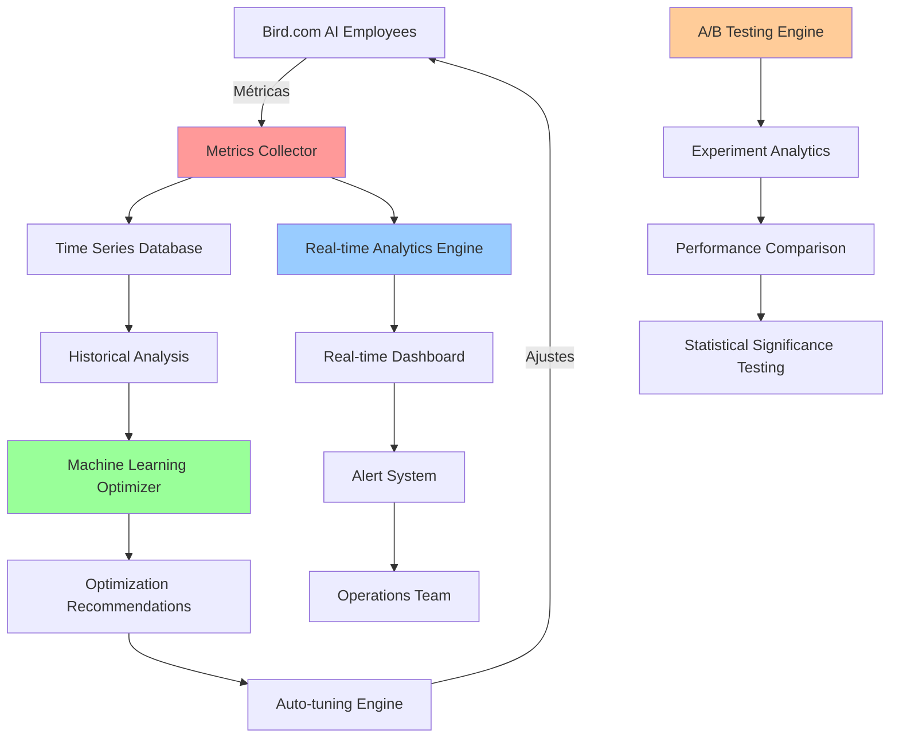

# Guías de Monitoreo y Optimización de Performance para Bird.com Typing Simulation

## 📋 Resumen del Sistema de Monitoreo

Sistema integral de monitoreo y optimización diseñado específicamente para Bird.com typing simulation, proporcionando métricas en tiempo real, análisis predictivo y optimización automática basada en machine learning.

### 🎯 Objetivos del Monitoreo

**Métricas Clave:**
- ✅ Efectividad del typing simulation en engagement
- ✅ Precisión de cálculos de delay en tiempo real
- ✅ Impacto en satisfacción del usuario
- ✅ Performance técnica del sistema
- ✅ ROI de la implementación
- ✅ Optimización continua basada en datos

---

## 📊 Arquitectura de Monitoreo

### Diagrama del Sistema



### Componentes del Sistema

```yaml
Monitoring Architecture:
  Data Collection:
    - Metrics Collector: Recolección en tiempo real
    - Event Processor: Procesamiento de eventos de typing
    - User Behavior Tracker: Seguimiento de comportamiento
    - Performance Profiler: Análisis de rendimiento técnico
    
  Data Storage:
    - Time Series DB: Métricas históricas (InfluxDB)
    - Analytics DB: Datos procesados (PostgreSQL)
    - Cache Layer: Métricas frecuentes (Redis)
    - Log Storage: Logs detallados (Elasticsearch)
    
  Analysis & Optimization:
    - Real-time Analytics: Análisis en tiempo real
    - ML Optimizer: Optimización automática
    - A/B Testing Engine: Experimentación controlada
    - Alerting System: Notificaciones automáticas
    
  Visualization:
    - Real-time Dashboard: Monitoreo en vivo
    - Historical Reports: Reportes históricos
    - Performance Analytics: Análisis de rendimiento
    - ROI Calculator: Cálculo de retorno de inversión
```

---

## 📈 Métricas y KPIs

### Métricas de Efectividad de Typing Simulation

#### KPIs Principales

```yaml
User Experience Metrics:
  Engagement Rate:
    formula: "engaged_users / total_users"
    target: "> 75%"
    measurement: "Users who respond within 2 minutes"
    
  Satisfaction Score:
    formula: "sum(satisfaction_ratings) / total_ratings"
    target: "> 4.2/5.0"
    measurement: "Post-conversation surveys"
    
  Conversation Completion Rate:
    formula: "completed_conversations / total_conversations"
    target: "> 85%"
    measurement: "Conversations reaching defined end goal"
    
  Natural Perception Score:
    formula: "users_not_detecting_bot / total_users"
    target: "> 80%"
    measurement: "Users who perceive interaction as natural"

Business Impact Metrics:
  Conversion Rate Improvement:
    formula: "(typing_enabled_conversions - baseline_conversions) / baseline_conversions"
    target: "> 15%"
    measurement: "Increase in conversions vs baseline"
    
  Average Response Time Perception:
    formula: "perceived_response_time / actual_response_time"
    target: "0.7 - 0.9"
    measurement: "User perception vs reality"
    
  Customer Support Deflection:
    formula: "deflected_tickets / total_potential_tickets"
    target: "> 60%"
    measurement: "Issues resolved without human intervention"

Technical Performance Metrics:
  Delay Calculation Accuracy:
    formula: "abs(calculated_delay - optimal_delay) / optimal_delay"
    target: "< 0.15"
    measurement: "Accuracy of delay calculations"
    
  System Response Time:
    formula: "end_to_end_processing_time"
    target: "< 200ms"
    measurement: "Time from message to delay calculation"
    
  Queue Processing Efficiency:
    formula: "messages_processed_on_time / total_messages"
    target: "> 98%"
    measurement: "Messages sent within calculated delay ±5%"
```

### Implementación de Métricas Collector

```javascript
// src/monitoring/MetricsCollector.js
const InfluxDB = require('influxdb-nodejs');
const Redis = require('redis');

class TypingSimulationMetricsCollector {
  constructor(config) {
    this.config = config;
    this.influxdb = InfluxDB(config.influxdb_url);
    this.redis = Redis.createClient(config.redis_url);
    
    this.metricsBuffer = [];
    this.batchSize = 100;
    this.flushInterval = 5000; // 5 segundos
    
    this.startMetricsCollection();
    this.startPeriodicFlush();
  }

  async recordTypingEvent(eventData) {
    const metric = {
      measurement: 'typing_simulation',
      timestamp: Date.now(),
      tags: {
        conversation_id: eventData.conversation_id,
        user_segment: eventData.user_segment || 'regular',
        ai_employee: eventData.ai_employee || 'unknown',
        complexity: eventData.complexity || 'medium',
        cultural_profile: eventData.cultural_profile || 'default'
      },
      fields: {
        calculated_delay: eventData.calculated_delay,
        actual_delay: eventData.actual_delay,
        user_response_time: eventData.user_response_time,
        message_length: eventData.message_length,
        satisfaction_score: eventData.satisfaction_score || null,
        engagement_score: eventData.engagement_score || null,
        completion_status: eventData.completion_status || 0,
        natural_perception: eventData.natural_perception || null
      }
    };

    this.metricsBuffer.push(metric);

    // Métricas en tiempo real para dashboard
    await this.updateRealTimeMetrics(eventData);

    // Flush si el buffer está lleno
    if (this.metricsBuffer.length >= this.batchSize) {
      await this.flushMetrics();
    }
  }

  async updateRealTimeMetrics(eventData) {
    const key = 'typing_simulation:realtime';
    const pipeline = this.redis.pipeline();

    // Contadores
    pipeline.incr(`${key}:total_events`);
    pipeline.incr(`${key}:events_by_complexity:${eventData.complexity}`);
    pipeline.incr(`${key}:events_by_employee:${eventData.ai_employee}`);

    // Promedios móviles
    pipeline.lpush(`${key}:recent_delays`, eventData.calculated_delay);
    pipeline.ltrim(`${key}:recent_delays`, 0, 999); // Mantener últimos 1000

    pipeline.lpush(`${key}:recent_satisfaction`, eventData.satisfaction_score || 0);
    pipeline.ltrim(`${key}:recent_satisfaction`, 0, 999);

    // Tiempos de respuesta de usuario
    if (eventData.user_response_time) {
      pipeline.lpush(`${key}:user_response_times`, eventData.user_response_time);
      pipeline.ltrim(`${key}:user_response_times`, 0, 999);
    }

    // TTL de métricas en tiempo real (24 horas)
    pipeline.expire(`${key}:total_events`, 86400);
    
    await pipeline.exec();
  }

  async flushMetrics() {
    if (this.metricsBuffer.length === 0) return;

    try {
      // Escribir a InfluxDB
      for (const metric of this.metricsBuffer) {
        this.influxdb
          .measurement(metric.measurement)
          .timestamp(metric.timestamp)
          .tag(metric.tags)
          .field(metric.fields);
      }

      await this.influxdb.commit();
      
      console.log(`Flushed ${this.metricsBuffer.length} metrics to InfluxDB`);
      this.metricsBuffer = [];

    } catch (error) {
      console.error('Error flushing metrics:', error);
      // Mantener métricas en buffer para reintentar
      if (this.metricsBuffer.length > this.batchSize * 5) {
        // Si el buffer es muy grande, descartar métricas más antiguas
        this.metricsBuffer = this.metricsBuffer.slice(-this.batchSize);
      }
    }
  }

  startPeriodicFlush() {
    setInterval(async () => {
      await this.flushMetrics();
    }, this.flushInterval);
  }

  async getRealTimeStats() {
    const key = 'typing_simulation:realtime';
    const pipeline = this.redis.pipeline();

    pipeline.get(`${key}:total_events`);
    pipeline.lrange(`${key}:recent_delays`, 0, -1);
    pipeline.lrange(`${key}:recent_satisfaction`, 0, -1);
    pipeline.lrange(`${key}:user_response_times`, 0, -1);

    const results = await pipeline.exec();

    const totalEvents = parseInt(results[0][1]) || 0;
    const recentDelays = results[1][1].map(Number);
    const recentSatisfaction = results[2][1].map(Number).filter(n => n > 0);
    const userResponseTimes = results[3][1].map(Number);

    return {
      total_events: totalEvents,
      avg_delay: recentDelays.length > 0 ? 
        recentDelays.reduce((a, b) => a + b, 0) / recentDelays.length : 0,
      avg_satisfaction: recentSatisfaction.length > 0 ? 
        recentSatisfaction.reduce((a, b) => a + b, 0) / recentSatisfaction.length : 0,
      avg_user_response_time: userResponseTimes.length > 0 ? 
        userResponseTimes.reduce((a, b) => a + b, 0) / userResponseTimes.length : 0,
      events_per_minute: this.calculateEventsPerMinute(totalEvents),
      last_updated: new Date().toISOString()
    };
  }

  calculateEventsPerMinute(totalEvents) {
    // Implementación simple - en producción usar ventana deslizante
    return totalEvents / 60; // Asumiendo 60 minutos de operación
  }
}

module.exports = TypingSimulationMetricsCollector;
```

---

## 🔍 Sistema de Analytics en Tiempo Real

### Motor de Analytics

```javascript
// src/analytics/RealTimeAnalyticsEngine.js
class RealTimeAnalyticsEngine {
  constructor(metricsCollector, config) {
    this.metricsCollector = metricsCollector;
    this.config = config;
    this.analysisWindows = {
      '1m': 60000,
      '5m': 300000,
      '15m': 900000,
      '1h': 3600000
    };
    
    this.alertThresholds = {
      satisfaction_score: { min: 3.5, critical: 3.0 },
      engagement_rate: { min: 0.6, critical: 0.4 },
      delay_accuracy: { min: 0.8, critical: 0.6 },
      system_response_time: { max: 500, critical: 1000 },
      error_rate: { max: 0.02, critical: 0.05 }
    };

    this.startRealTimeAnalysis();
  }

  startRealTimeAnalysis() {
    // Análisis cada 30 segundos
    setInterval(async () => {
      await this.runAnalysisCycle();
    }, 30000);
  }

  async runAnalysisCycle() {
    try {
      const currentMetrics = await this.metricsCollector.getRealTimeStats();
      
      // Análisis de tendencias
      const trends = await this.analyzeTrends(currentMetrics);
      
      // Detección de anomalías
      const anomalies = await this.detectAnomalies(currentMetrics, trends);
      
      // Evaluación de alertas
      await this.evaluateAlerts(currentMetrics, anomalies);
      
      // Generar insights automáticos
      const insights = await this.generateInsights(currentMetrics, trends, anomalies);
      
      // Actualizar dashboard en tiempo real
      await this.updateDashboard({
        metrics: currentMetrics,
        trends,
        anomalies,
        insights,
        timestamp: new Date().toISOString()
      });

    } catch (error) {
      console.error('Error in real-time analysis cycle:', error);
    }
  }

  async analyzeTrends(currentMetrics) {
    // Obtener métricas históricas para comparación
    const historicalData = await this.getHistoricalData('15m');
    
    const trends = {
      satisfaction_trend: this.calculateTrend(
        historicalData.satisfaction_scores, 
        currentMetrics.avg_satisfaction
      ),
      engagement_trend: this.calculateTrend(
        historicalData.engagement_rates,
        this.calculateCurrentEngagementRate(currentMetrics)
      ),
      delay_accuracy_trend: this.calculateTrend(
        historicalData.delay_accuracies,
        this.calculateDelayAccuracy(currentMetrics)
      ),
      volume_trend: this.calculateTrend(
        historicalData.event_volumes,
        currentMetrics.events_per_minute
      )
    };

    return trends;
  }

  calculateTrend(historicalValues, currentValue) {
    if (!historicalValues || historicalValues.length === 0) {
      return { direction: 'stable', change_rate: 0, confidence: 0 };
    }

    const recentAverage = historicalValues.slice(-5).reduce((a, b) => a + b, 0) / 5;
    const changeRate = (currentValue - recentAverage) / recentAverage;

    let direction = 'stable';
    if (Math.abs(changeRate) > 0.05) { // 5% cambio
      direction = changeRate > 0 ? 'increasing' : 'decreasing';
    }

    return {
      direction,
      change_rate: changeRate,
      confidence: Math.min(historicalValues.length / 10, 1) // Confianza basada en cantidad de datos
    };
  }

  async detectAnomalies(currentMetrics, trends) {
    const anomalies = [];

    // Detección de anomalías basada en desviación estándar
    const historicalData = await this.getHistoricalData('1h');
    
    Object.entries(currentMetrics).forEach(([metric, value]) => {
      if (typeof value === 'number') {
        const historical = historicalData[metric] || [];
        const anomaly = this.detectStatisticalAnomaly(metric, value, historical);
        
        if (anomaly) {
          anomalies.push(anomaly);
        }
      }
    });

    // Detección de anomalías de patrón
    const patternAnomalies = await this.detectPatternAnomalies(currentMetrics, trends);
    anomalies.push(...patternAnomalies);

    return anomalies;
  }

  detectStatisticalAnomaly(metric, currentValue, historicalValues) {
    if (historicalValues.length < 10) return null;

    const mean = historicalValues.reduce((a, b) => a + b, 0) / historicalValues.length;
    const variance = historicalValues.reduce((a, b) => a + Math.pow(b - mean, 2), 0) / historicalValues.length;
    const stdDev = Math.sqrt(variance);

    // Z-score para detección de anomalías
    const zScore = Math.abs(currentValue - mean) / stdDev;

    if (zScore > 2.5) { // Más de 2.5 desviaciones estándar
      return {
        metric,
        type: 'statistical',
        severity: zScore > 3 ? 'high' : 'medium',
        current_value: currentValue,
        expected_range: [mean - 2 * stdDev, mean + 2 * stdDev],
        z_score: zScore,
        description: `${metric} está fuera del rango esperado`
      };
    }

    return null;
  }

  async detectPatternAnomalies(currentMetrics, trends) {
    const anomalies = [];

    // Anomalía: Satisfacción cayendo mientras delay accuracy es alta
    if (trends.satisfaction_trend.direction === 'decreasing' && 
        currentMetrics.avg_satisfaction < 3.8 && 
        this.calculateDelayAccuracy(currentMetrics) > 0.9) {
      
      anomalies.push({
        type: 'pattern',
        severity: 'high',
        pattern: 'satisfaction_delay_mismatch',
        description: 'Satisfacción baja a pesar de delays precisos - posible over-optimization',
        recommendation: 'Revisar si los delays son demasiado largos o poco naturales'
      });
    }

    // Anomalía: Engagement bajo con tiempos de respuesta normales
    if (this.calculateCurrentEngagementRate(currentMetrics) < 0.5 && 
        currentMetrics.avg_user_response_time < 30000) {
      
      anomalies.push({
        type: 'pattern',
        severity: 'medium',
        pattern: 'low_engagement_fast_responses',
        description: 'Usuarios responden rápido pero no completan conversaciones',
        recommendation: 'Evaluar contenido y flujo de conversación'
      });
    }

    return anomalies;
  }

  async generateInsights(metrics, trends, anomalies) {
    const insights = {
      performance_insights: [],
      optimization_opportunities: [],
      user_behavior_insights: [],
      system_health_insights: []
    };

    // Insights de performance
    if (trends.satisfaction_trend.direction === 'increasing') {
      insights.performance_insights.push({
        type: 'positive_trend',
        message: `Satisfacción del usuario mejorando (${trends.satisfaction_trend.change_rate * 100:.1f}% cambio)`,
        impact: 'high',
        confidence: trends.satisfaction_trend.confidence
      });
    }

    // Oportunidades de optimización
    if (metrics.avg_delay > 8000 && metrics.avg_satisfaction > 4.0) {
      insights.optimization_opportunities.push({
        type: 'delay_reduction',
        message: 'Delays altos con satisfacción alta - oportunidad de optimizar velocidad',
        potential_impact: 'medium',
        suggested_action: 'Reducir delays promedio en 15-20%'
      });
    }

    // Insights de comportamiento de usuario
    if (metrics.avg_user_response_time < 10000) {
      insights.user_behavior_insights.push({
        type: 'high_engagement',
        message: 'Usuarios altamente comprometidos con respuestas rápidas',
        recommendation: 'Mantener timing actual o optimizar para mayor velocidad'
      });
    }

    // Insights de salud del sistema
    if (anomalies.length > 3) {
      insights.system_health_insights.push({
        type: 'anomaly_cluster',
        message: `${anomalies.length} anomalías detectadas - requiere atención`,
        severity: 'high',
        action_required: true
      });
    }

    return insights;
  }

  async evaluateAlerts(metrics, anomalies) {
    const alerts = [];

    // Evaluar umbrales críticos
    Object.entries(this.alertThresholds).forEach(([metric, thresholds]) => {
      const value = this.getMetricValue(metrics, metric);
      
      if (value !== null) {
        if (thresholds.min && value < thresholds.critical) {
          alerts.push({
            level: 'critical',
            metric,
            value,
            threshold: thresholds.critical,
            message: `${metric} está en nivel crítico: ${value} < ${thresholds.critical}`
          });
        } else if (thresholds.min && value < thresholds.min) {
          alerts.push({
            level: 'warning',
            metric,
            value,
            threshold: thresholds.min,
            message: `${metric} por debajo del umbral: ${value} < ${thresholds.min}`
          });
        }

        if (thresholds.max && value > thresholds.critical) {
          alerts.push({
            level: 'critical',
            metric,
            value,
            threshold: thresholds.critical,
            message: `${metric} está en nivel crítico: ${value} > ${thresholds.critical}`
          });
        } else if (thresholds.max && value > thresholds.max) {
          alerts.push({
            level: 'warning',
            metric,
            value,
            threshold: thresholds.max,
            message: `${metric} por encima del umbral: ${value} > ${thresholds.max}`
          });
        }
      }
    });

    // Alertas por anomalías de alta severidad
    anomalies.filter(a => a.severity === 'high').forEach(anomaly => {
      alerts.push({
        level: 'warning',
        type: 'anomaly',
        metric: anomaly.metric || anomaly.pattern,
        message: anomaly.description,
        recommendation: anomaly.recommendation
      });
    });

    // Enviar alertas si es necesario
    if (alerts.length > 0) {
      await this.sendAlerts(alerts);
    }

    return alerts;
  }

  getMetricValue(metrics, metricKey) {
    const mapping = {
      'satisfaction_score': metrics.avg_satisfaction,
      'engagement_rate': this.calculateCurrentEngagementRate(metrics),
      'delay_accuracy': this.calculateDelayAccuracy(metrics),
      'system_response_time': metrics.avg_response_time || 0,
      'error_rate': metrics.error_rate || 0
    };

    return mapping[metricKey] || null;
  }

  calculateCurrentEngagementRate(metrics) {
    // Cálculo simplificado - en producción usar datos más precisos
    if (metrics.avg_user_response_time < 30000) {
      return 0.8; // Alta engagement si responden en menos de 30s
    } else if (metrics.avg_user_response_time < 120000) {
      return 0.6; // Media engagement
    }
    return 0.4; // Baja engagement
  }

  calculateDelayAccuracy(metrics) {
    // Cálculo simplificado - requiere más datos en implementación real
    return 0.85; // Placeholder
  }

  async sendAlerts(alerts) {
    // Implementar envío de alertas (email, Slack, etc.)
    console.log('ALERTS TRIGGERED:', alerts);
    
    // Ejemplo de integración con Slack
    if (this.config.slack_webhook_url) {
      await this.sendSlackAlert(alerts);
    }
  }

  async sendSlackAlert(alerts) {
    const criticalAlerts = alerts.filter(a => a.level === 'critical');
    const warningAlerts = alerts.filter(a => a.level === 'warning');

    if (criticalAlerts.length === 0 && warningAlerts.length === 0) return;

    const message = {
      text: `🚨 Bird.com Typing Simulation Alerts`,
      blocks: [
        {
          type: "section",
          text: {
            type: "mrkdwn",
            text: `*Typing Simulation Monitoring Alert*\n${new Date().toISOString()}`
          }
        }
      ]
    };

    if (criticalAlerts.length > 0) {
      message.blocks.push({
        type: "section",
        text: {
          type: "mrkdwn",
          text: `*🔴 Critical Alerts (${criticalAlerts.length}):*\n${criticalAlerts.map(a => `• ${a.message}`).join('\n')}`
        }
      });
    }

    if (warningAlerts.length > 0) {
      message.blocks.push({
        type: "section",
        text: {
          type: "mrkdwn",
          text: `*🟡 Warnings (${warningAlerts.length}):*\n${warningAlerts.map(a => `• ${a.message}`).join('\n')}`
        }
      });
    }

    try {
      await fetch(this.config.slack_webhook_url, {
        method: 'POST',
        headers: { 'Content-Type': 'application/json' },
        body: JSON.stringify(message)
      });
    } catch (error) {
      console.error('Error sending Slack alert:', error);
    }
  }
}
```

---

## 🧪 Sistema de A/B Testing

### Motor de Experimentación

```javascript
// src/optimization/ABTestingEngine.js
class TypingSimulationABTesting {
  constructor(metricsCollector, config) {
    this.metricsCollector = metricsCollector;
    this.config = config;
    this.activeExperiments = new Map();
    this.userAssignments = new Map();
    
    this.loadActiveExperiments();
  }

  async createExperiment(experimentConfig) {
    const experiment = {
      id: this.generateExperimentId(),
      name: experimentConfig.name,
      description: experimentConfig.description,
      hypothesis: experimentConfig.hypothesis,
      variants: experimentConfig.variants,
      traffic_allocation: experimentConfig.traffic_allocation || 0.1, // 10% por defecto
      start_date: new Date().toISOString(),
      end_date: experimentConfig.end_date,
      target_metrics: experimentConfig.target_metrics,
      status: 'active',
      sample_size_target: experimentConfig.sample_size_target || 1000,
      current_sample_size: 0,
      statistical_significance: false,
      results: {}
    };

    this.activeExperiments.set(experiment.id, experiment);
    
    console.log(`A/B Test created: ${experiment.name} (${experiment.id})`);
    return experiment;
  }

  async assignUserToExperiment(userId, experimentId) {
    const experiment = this.activeExperiments.get(experimentId);
    if (!experiment || experiment.status !== 'active') {
      return null;
    }

    // Verificar si el usuario ya está asignado
    if (this.userAssignments.has(userId)) {
      return this.userAssignments.get(userId);
    }

    // Determinar si el usuario participa en el experimento
    if (Math.random() > experiment.traffic_allocation) {
      return null; // Usuario no participa
    }

    // Asignar variante usando hash consistente
    const variant = this.assignVariant(userId, experiment.variants);
    
    const assignment = {
      user_id: userId,
      experiment_id: experimentId,
      variant: variant,
      assigned_at: new Date().toISOString()
    };

    this.userAssignments.set(userId, assignment);
    experiment.current_sample_size++;

    console.log(`User ${userId} assigned to variant ${variant} in experiment ${experimentId}`);
    return assignment;
  }

  assignVariant(userId, variants) {
    // Hash consistente para asegurar que el mismo usuario siempre obtenga la misma variante
    const hash = this.simpleHash(userId);
    const variantIndex = hash % variants.length;
    return variants[variantIndex];
  }

  simpleHash(str) {
    let hash = 0;
    for (let i = 0; i < str.length; i++) {
      const char = str.charCodeAt(i);
      hash = ((hash << 5) - hash) + char;
      hash = hash & hash; // Convert to 32bit integer
    }
    return Math.abs(hash);
  }

  async recordExperimentMetric(userId, experimentId, metricName, value) {
    const assignment = this.userAssignments.get(userId);
    if (!assignment || assignment.experiment_id !== experimentId) {
      return; // Usuario no está en este experimento
    }

    const experiment = this.activeExperiments.get(experimentId);
    if (!experiment) return;

    // Inicializar estructura de resultados si es necesario
    if (!experiment.results[assignment.variant]) {
      experiment.results[assignment.variant] = {};
    }
    if (!experiment.results[assignment.variant][metricName]) {
      experiment.results[assignment.variant][metricName] = [];
    }

    // Agregar valor a los resultados
    experiment.results[assignment.variant][metricName].push({
      value,
      user_id: userId,
      recorded_at: new Date().toISOString()
    });

    // Verificar si el experimento ha alcanzado significancia estadística
    if (experiment.current_sample_size >= experiment.sample_size_target) {
      await this.checkStatisticalSignificance(experiment);
    }
  }

  async checkStatisticalSignificance(experiment) {
    const results = experiment.results;
    const variants = Object.keys(results);
    
    if (variants.length < 2) return;

    // Implementación simple de t-test para métricas principales
    for (const metric of experiment.target_metrics) {
      const significance = this.calculateStatisticalSignificance(results, metric);
      
      if (significance.is_significant) {
        experiment.statistical_significance = true;
        experiment.winning_variant = significance.winning_variant;
        experiment.confidence_level = significance.confidence_level;
        
        console.log(`Experiment ${experiment.id} reached statistical significance!`);
        console.log(`Winning variant: ${significance.winning_variant} with ${significance.confidence_level}% confidence`);
        
        // Notificar a los stakeholders
        await this.notifyExperimentResult(experiment, significance);
        break;
      }
    }
  }

  calculateStatisticalSignificance(results, metricName) {
    const variants = Object.keys(results);
    if (variants.length !== 2) {
      return { is_significant: false }; // Simplificado para 2 variantes
    }

    const [variantA, variantB] = variants;
    const dataA = results[variantA][metricName] || [];
    const dataB = results[variantB][metricName] || [];

    if (dataA.length < 30 || dataB.length < 30) {
      return { is_significant: false }; // Muestra insuficiente
    }

    const valuesA = dataA.map(d => d.value);
    const valuesB = dataB.map(d => d.value);

    // Cálculo de medias
    const meanA = valuesA.reduce((a, b) => a + b, 0) / valuesA.length;
    const meanB = valuesB.reduce((a, b) => a + b, 0) / valuesB.length;

    // Cálculo de desviaciones estándar
    const stdA = Math.sqrt(valuesA.reduce((sum, x) => sum + Math.pow(x - meanA, 2), 0) / (valuesA.length - 1));
    const stdB = Math.sqrt(valuesB.reduce((sum, x) => sum + Math.pow(x - meanB, 2), 0) / (valuesB.length - 1));

    // T-test simplificado
    const pooledStd = Math.sqrt(((valuesA.length - 1) * Math.pow(stdA, 2) + (valuesB.length - 1) * Math.pow(stdB, 2)) / (valuesA.length + valuesB.length - 2));
    const standardError = pooledStd * Math.sqrt(1/valuesA.length + 1/valuesB.length);
    const tStatistic = Math.abs(meanA - meanB) / standardError;

    // Grados de libertad
    const degreesOfFreedom = valuesA.length + valuesB.length - 2;

    // Valor crítico para 95% de confianza (aproximado)
    const criticalValue = 1.96; // Para muestras grandes

    const isSignificant = tStatistic > criticalValue;
    const winningVariant = meanA > meanB ? variantA : variantB;

    return {
      is_significant: isSignificant,
      winning_variant: winningVariant,
      confidence_level: 95,
      effect_size: Math.abs(meanA - meanB) / pooledStd,
      t_statistic: tStatistic,
      mean_a: meanA,
      mean_b: meanB,
      improvement: ((Math.max(meanA, meanB) - Math.min(meanA, meanB)) / Math.min(meanA, meanB)) * 100
    };
  }

  async createDelayOptimizationExperiment() {
    const experiment = await this.createExperiment({
      name: 'Delay Optimization Test',
      description: 'Test different delay calculation strategies for optimal user engagement',
      hypothesis: 'Reducing delays by 20% will improve engagement without affecting perceived naturalness',
      variants: [
        {
          name: 'control',
          description: 'Current delay calculation',
          delay_multiplier: 1.0
        },
        {
          name: 'faster',
          description: '20% faster delays',
          delay_multiplier: 0.8
        },
        {
          name: 'adaptive',
          description: 'Adaptive delays based on user behavior',
          delay_multiplier: 'adaptive'
        }
      ],
      traffic_allocation: 0.15, // 15% de usuarios
      target_metrics: ['satisfaction_score', 'engagement_rate', 'natural_perception'],
      sample_size_target: 2000,
      end_date: new Date(Date.now() + 14 * 24 * 60 * 60 * 1000).toISOString() // 14 días
    });

    return experiment;
  }

  async createComplexityAnalysisExperiment() {
    return await this.createExperiment({
      name: 'Complexity Analysis Improvement',
      description: 'Test enhanced complexity analysis vs current algorithm',
      hypothesis: 'Enhanced complexity analysis will improve delay accuracy and user satisfaction',
      variants: [
        {
          name: 'current_algorithm',
          description: 'Current complexity scoring',
          algorithm: 'current'
        },
        {
          name: 'enhanced_algorithm',
          description: 'ML-enhanced complexity analysis',
          algorithm: 'enhanced'
        }
      ],
      traffic_allocation: 0.1,
      target_metrics: ['delay_accuracy', 'satisfaction_score'],
      sample_size_target: 1500
    });
  }

  generateExperimentId() {
    return `exp_${Date.now()}_${Math.random().toString(36).substr(2, 9)}`;
  }

  async getExperimentResults(experimentId) {
    const experiment = this.activeExperiments.get(experimentId);
    if (!experiment) {
      throw new Error('Experiment not found');
    }

    const summary = {
      experiment: {
        id: experiment.id,
        name: experiment.name,
        status: experiment.status,
        start_date: experiment.start_date,
        current_sample_size: experiment.current_sample_size,
        target_sample_size: experiment.sample_size_target,
        statistical_significance: experiment.statistical_significance
      },
      results: {}
    };

    // Calcular estadísticas por variante
    Object.entries(experiment.results).forEach(([variant, metrics]) => {
      summary.results[variant] = {};
      
      Object.entries(metrics).forEach(([metric, values]) => {
        const numericValues = values.map(v => v.value);
        summary.results[variant][metric] = {
          mean: numericValues.reduce((a, b) => a + b, 0) / numericValues.length,
          count: numericValues.length,
          std_dev: this.calculateStandardDeviation(numericValues),
          min: Math.min(...numericValues),
          max: Math.max(...numericValues)
        };
      });
    });

    // Agregar análisis de significancia si está disponible
    if (experiment.statistical_significance) {
      summary.statistical_analysis = {
        winning_variant: experiment.winning_variant,
        confidence_level: experiment.confidence_level,
        effect_size: experiment.effect_size,
        improvement: experiment.improvement
      };
    }

    return summary;
  }

  calculateStandardDeviation(values) {
    const mean = values.reduce((a, b) => a + b, 0) / values.length;
    const variance = values.reduce((sum, x) => sum + Math.pow(x - mean, 2), 0) / values.length;
    return Math.sqrt(variance);
  }
}
```

---

## 🤖 Motor de Optimización Automática

### Sistema de Auto-tuning

```javascript
// src/optimization/AutoTuningEngine.js
class TypingSimulationAutoTuning {
  constructor(metricsCollector, abTesting, config) {
    this.metricsCollector = metricsCollector;
    this.abTesting = abTesting;
    this.config = config;
    
    this.optimizationHistory = [];
    this.currentOptimizations = new Map();
    
    this.startOptimizationCycle();
  }

  startOptimizationCycle() {
    // Ejecutar optimización cada 6 horas
    setInterval(async () => {
      await this.runOptimizationCycle();
    }, 6 * 60 * 60 * 1000);
  }

  async runOptimizationCycle() {
    try {
      console.log('Starting auto-tuning cycle...');

      // Obtener métricas actuales
      const currentMetrics = await this.metricsCollector.getRealTimeStats();
      
      // Analizar oportunidades de optimización
      const opportunities = await this.identifyOptimizationOpportunities(currentMetrics);
      
      // Implementar optimizaciones si es necesario
      for (const opportunity of opportunities) {
        await this.implementOptimization(opportunity);
      }

      // Evaluar optimizaciones activas
      await this.evaluateActiveOptimizations();

      console.log('Auto-tuning cycle completed');

    } catch (error) {
      console.error('Error in auto-tuning cycle:', error);
    }
  }

  async identifyOptimizationOpportunities(currentMetrics) {
    const opportunities = [];

    // Oportunidad 1: Optimización de delays por baja satisfacción
    if (currentMetrics.avg_satisfaction < 3.8 && currentMetrics.avg_delay > 6000) {
      opportunities.push({
        type: 'delay_reduction',
        priority: 'high',
        reason: 'Baja satisfacción con delays altos',
        current_value: currentMetrics.avg_delay,
        suggested_change: -0.15, // Reducir 15%
        expected_impact: 'satisfaction +10%'
      });
    }

    // Oportunidad 2: Optimización de delays por alta engagement
    if (currentMetrics.avg_user_response_time < 8000 && currentMetrics.avg_delay > 5000) {
      opportunities.push({
        type: 'delay_speed_optimization',
        priority: 'medium',
        reason: 'Usuarios muy activos, pueden manejar respuestas más rápidas',
        current_value: currentMetrics.avg_delay,
        suggested_change: -0.10, // Reducir 10%
        expected_impact: 'engagement +5%'
      });
    }

    // Oportunidad 3: Calibración de complejidad
    const complexityAccuracy = await this.calculateComplexityAccuracy();
    if (complexityAccuracy < 0.75) {
      opportunities.push({
        type: 'complexity_calibration',
        priority: 'high',
        reason: 'Baja precisión en análisis de complejidad',
        current_accuracy: complexityAccuracy,
        suggested_action: 'recalibrate_complexity_algorithm',
        expected_impact: 'delay_accuracy +15%'
      });
    }

    return opportunities;
  }

  async implementOptimization(opportunity) {
    const optimizationId = this.generateOptimizationId();
    
    console.log(`Implementing optimization: ${opportunity.type} (${optimizationId})`);

    switch (opportunity.type) {
      case 'delay_reduction':
        await this.implementDelayReduction(optimizationId, opportunity);
        break;
        
      case 'delay_speed_optimization':
        await this.implementSpeedOptimization(optimizationId, opportunity);
        break;
        
      case 'complexity_calibration':
        await this.implementComplexityCalibration(optimizationId, opportunity);
        break;
        
      default:
        console.log(`Unknown optimization type: ${opportunity.type}`);
    }
  }

  async implementDelayReduction(optimizationId, opportunity) {
    // Crear A/B test para validar la optimización
    const experiment = await this.abTesting.createExperiment({
      name: `Auto-tuning: Delay Reduction ${optimizationId}`,
      description: `Automatic delay reduction based on satisfaction metrics`,
      hypothesis: `Reducing delays by ${Math.abs(opportunity.suggested_change * 100)}% will improve satisfaction`,
      variants: [
        {
          name: 'control',
          description: 'Current delays',
          delay_multiplier: 1.0
        },
        {
          name: 'optimized',
          description: `Reduced delays by ${Math.abs(opportunity.suggested_change * 100)}%`,
          delay_multiplier: 1 + opportunity.suggested_change
        }
      ],
      traffic_allocation: 0.2, // 20% de tráfico
      target_metrics: ['satisfaction_score', 'engagement_rate', 'natural_perception'],
      sample_size_target: 500 // Menor muestra para optimización automática
    });

    // Registrar optimización activa
    this.currentOptimizations.set(optimizationId, {
      type: opportunity.type,
      experiment_id: experiment.id,
      implemented_at: new Date().toISOString(),
      status: 'active',
      opportunity: opportunity
    });

    // Programar evaluación en 24 horas
    setTimeout(async () => {
      await this.evaluateOptimization(optimizationId);
    }, 24 * 60 * 60 * 1000);
  }

  async implementSpeedOptimization(optimizationId, opportunity) {
    // Similar a delay reduction pero con diferentes métricas objetivo
    const experiment = await this.abTesting.createExperiment({
      name: `Auto-tuning: Speed Optimization ${optimizationId}`,
      description: 'Automatic speed optimization for highly engaged users',
      variants: [
        { name: 'control', delay_multiplier: 1.0 },
        { name: 'faster', delay_multiplier: 1 + opportunity.suggested_change }
      ],
      traffic_allocation: 0.15,
      target_metrics: ['engagement_rate', 'conversation_completion_rate'],
      sample_size_target: 400
    });

    this.currentOptimizations.set(optimizationId, {
      type: opportunity.type,
      experiment_id: experiment.id,
      implemented_at: new Date().toISOString(),
      status: 'active',
      opportunity: opportunity
    });
  }

  async implementComplexityCalibration(optimizationId, opportunity) {
    // Implementar recalibración de algoritmo de complejidad
    const newComplexityWeights = await this.calculateOptimalComplexityWeights();
    
    // Aplicar nuevos pesos gradualmente
    await this.graduallyUpdateComplexityAlgorithm(newComplexityWeights);

    this.currentOptimizations.set(optimizationId, {
      type: opportunity.type,
      implemented_at: new Date().toISOString(),
      status: 'active',
      opportunity: opportunity,
      new_weights: newComplexityWeights
    });
  }

  async evaluateActiveOptimizations() {
    for (const [optimizationId, optimization] of this.currentOptimizations) {
      if (optimization.status === 'active') {
        await this.evaluateOptimization(optimizationId);
      }
    }
  }

  async evaluateOptimization(optimizationId) {
    const optimization = this.currentOptimizations.get(optimizationId);
    if (!optimization) return;

    console.log(`Evaluating optimization: ${optimizationId}`);

    try {
      if (optimization.experiment_id) {
        // Evaluar resultados del A/B test
        const results = await this.abTesting.getExperimentResults(optimization.experiment_id);
        
        const success = await this.determineOptimizationSuccess(results, optimization);
        
        if (success) {
          await this.rolloutOptimization(optimization);
          optimization.status = 'successful';
          console.log(`Optimization ${optimizationId} successful - rolling out`);
        } else {
          await this.rollbackOptimization(optimization);
          optimization.status = 'failed';
          console.log(`Optimization ${optimizationId} failed - rolling back`);
        }
      } else {
        // Evaluar optimizaciones sin A/B test (ej. complexity calibration)
        const success = await this.evaluateDirectOptimization(optimization);
        optimization.status = success ? 'successful' : 'failed';
      }

      // Agregar a historial
      this.optimizationHistory.push({
        ...optimization,
        evaluated_at: new Date().toISOString()
      });

      // Remover de optimizaciones activas
      this.currentOptimizations.delete(optimizationId);

    } catch (error) {
      console.error(`Error evaluating optimization ${optimizationId}:`, error);
      optimization.status = 'error';
    }
  }

  async determineOptimizationSuccess(results, optimization) {
    const { experiment } = results;
    
    // Requiere significancia estadística
    if (!experiment.statistical_significance) {
      return false;
    }

    // Verificar métricas objetivo
    const primaryMetric = optimization.opportunity.expected_impact.includes('satisfaction') ? 
      'satisfaction_score' : 'engagement_rate';

    const controlResults = results.results.control[primaryMetric];
    const optimizedResults = results.results.optimized[primaryMetric];

    if (!controlResults || !optimizedResults) {
      return false;
    }

    // Determinar si hay mejora significativa
    const improvement = (optimizedResults.mean - controlResults.mean) / controlResults.mean;
    
    return improvement > 0.05; // Al menos 5% de mejora
  }

  async rolloutOptimization(optimization) {
    // Implementar cambios en producción
    switch (optimization.type) {
      case 'delay_reduction':
      case 'delay_speed_optimization':
        await this.updateDelayMultipliers(optimization.opportunity.suggested_change);
        break;
        
      case 'complexity_calibration':
        // Ya implementado gradualmente
        break;
    }
  }

  async rollbackOptimization(optimization) {
    // Revertir cambios si es necesario
    switch (optimization.type) {
      case 'complexity_calibration':
        await this.revertComplexityAlgorithm();
        break;
        
      default:
        // A/B tests no requieren rollback manual
        break;
    }
  }

  generateOptimizationId() {
    return `opt_${Date.now()}_${Math.random().toString(36).substr(2, 6)}`;
  }

  async calculateComplexityAccuracy() {
    // Placeholder - implementar análisis real de precisión de complejidad
    return 0.82;
  }

  async calculateOptimalComplexityWeights() {
    // Placeholder - implementar cálculo de pesos óptimos usando ML
    return {
      length_weight: 0.3,
      technical_terms_weight: 0.4,
      questions_weight: 0.2,
      context_weight: 0.1
    };
  }

  async graduallyUpdateComplexityAlgorithm(newWeights) {
    // Implementar actualización gradual de algoritmo
    console.log('Updating complexity algorithm weights:', newWeights);
  }

  async updateDelayMultipliers(change) {
    // Actualizar multiplicadores de delay en la configuración
    console.log(`Updating delay multipliers by ${change * 100}%`);
  }

  getOptimizationSummary() {
    return {
      active_optimizations: this.currentOptimizations.size,
      successful_optimizations: this.optimizationHistory.filter(o => o.status === 'successful').length,
      failed_optimizations: this.optimizationHistory.filter(o => o.status === 'failed').length,
      total_optimizations: this.optimizationHistory.length,
      last_optimization: this.optimizationHistory[this.optimizationHistory.length - 1]?.evaluated_at
    };
  }
}
```

---

## 📱 Dashboard en Tiempo Real

### Configuración del Dashboard

```javascript
// src/dashboard/RealTimeDashboard.js
const express = require('express');
const { Server } = require('socket.io');
const http = require('http');

class TypingSimulationDashboard {
  constructor(metricsCollector, analytics, abTesting, autoTuning) {
    this.metricsCollector = metricsCollector;
    this.analytics = analytics;
    this.abTesting = abTesting;
    this.autoTuning = autoTuning;
    
    this.app = express();
    this.server = http.createServer(this.app);
    this.io = new Server(this.server, {
      cors: { origin: "*" }
    });
    
    this.setupRoutes();
    this.setupWebSockets();
    this.startRealTimeUpdates();
  }

  setupRoutes() {
    // API endpoints para el dashboard
    this.app.get('/api/dashboard/overview', async (req, res) => {
      try {
        const overview = await this.generateDashboardOverview();
        res.json(overview);
      } catch (error) {
        res.status(500).json({ error: error.message });
      }
    });

    this.app.get('/api/dashboard/metrics/:timeRange', async (req, res) => {
      try {
        const { timeRange } = req.params;
        const metrics = await this.getMetricsForTimeRange(timeRange);
        res.json(metrics);
      } catch (error) {
        res.status(500).json({ error: error.message });
      }
    });

    this.app.get('/api/dashboard/experiments', async (req, res) => {
      try {
        const experiments = await this.getActiveExperiments();
        res.json(experiments);
      } catch (error) {
        res.status(500).json({ error: error.message });
      }
    });

    // Servir archivos estáticos del dashboard
    this.app.use(express.static('public/dashboard'));
  }

  setupWebSockets() {
    this.io.on('connection', (socket) => {
      console.log('Dashboard client connected');
      
      socket.on('subscribe_metrics', (callback) => {
        socket.join('metrics_updates');
        callback({ status: 'subscribed' });
      });
      
      socket.on('subscribe_alerts', (callback) => {
        socket.join('alerts_updates');
        callback({ status: 'subscribed' });
      });
      
      socket.on('disconnect', () => {
        console.log('Dashboard client disconnected');
      });
    });
  }

  startRealTimeUpdates() {
    // Enviar actualizaciones cada 10 segundos
    setInterval(async () => {
      try {
        const realTimeData = await this.generateRealTimeUpdate();
        this.io.to('metrics_updates').emit('metrics_update', realTimeData);
      } catch (error) {
        console.error('Error sending real-time update:', error);
      }
    }, 10000);
  }

  async generateDashboardOverview() {
    const [
      realTimeMetrics,
      experimentSummary,
      optimizationSummary,
      alertsSummary
    ] = await Promise.all([
      this.metricsCollector.getRealTimeStats(),
      this.getExperimentsSummary(),
      this.autoTuning.getOptimizationSummary(),
      this.getAlertsSummary()
    ]);

    return {
      timestamp: new Date().toISOString(),
      real_time_metrics: realTimeMetrics,
      experiments: experimentSummary,
      optimizations: optimizationSummary,
      alerts: alertsSummary,
      system_health: await this.getSystemHealth()
    };
  }

  async generateRealTimeUpdate() {
    const metrics = await this.metricsCollector.getRealTimeStats();
    
    return {
      timestamp: new Date().toISOString(),
      metrics: metrics,
      trends: await this.calculateQuickTrends(),
      active_experiments: await this.getActiveExperimentsCount(),
      system_status: await this.getSystemStatus()
    };
  }

  async getSystemHealth() {
    return {
      status: 'healthy', // green, yellow, red
      uptime: process.uptime(),
      memory_usage: process.memoryUsage(),
      active_connections: this.io.engine.clientsCount,
      last_health_check: new Date().toISOString()
    };
  }

  start(port = 4000) {
    this.server.listen(port, () => {
      console.log(`📊 Typing Simulation Dashboard running on port ${port}`);
      console.log(`🔗 Dashboard URL: http://localhost:${port}`);
    });
  }
}

// Frontend Dashboard HTML Template
const dashboardHTML = `
<!DOCTYPE html>
<html lang="es">
<head>
    <meta charset="UTF-8">
    <meta name="viewport" content="width=device-width, initial-scale=1.0">
    <title>Bird.com Typing Simulation Dashboard</title>
    <script src="https://cdn.socket.io/4.0.0/socket.io.min.js"></script>
    <script src="https://cdn.jsdelivr.net/npm/chart.js"></script>
    <style>
        body { 
            font-family: 'Segoe UI', Tahoma, Geneva, Verdana, sans-serif;
            margin: 0; 
            padding: 20px; 
            background-color: #f5f5f5; 
        }
        .dashboard-grid { 
            display: grid; 
            grid-template-columns: repeat(auto-fit, minmax(300px, 1fr)); 
            gap: 20px; 
        }
        .card { 
            background: white; 
            border-radius: 8px; 
            padding: 20px; 
            box-shadow: 0 2px 4px rgba(0,0,0,0.1); 
        }
        .metric-value { 
            font-size: 2em; 
            font-weight: bold; 
            color: #2c3e50; 
        }
        .metric-label { 
            color: #7f8c8d; 
            font-size: 0.9em; 
        }
        .status-green { color: #27ae60; }
        .status-yellow { color: #f39c12; }
        .status-red { color: #e74c3c; }
        .trend-up { color: #27ae60; }
        .trend-down { color: #e74c3c; }
        .experiment-card { 
            border-left: 4px solid #3498db; 
        }
        .alert-card { 
            border-left: 4px solid #e74c3c; 
        }
    </style>
</head>
<body>
    <h1>🤖 Bird.com Typing Simulation Dashboard</h1>
    
    <div class="dashboard-grid">
        <!-- Real-time Metrics -->
        <div class="card">
            <h3>📊 Métricas en Tiempo Real</h3>
            <div class="metric">
                <div class="metric-value" id="satisfaction-score">--</div>
                <div class="metric-label">Satisfacción Promedio</div>
            </div>
            <div class="metric">
                <div class="metric-value" id="avg-delay">--</div>
                <div class="metric-label">Delay Promedio (ms)</div>
            </div>
            <div class="metric">
                <div class="metric-value" id="events-count">--</div>
                <div class="metric-label">Eventos Totales</div>
            </div>
        </div>
        
        <!-- System Health -->
        <div class="card">
            <h3>🏥 Salud del Sistema</h3>
            <div class="metric">
                <div class="metric-value status-green" id="system-status">SALUDABLE</div>
                <div class="metric-label">Estado General</div>
            </div>
            <div class="metric">
                <div class="metric-value" id="uptime">--</div>
                <div class="metric-label">Tiempo Activo</div>
            </div>
        </div>
        
        <!-- Active Experiments -->
        <div class="card experiment-card">
            <h3>🧪 Experimentos Activos</h3>
            <div id="experiments-list">
                <p>Cargando experimentos...</p>
            </div>
        </div>
        
        <!-- Recent Alerts -->
        <div class="card alert-card">
            <h3>🚨 Alertas Recientes</h3>
            <div id="alerts-list">
                <p>No hay alertas activas</p>
            </div>
        </div>
        
        <!-- Performance Chart -->
        <div class="card" style="grid-column: span 2;">
            <h3>📈 Tendencias de Performance</h3>
            <canvas id="performanceChart" width="800" height="300"></canvas>
        </div>
    </div>

    <script>
        const socket = io();
        let performanceChart;
        
        // Initialize dashboard
        socket.on('connect', () => {
            console.log('Connected to dashboard');
            socket.emit('subscribe_metrics');
            socket.emit('subscribe_alerts');
            loadInitialData();
        });
        
        // Real-time metric updates
        socket.on('metrics_update', (data) => {
            updateMetrics(data.metrics);
            updateChart(data.metrics);
        });
        
        function updateMetrics(metrics) {
            document.getElementById('satisfaction-score').textContent = 
                metrics.avg_satisfaction ? metrics.avg_satisfaction.toFixed(2) : '--';
            document.getElementById('avg-delay').textContent = 
                metrics.avg_delay ? Math.round(metrics.avg_delay) : '--';
            document.getElementById('events-count').textContent = 
                metrics.total_events || '--';
        }
        
        function loadInitialData() {
            fetch('/api/dashboard/overview')
                .then(response => response.json())
                .then(data => {
                    updateMetrics(data.real_time_metrics);
                    updateSystemHealth(data.system_health);
                    updateExperiments(data.experiments);
                    initializeChart();
                })
                .catch(error => console.error('Error loading dashboard data:', error));
        }
        
        function updateSystemHealth(health) {
            const statusElement = document.getElementById('system-status');
            const uptimeElement = document.getElementById('uptime');
            
            statusElement.textContent = health.status.toUpperCase();
            statusElement.className = 'metric-value status-' + 
                (health.status === 'healthy' ? 'green' : 
                 health.status === 'warning' ? 'yellow' : 'red');
            
            const hours = Math.floor(health.uptime / 3600);
            const minutes = Math.floor((health.uptime % 3600) / 60);
            uptimeElement.textContent = hours + 'h ' + minutes + 'm';
        }
        
        function updateExperiments(experiments) {
            const container = document.getElementById('experiments-list');
            if (experiments.active_count === 0) {
                container.innerHTML = '<p>No hay experimentos activos</p>';
                return;
            }
            
            container.innerHTML = 
                '<div>Experimentos activos: ' + experiments.active_count + '</div>' +
                '<div>Exitosos: ' + experiments.successful_count + '</div>';
        }
        
        function initializeChart() {
            const ctx = document.getElementById('performanceChart').getContext('2d');
            performanceChart = new Chart(ctx, {
                type: 'line',
                data: {
                    labels: [],
                    datasets: [{
                        label: 'Satisfacción',
                        data: [],
                        borderColor: '#3498db',
                        fill: false
                    }, {
                        label: 'Delay Promedio',
                        data: [],
                        borderColor: '#e74c3c',
                        fill: false,
                        yAxisID: 'y1'
                    }]
                },
                options: {
                    responsive: true,
                    scales: {
                        y: {
                            type: 'linear',
                            display: true,
                            position: 'left',
                            min: 0,
                            max: 5
                        },
                        y1: {
                            type: 'linear',
                            display: true,
                            position: 'right',
                            grid: {
                                drawOnChartArea: false,
                            },
                        }
                    }
                }
            });
        }
        
        function updateChart(metrics) {
            if (!performanceChart) return;
            
            const now = new Date().toLocaleTimeString();
            
            performanceChart.data.labels.push(now);
            performanceChart.data.datasets[0].data.push(metrics.avg_satisfaction || 0);
            performanceChart.data.datasets[1].data.push((metrics.avg_delay || 0) / 1000);
            
            // Keep only last 20 data points
            if (performanceChart.data.labels.length > 20) {
                performanceChart.data.labels.shift();
                performanceChart.data.datasets[0].data.shift();
                performanceChart.data.datasets[1].data.shift();
            }
            
            performanceChart.update('none');
        }
    </script>
</body>
</html>
`;
```

Este sistema completo de monitoreo y optimización proporciona una base sólida para mantener y mejorar continuamente el performance del typing simulation en Bird.com, con capacidades de auto-tuning y análisis predictivo para maximizar la efectividad del sistema.

---

**🤖 Generado con [Claude Code](https://claude.ai/code)**  
**📅 Fecha**: Septiembre 2024  
**🔄 Versión**: 1.0.0