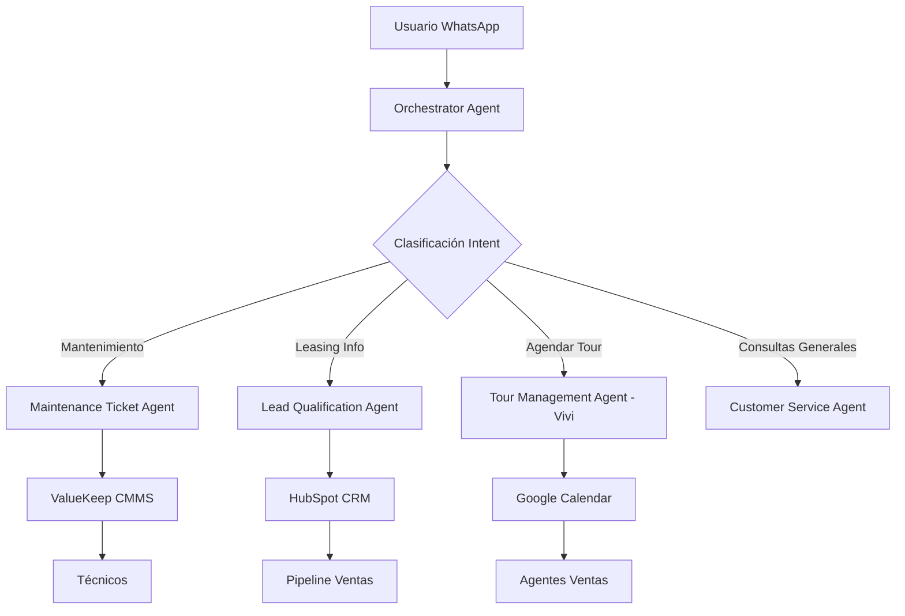

# UrbanHub Multi-Agent AI System - Síntesis Técnica

## 📋 Resumen Ejecutivo

**UrbanHub Multi-Agent AI System** es una arquitectura de 5 agentes especializados de inteligencia artificial, configurados 100% nativamente en la plataforma Bird.com, diseñados para automatizar completamente los procesos de captación de clientes (leasing/marketing) y gestión de operaciones (mantenimiento) de UrbanHub.

### Objetivo del Proyecto
Transformar las operaciones de UrbanHub de **100% manual** a **100% automatizado**, reduciendo los tiempos de respuesta de **10-30 minutos** a **<2 minutos** y expandiendo la disponibilidad de **horario comercial** a **24/7**, todo mediante configuración nativa en Bird.com sin desarrollo de código personalizado.

### Impacto Esperado
- **Operacional**: Automatización completa de ticket creation vs proceso manual actual
- **Comercial**: Disponibilidad 24/7 para leads vs solo horario de oficina  
- **Experiencia**: Respuesta <2 minutos vs 10-30 minutos actuales
- **Escalabilidad**: Fácil expansión a nuevas propiedades y funcionalidades

---

## 🏗️ Arquitectura Multi-Agente

### Paradigma de Especialización
El sistema implementa un **modelo de especialización por función** donde cada agente domina un área específica del customer journey, trabajando en orquestación para brindar una experiencia fluida y experta.



---

## 🤖 Agentes Especializados

### 1. 🚦 **Orchestrator Agent** - Traffic Controller
**Función**: Director de tráfico inteligente que identifica intenciones y rutea conversaciones

**Capacidades Clave**:
- Identificación de intención en <20 segundos
- Clasificación automática: Mantenimiento (40%), Leasing (35%), Pagos (15%), Amenidades (8%), Otros (2%)
- Preservación de contexto al 100% entre transfers
- Manejo de multi-intents y situaciones ambiguas

**Métricas de Éxito**:
- >95% precisión en routing
- <20 segundos tiempo de enrutamiento
- <10% necesidad de clarificación adicional

### 2. 💼 **Lead Qualification Agent** - Prospect Evaluator  
**Función**: Especialista en calificación eficiente de prospectos inmobiliarios

**Capacidades Clave**:
- Calificación en máximo 5 intercambios de mensajes
- Segmentación: Hot (>$25K, <30 días), Warm ($18-25K, 30-60 días), Cold (exploración)
- Verificación de presupuesto mínimo ($15,400 MXN + servicios)
- Integración directa con HubSpot CRM para tracking

**Métricas de Éxito**:
- <5 minutos tiempo promedio calificación
- >90% tasa de captura de datos completos
- >85% precisión en segmentación

### 3. 📅 **Tour Management Agent - "Vivi"** - Sales Specialist
**Función**: Especialista en experiencias de tour ultra-personalizadas con voice-brand UrbanHub

**Capacidades Clave**:
- **Flujo de 6 pasos obligatorio**: 
  1. Explicar qué es Urbanista ("Más que cuatro paredes, sin aval")
  2. Calificación de presupuesto por propiedad específica
  3. Segmentación por tipo de unidad (Studio/1BR/2BR)
  4. Tiempo de estancia (12 meses estándar, 6 meses casos especiales)  
  5. Consulta mascotas ("Pet lovers", no solo "pet friendly")
  6. Agendamiento con confirmación y recordatorios

**Voice-Brand Mensajes Exactos**:
- "Urbanista es mucho más que cuatro paredes, no necesitas aval y rentar aquí es fácil y rápido"
- "Tu dinero rinde más. When you live in here, you thrive out there"
- "En Urbanista no somos solo pet friendly—somos pet lovers"

**Métricas de Éxito**:
- >85% show rate de tours agendados
- >40% conversión tour-to-application
- >4.7/5 satisfaction score

### 4. 🔧 **Maintenance Ticket Agent** - Operations Automation
**Función**: Automatización completa del flujo de tickets con integración ValueKeep CMMS

**Capacidades Clave**:
- Creación automática de tickets en <2 minutos
- Clasificación inteligente: Plomería, Electricidad, Carpintería, Pintura, Electrodomésticos, Cerrajería
- Asignación automática de técnicos basada en carga de trabajo y especialización
- Priorización: Urgente (<4h), Alta (<24h), Media (<48h), Baja (<1 semana)
- Seguimiento completo hasta cierre con confirmación del residente

**Flujo Automatizado**:
1. Recepción → Clasificación → Creación ticket → Asignación técnico → Programación → Seguimiento → Cierre

**Métricas de Éxito**:
- 100% automatización vs 100% manual actual
- <24h resolución urgentes, <72h normales
- >4.5/5 satisfacción post-servicio

### 5. 🎯 **Customer Service Agent** - General Support
**Función**: Manejo de consultas generales, amenidades y escalaciones (implícito en arquitectura)

**Capacidades Clave**:
- Respuesta a FAQs generales
- Gestión de reservas de amenidades
- Clarificación de políticas y procedimientos
- Escalación a agentes humanos cuando necesario

---

## 🏢 Propiedades UrbanHub - Knowledge Base

### 8 Ubicaciones Estratégicas

#### **Zona Premium**
- **Josefa (Reforma)**: $20,200-$32,600 MXN - Torre corporativa premium
- **Inés (Nuevo Polanco)**: $23,600-$58,400 MXN - Luxury executive development
- **Leona (Condesa)**: $20,000-$26,500 MXN - Bohemian lifestyle boutique

#### **Zona Establecida** 
- **Matilde (Roma Sur)**: $18,500-$25,800 MXN - Creative district moderno
- **Amalia (Nápoles)**: $20,400-$32,800 MXN - Connectivity hub de negocios
- **Joaquina (Del Valle)**: $18,200-$33,100 MXN - Premium residential familiar

#### **Zona Emergente**
- **Juárez (Centro Histórico)**: $15,400-$21,800 MXN - Heritage renovado
- **Natalia (Doctores)**: $15,400-$20,500 MXN - Modern value en crecimiento

### Características Universales
- **Sin aval requerido** - Diferencial clave vs competencia
- **Pet-lovers friendly** - Espacios especiales para mascotas
- **All-inclusive**: Servicios y mantenimiento incluidos
- **Amenidades premium**: Co-working, gym, cinema, rooftops, 24/7 security

---

## 🔗 Integraciones Tecnológicas Clave

### **ValueKeep CMMS** - Maintenance Automation
- **API Endpoints**: Tickets, Technicians, Calendar, Work Orders
- **Authentication**: Bearer Token con HMAC-SHA256 security
- **Flujo**: Bird.com → ValueKeep API → Ticket Creation → Technician Assignment → Resident Updates
- **Error Handling**: Retry logic, escalation protocols, manual fallback

### **HubSpot CRM** - Sales Pipeline Management  
- **Deal Stages**: Lead → Qualified → Tour Scheduled → Tour Completed → Application → Closed
- **Properties Tracking**: Budget, Property Interest, Tour Feedback, Conversion Metrics
- **Automation**: Lead scoring, pipeline advancement, follow-up sequences

### **Google Calendar/Calendly** - Tour Scheduling
- **Calendar Events**: Automated creation with prospect and agent details
- **Reminders**: 24h y 2h before tour con confirmación/cancelación options
- **Optimization**: Horarios high-conversion (10am-12pm, 4pm-6pm)

### **WhatsApp Business** - Primary Channel
- **Multi-número strategy**: Números especializados por función
- **Message Templates**: Pre-approved por Meta para confirmaciones/recordatorios
- **Rich Media**: Photos, documents, location sharing capabilities

---

## 🎨 Voice-Brand UrbanHub - Diferenciación Competitiva

### Mensajes Clave Obligatorios
- **Core Value Prop**: "Tu dinero rinde más"
- **Tagline**: "When you live in here, you thrive out there"  
- **Differentiator**: "Más que cuatro paredes"
- **Pet Positioning**: "Pet lovers" (nunca solo "pet friendly")

### Tonalidad y Personalidad
- **Aspiracional pero accesible**: Premium lifestyle sin pretensiones
- **Mexicano auténtico**: Expresiones naturales culturalmente apropiadas
- **Community-focused**: Énfasis en pertenecer a algo especial
- **Solucionador**: "Mientras nosotros resolvemos, tú avanzas"

### Scripts Exactos No Modificables
Vivi (Tour Agent) debe usar textualmente los mensajes especificados en el knowledge base para mantener consistencia de brand y optimizar conversión.

---

## 📊 Métricas de Éxito y KPIs

### **Métricas Operacionales**
- **Response Time**: <2 minutos (Target vs 10-30 minutos actual)
- **Resolution Rate**: >80% sin escalación humana
- **Availability**: 24/7 vs horario comercial actual
- **Automation**: 100% ticket creation vs 100% manual actual

### **Métricas de Negocio**
- **Lead Qualification**: >80% conversations properly qualified
- **Tour Conversion**: >25% qualified leads book tours  
- **Show Rate**: >85% de tours agendados se realizan
- **Satisfaction**: >4.5/5 CSAT score across all touchpoints

### **Métricas de Eficiencia**
- **Intent Recognition**: >90% accuracy en clasificación automática
- **Context Preservation**: >95% successful handoffs entre agentes
- **First Contact Resolution**: >60% mantenimiento, >75% leasing
- **Agent Utilization**: 50% time savings para equipo humano

---

## ⚙️ Implementación Bird.com - 100% Nativa

### **Restricción Fundamental**
- **MANUAL CONFIGURATION ONLY**: Bird.com NO soporta JSON/YAML/API configs
- **Web Interface Only**: Todo debe configurarse step-by-step via GUI  
- **No Custom Code**: Uso exclusivo de funcionalidades nativas de la plataforma

### **Componentes de Configuración**

#### **Profile Configuration**
- Name, Avatar, Description, LLM Model (GPT-4), Language (Mexican Spanish)

#### **Personality Configuration**  
- Purpose (2-3 párrafos), Tasks (5+ específicas), Audience (demografía), Tone (ejemplos), Custom Instructions (500+ words)

#### **Guardrails**
- Must Do behaviors, Must Not Do restrictions, Escalation triggers

#### **Knowledge Base**
- Markdown files organizados por folders
- Headers H1/H2/H3 optimizados para embedding search  
- 500-2000 words per file para optimal retrieval

#### **Actions**
- Main Task, Handover conditions, Send Message templates, Resolve criteria

### **3-Phase Implementation Framework**

#### **Phase 1: Strategic Planning (1-2 weeks)**
- Business requirements definition y content preparation
- Technical planning y integration documentation

#### **Phase 2: Manual Configuration (2-3 weeks)**  
- Week 1: Basic setup (Profile, Personality, Guardrails)
- Week 2: Content & Knowledge (Knowledge Base structure y population)  
- Week 3: Actions & Integration (AI Actions setup y integrations)

#### **Phase 3: Testing & Optimization (1-2 weeks)**
- Internal testing, soft launch con pilot users, optimization based on metrics

---

## 🚀 Beneficios Estratégicos

### **Para UrbanHub**
- **Operational Excellence**: Eliminación de carga manual, consistencia en procesos
- **Competitive Advantage**: Experiencia 24/7 diferenciada en el mercado
- **Scalability**: Fácil expansión a nuevas propiedades sin incremento proporcional de staff  
- **Data Intelligence**: Insights precisos de conversión y comportamiento por propiedad

### **Para Residentes/Prospects**
- **Instant Response**: Respuesta inmediata sin importar hora/día
- **Personalized Experience**: Información específica según propiedad de interés
- **Seamless Journey**: From first contact to lease signing sin fricciones
- **Consistent Quality**: Mismo nivel de expertise y voice-brand en cada interacción

### **Para el Equipo UrbanHub**
- **Focus Shift**: De tareas operativas a strategy y relationship building
- **Quality Time**: Tiempo liberado para casos complejos y VIP prospects
- **Data-Driven**: Decisions basadas en metrics precisos vs intuición
- **Growth Enablement**: Capacidad de growth sin limitaciones operacionales

---

## 🎯 Diferenciadores Competitivos

### **Vs Chatbots Tradicionales**
- **Multi-Agent Specialization** vs single-bot approach
- **Context Preservation** perfecto entre transfers
- **Industry-Specific Knowledge** profundo vs responses genéricos

### **Vs Proceso Manual Actual**  
- **24/7 Availability** vs horario limitado
- **Instant Response** vs delays de horas/días
- **Consistent Quality** vs variabilidad humana
- **Scalable Operations** vs linear growth limitations

### **Vs Competencia Real Estate**
- **Voice-Brand Distinctive** ("Pet lovers", "Tu dinero rinde más")
- **No-Guarantor Positioning** como diferencial clave
- **Community-First Approach** vs transactional relationships
- **Technology-Forward** experience que refleja lifestyle target

---

## 📁 Estructura del Repositorio

```
src/
├── agents/                          # Configuraciones de agentes individuales
│   ├── orchestrator/               # Traffic controller y routing logic
│   ├── lead-qualification/         # Prospect evaluation y segmentation  
│   ├── tour-management/           # "Vivi" scheduling specialist
│   ├── maintenance-tickets/       # Operations automation
│   └── customer-service/          # General support (implícito)
├── integrations/                   # API integrations guides
│   ├── bird-valuekeep/            # CMMS automation
│   ├── bird-hubspot/             # CRM sync
│   └── bird-calendars/           # Calendar management
├── knowledge-base/               # Shared knowledge para todos los agentes
│   ├── properties/               # 8 UrbanHub locations details
│   ├── voice-brand/             # Brand messaging y scripts exactos
│   └── templates/               # Response templates
└── testing/                     # Test scenarios y integration tests
```

---

## 🔄 Continuous Optimization

### **Weekly Review Cycle**
- **Monday**: Metrics analysis via Bird.com dashboard
- **Wednesday**: Content updates based on real conversations  
- **Friday**: Configuration adjustments y feature testing

### **Feedback Loop Sources**
- **Quantitative**: Bird.com analytics, performance metrics, user behavior data
- **Qualitative**: Customer surveys, team observations, support ticket analysis

### **Improvement Framework**
- **Quick Wins** (<1 day): Knowledge Base updates, response templates
- **Medium Changes** (1-2 weeks): Conversation flows, integration enhancements
- **Major Updates** (1+ month): Architecture changes, new agent creation

---

*Documento creado: 2025-09-01*  
*Versión: 1.0 - Síntesis Técnica Consolidada*  
*Fuente: Análisis completo del directorio `/src` del repositorio UrbanHub*