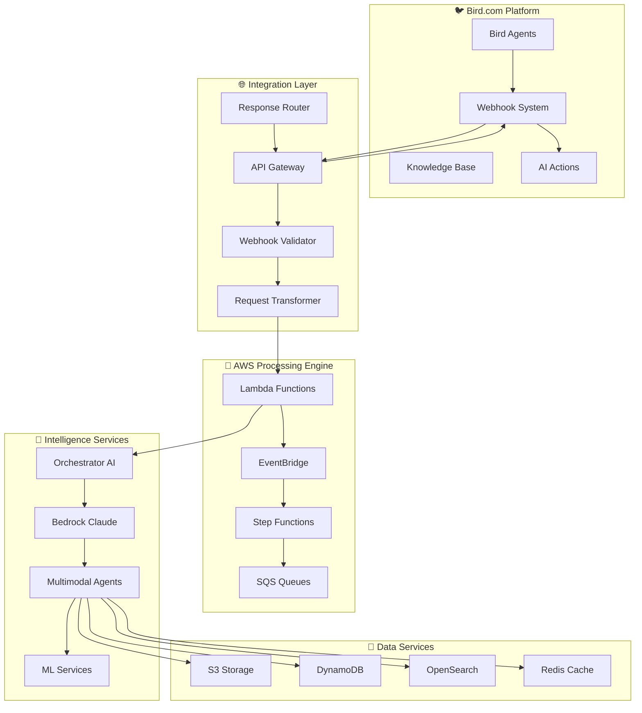

# 🔗 Integraciones Híbridas Bird.com + AWS - Conectores Avanzados

## 📋 Resumen Ejecutivo

Las **Integraciones Híbridas UrbanHub** implementan la conectividad perfecta entre Bird.com como capa de presentación y AWS Serverless como motor de procesamiento avanzado. Utilizando AWS Powertools, patrones event-driven, y la API nativa de Bird.com, estas integraciones garantizan comunicación bidireccional fluida, procesamiento en tiempo real, y escalabilidad automática.

### 🎯 Principios de Integración

#### **1. Bird.com First Approach**
- **API Nativa**: Uso exclusivo de endpoints oficiales Bird.com  
- **Webhook Optimización**: Configuración avanzada para máximo rendimiento
- **Manual Configuration**: Setup 100% via GUI web Bird.com
- **No Custom Code**: Cero modificaciones platform Bird.com

#### **2. AWS Serverless Excellence** 
- **Event-Driven Architecture**: EventBridge + Lambda + Step Functions
- **Auto-scaling**: Escalamiento automático basado en demanda
- **Cost Optimization**: Pay-per-use con resource optimization
- **AWS Powertools Integration**: Logging, metrics, tracing automáticos

#### **3. Hybrid Pattern Innovation**
- **Bi-directional Communication**: Bird.com ↔ AWS seamless flows
- **Context Preservation**: Estado conversacional perfecto entre sistemas
- **Real-time Processing**: Latencia < 2s end-to-end
- **Fault Tolerance**: Múltiples niveles de failover automático

## 🏗️ Arquitectura de Integración



## 📡 Conectores Principales

### **1. Webhook Processing Connector**

#### **Enhanced Webhook Handler**
```python
import boto3
import json
from aws_lambda_powertools import Logger, Tracer, Metrics
from aws_lambda_powertools.logging import correlation_paths
from aws_lambda_powertools.metrics import MetricUnit

logger = Logger()
tracer = Tracer()
metrics = Metrics(namespace="UrbanHub/Integration")

@tracer.capture_lambda_handler
@logger.inject_lambda_context(correlation_id_path=correlation_paths.API_GATEWAY_HTTP)
@metrics.log_metrics
def bird_webhook_handler(event, context):
    """
    Enhanced Bird.com webhook processor con validación avanzada
    Implementa patrones AWS Powertools para observabilidad completa
    """
    
    # 1. Validate webhook authenticity
    webhook_validator = BirdWebhookValidator()
    if not webhook_validator.validate_signature(event):
        logger.error("Invalid webhook signature", extra={
            "webhook_source": event.get('headers', {}).get('x-bird-source'),
            "timestamp": event.get('headers', {}).get('x-bird-timestamp')
        })
        metrics.add_metric(name="InvalidWebhookSignature", unit=MetricUnit.Count, value=1)
        return {"statusCode": 403, "body": "Unauthorized"}
    
    # 2. Parse and enrich webhook payload
    try:
        webhook_data = json.loads(event['body'])
        enriched_payload = enrich_webhook_payload(webhook_data)
        
        logger.info("Webhook received successfully", extra={
            "user_id": enriched_payload.get('user_id'),
            "message_type": enriched_payload.get('message_type'),
            "agent_id": enriched_payload.get('agent_id')
        })
        
    except json.JSONDecodeError as e:
        logger.exception("Failed to parse webhook payload")
        metrics.add_metric(name="WebhookParseError", unit=MetricUnit.Count, value=1)
        return {"statusCode": 400, "body": "Invalid JSON payload"}
    
    # 3. Route to appropriate processing pipeline
    routing_decision = determine_processing_route(enriched_payload)
    
    # 4. Publish to EventBridge for async processing
    eventbridge_client = boto3.client('events')
    event_detail = {
        'Source': 'bird.webhook',
        'DetailType': f'Bird.com {routing_decision.event_type}',
        'Detail': json.dumps({
            'webhook_payload': enriched_payload,
            'routing_decision': routing_decision.__dict__,
            'processing_metadata': {
                'received_at': context.aws_request_id,
                'correlation_id': logger.get_correlation_id()
            }
        })
    }
    
    try:
        response = eventbridge_client.put_events(
            Entries=[{
                'Source': 'urbanhub.integration',
                'DetailType': routing_decision.event_type,
                'Detail': json.dumps(event_detail),
                'EventBusName': 'urbanhub-multimodal-events'
            }]
        )
        
        metrics.add_metric(name="WebhookProcessed", unit=MetricUnit.Count, value=1)
        metrics.add_metric(name="WebhookLatency", unit=MetricUnit.Milliseconds, 
                          value=get_processing_time_ms())
        
        logger.info("Webhook routed successfully", extra={
            "event_id": response['Entries'][0]['EventId'],
            "routing_target": routing_decision.target_service
        })
        
        return {
            "statusCode": 200,
            "body": json.dumps({
                "status": "processed",
                "event_id": response['Entries'][0]['EventId']
            })
        }
        
    except Exception as e:
        logger.exception("Failed to route webhook to EventBridge")
        metrics.add_metric(name="WebhookRoutingError", unit=MetricUnit.Count, value=1)
        return {"statusCode": 500, "body": "Internal processing error"}

class BirdWebhookValidator:
    """Validador de autenticidad webhooks Bird.com"""
    
    def __init__(self):
        self.secrets_manager = boto3.client('secretsmanager')
        self.webhook_secret = self._get_webhook_secret()
    
    def validate_signature(self, event):
        """Valida firma HMAC webhook Bird.com"""
        import hmac
        import hashlib
        
        signature = event.get('headers', {}).get('x-bird-signature')
        timestamp = event.get('headers', {}).get('x-bird-timestamp')
        payload = event.get('body', '')
        
        if not all([signature, timestamp, payload]):
            return False
            
        # Validate timestamp (prevent replay attacks)
        import time
        if abs(time.time() - int(timestamp)) > 300:  # 5 minutes tolerance
            return False
            
        # Validate HMAC signature
        expected_signature = hmac.new(
            self.webhook_secret.encode('utf-8'),
            f"{timestamp}.{payload}".encode('utf-8'),
            hashlib.sha256
        ).hexdigest()
        
        return hmac.compare_digest(signature, expected_signature)
    
    def _get_webhook_secret(self):
        """Retrieve webhook secret from AWS Secrets Manager"""
        try:
            response = self.secrets_manager.get_secret_value(
                SecretId='urbanhub/bird-webhook-secret'
            )
            return json.loads(response['SecretString'])['webhook_secret']
        except Exception:
            logger.exception("Failed to retrieve webhook secret")
            raise

def enrich_webhook_payload(webhook_data):
    """Enriquece payload con contexto adicional y normalización"""
    
    enriched = {
        'original_payload': webhook_data,
        'user_id': extract_user_id(webhook_data),
        'message_type': classify_message_type(webhook_data),
        'agent_id': webhook_data.get('agent_id'),
        'timestamp': webhook_data.get('timestamp'),
        'platform': 'bird.com',
        'enrichment_metadata': {
            'processed_at': int(time.time()),
            'version': '2.0'
        }
    }
    
    # Add conversation context if available
    if 'conversation_id' in webhook_data:
        context = get_conversation_context(webhook_data['conversation_id'])
        enriched['conversation_context'] = context
    
    # Add multimodal content analysis
    if has_multimodal_content(webhook_data):
        enriched['multimodal_analysis'] = analyze_multimodal_content(webhook_data)
    
    return enriched

def determine_processing_route(payload):
    """Determina la ruta de procesamiento óptima basada en payload"""
    
    class RoutingDecision:
        def __init__(self, event_type, target_service, priority="normal"):
            self.event_type = event_type
            self.target_service = target_service
            self.priority = priority
    
    message_type = payload.get('message_type')
    has_multimodal = 'multimodal_analysis' in payload
    
    # Routing logic based on content and context
    if message_type == 'multimodal_complex':
        return RoutingDecision(
            event_type="MultimodalProcessingRequired",
            target_service="orchestrator-coordinator",
            priority="high"
        )
    elif message_type == 'document_upload':
        return RoutingDecision(
            event_type="DocumentAnalysisRequired", 
            target_service="document-intelligence",
            priority="high"
        )
    elif message_type == 'voice_message':
        return RoutingDecision(
            event_type="VoiceProcessingRequired",
            target_service="voice-tour-guide",
            priority="normal"
        )
    elif has_multimodal:
        return RoutingDecision(
            event_type="MultimodalConversation",
            target_service="multimodal-conversation-ai",
            priority="normal"
        )
    else:
        return RoutingDecision(
            event_type="StandardConversation",
            target_service="orchestrator-coordinator", 
            priority="normal"
        )
```

### **2. Response Generation Connector**

#### **Bird.com API Response Handler**
```python
import boto3
import json
from aws_lambda_powertools import Logger, Tracer, Metrics
from aws_lambda_powertools.utilities.typing import LambdaContext

logger = Logger()
tracer = Tracer()
metrics = Metrics(namespace="UrbanHub/ResponseHandler")

@tracer.capture_lambda_handler
@logger.inject_lambda_context
@metrics.log_metrics  
def bird_response_handler(event, context: LambdaContext):
    """
    Maneja respuestas generadas por agentes y las envía de vuelta a Bird.com
    Implementa retry logic, rate limiting, y response optimization
    """
    
    try:
        # 1. Parse agent response from EventBridge
        agent_response = parse_agent_response(event)
        
        # 2. Format response for Bird.com API
        bird_payload = format_for_bird_api(agent_response)
        
        # 3. Apply rate limiting and optimization
        rate_limiter = BirdAPIRateLimiter()
        if not rate_limiter.can_send_message(agent_response.user_id):
            logger.warning("Rate limit exceeded, queuing message", extra={
                "user_id": agent_response.user_id,
                "current_rate": rate_limiter.get_current_rate(agent_response.user_id)
            })
            return queue_for_later_delivery(agent_response)
        
        # 4. Send to Bird.com with retry logic
        bird_api_client = BirdAPIClient()
        response = bird_api_client.send_message_with_retry(
            agent_id=agent_response.agent_id,
            user_id=agent_response.user_id,
            payload=bird_payload,
            max_retries=3
        )
        
        # 5. Track metrics and log success
        metrics.add_metric(name="ResponseSent", unit=MetricUnit.Count, value=1)
        metrics.add_metric(name="ResponseLatency", unit=MetricUnit.Milliseconds, 
                          value=response.latency_ms)
        
        logger.info("Response sent successfully to Bird.com", extra={
            "user_id": agent_response.user_id,
            "response_type": bird_payload.get('type'),
            "bird_message_id": response.message_id
        })
        
        # 6. Update conversation state
        update_conversation_state(agent_response, response)
        
        return {
            "statusCode": 200,
            "messageId": response.message_id,
            "deliveryStatus": "sent"
        }
        
    except Exception as e:
        logger.exception("Failed to send response to Bird.com")
        metrics.add_metric(name="ResponseError", unit=MetricUnit.Count, value=1)
        
        # Queue for retry if it's a recoverable error
        if is_recoverable_error(e):
            return queue_for_retry(event, str(e))
        else:
            return {"statusCode": 500, "error": str(e)}

class BirdAPIClient:
    """Cliente optimizado para API Bird.com con retry y rate limiting"""
    
    def __init__(self):
        self.secrets_manager = boto3.client('secretsmanager')
        self.api_credentials = self._get_api_credentials()
        self.base_url = "https://api.bird.com/v1"
        
    def send_message_with_retry(self, agent_id, user_id, payload, max_retries=3):
        """Envía mensaje con retry automático y exponential backoff"""
        import requests
        import time
        import random
        
        for attempt in range(max_retries + 1):
            try:
                response = requests.post(
                    f"{self.base_url}/agents/{agent_id}/conversations/{user_id}/messages",
                    headers={
                        "Authorization": f"Bearer {self.api_credentials.access_token}",
                        "Content-Type": "application/json",
                        "X-Bird-Source": "urbanhub-integration"
                    },
                    json=payload,
                    timeout=30
                )
                
                if response.status_code == 200:
                    return BirdAPIResponse(
                        message_id=response.json()['messageId'],
                        status='delivered',
                        latency_ms=response.elapsed.total_seconds() * 1000
                    )
                elif response.status_code == 429:  # Rate limit
                    retry_after = int(response.headers.get('Retry-After', 60))
                    logger.warning(f"Rate limited, waiting {retry_after}s")
                    time.sleep(retry_after)
                    continue
                else:
                    logger.error(f"Bird API error: {response.status_code}", extra={
                        "response_body": response.text
                    })
                    if attempt < max_retries:
                        backoff_time = (2 ** attempt) + random.uniform(0, 1)
                        time.sleep(backoff_time)
                        continue
                    else:
                        raise BirdAPIException(f"API error after {max_retries} retries")
                        
            except requests.RequestException as e:
                logger.warning(f"Request failed, attempt {attempt + 1}/{max_retries + 1}")
                if attempt < max_retries:
                    backoff_time = (2 ** attempt) + random.uniform(0, 1)
                    time.sleep(backoff_time)
                else:
                    raise
        
        raise BirdAPIException(f"Failed to send message after {max_retries} retries")

def format_for_bird_api(agent_response):
    """Formatea respuesta de agente para API Bird.com"""
    
    # Base message structure
    bird_message = {
        "type": "text",
        "text": agent_response.text_content,
        "metadata": {
            "agent_source": agent_response.agent_id,
            "processing_time_ms": agent_response.processing_time,
            "confidence_score": agent_response.confidence_score
        }
    }
    
    # Add multimodal content if present
    if agent_response.has_images():
        bird_message["images"] = [
            {
                "url": img.url,
                "alt_text": img.description,
                "type": img.type
            }
            for img in agent_response.images
        ]
    
    # Add interactive elements
    if agent_response.has_quick_replies():
        bird_message["quickReplies"] = [
            {
                "text": reply.text,
                "payload": reply.payload
            }
            for reply in agent_response.quick_replies
        ]
    
    # Add rich content (cards, carousels, etc.)
    if agent_response.has_rich_content():
        bird_message["richContent"] = format_rich_content(agent_response.rich_content)
    
    return bird_message

class BirdAPIRateLimiter:
    """Rate limiting para API Bird.com usando Redis"""
    
    def __init__(self):
        import redis
        self.redis = redis.Redis(
            host=os.environ['REDIS_HOST'],
            port=6379,
            decode_responses=True
        )
        self.rate_limit_per_user = 10  # messages per minute
        
    def can_send_message(self, user_id):
        """Verifica si usuario está dentro de rate limits"""
        key = f"rate_limit:bird_api:{user_id}"
        current_count = self.redis.get(key)
        
        if current_count is None:
            self.redis.setex(key, 60, 1)  # 60 seconds expiry
            return True
        elif int(current_count) < self.rate_limit_per_user:
            self.redis.incr(key)
            return True
        else:
            return False
            
    def get_current_rate(self, user_id):
        """Obtiene rate actual del usuario"""
        key = f"rate_limit:bird_api:{user_id}"
        return int(self.redis.get(key) or 0)
```

### **3. State Management Connector**

#### **Conversation State Synchronizer**
```python
import boto3
import json
from aws_lambda_powertools import Logger, Tracer, Metrics
from decimal import Decimal

logger = Logger()
tracer = Tracer() 
metrics = Metrics(namespace="UrbanHub/StateManager")

@tracer.capture_lambda_handler
@logger.inject_lambda_context
@metrics.log_metrics
def conversation_state_manager(event, context):
    """
    Gestiona sincronización de estado conversacional entre Bird.com y AWS
    Implementa pattern CQRS para read/write optimization
    """
    
    try:
        state_operation = event.get('operation')  # 'read', 'write', 'sync'
        conversation_id = event.get('conversation_id')
        
        state_manager = ConversationStateManager()
        
        if state_operation == 'read':
            state = state_manager.get_conversation_state(conversation_id)
            return {"statusCode": 200, "state": state}
            
        elif state_operation == 'write':
            new_state = event.get('state_data')
            result = state_manager.update_conversation_state(conversation_id, new_state)
            return {"statusCode": 200, "updated": result}
            
        elif state_operation == 'sync':
            sync_result = state_manager.sync_with_bird_platform(conversation_id)
            return {"statusCode": 200, "sync_status": sync_result}
            
        else:
            return {"statusCode": 400, "error": "Invalid operation"}
            
    except Exception as e:
        logger.exception("State management operation failed")
        metrics.add_metric(name="StateOperationError", unit=MetricUnit.Count, value=1)
        return {"statusCode": 500, "error": str(e)}

class ConversationStateManager:
    """Gestor avanzado de estado conversacional con multi-layer caching"""
    
    def __init__(self):
        self.dynamodb = boto3.resource('dynamodb')
        self.table = self.dynamodb.Table('urbanhub-conversation-state')
        self.redis_client = self._initialize_redis()
        
    @tracer.capture_method
    def get_conversation_state(self, conversation_id):
        """Retrieve conversation state with L1/L2 caching"""
        
        # L1 Cache - Redis (hot data)
        cached_state = self.redis_client.get(f"conv_state:{conversation_id}")
        if cached_state:
            logger.info("State retrieved from L1 cache", extra={"conversation_id": conversation_id})
            metrics.add_metric(name="StateCacheHit", unit=MetricUnit.Count, value=1)
            return json.loads(cached_state)
        
        # L2 Cache - DynamoDB (persistent state)
        try:
            response = self.table.get_item(Key={'conversation_id': conversation_id})
            
            if 'Item' in response:
                state_data = self._convert_decimal_to_float(response['Item'])
                
                # Update L1 cache
                self.redis_client.setex(
                    f"conv_state:{conversation_id}", 
                    300,  # 5 minutes TTL
                    json.dumps(state_data)
                )
                
                logger.info("State retrieved from L2 cache", extra={"conversation_id": conversation_id})
                metrics.add_metric(name="StateCacheMiss", unit=MetricUnit.Count, value=1)
                return state_data
            else:
                # Initialize new conversation state
                return self._initialize_conversation_state(conversation_id)
                
        except Exception as e:
            logger.exception("Failed to retrieve conversation state")
            raise
    
    @tracer.capture_method
    def update_conversation_state(self, conversation_id, state_updates):
        """Update conversation state with atomic operations"""
        
        import time
        timestamp = int(time.time())
        
        try:
            # Prepare update expression
            update_expression = "SET "
            expression_values = {}
            expression_names = {}
            
            for key, value in state_updates.items():
                safe_key = key.replace('-', '_').replace('.', '_')
                update_expression += f"#{safe_key} = :{safe_key}, "
                expression_names[f"#{safe_key}"] = key
                expression_values[f":{safe_key}"] = value
            
            # Add metadata
            update_expression += "#updated_at = :updated_at, #version = #version + :inc"
            expression_names["#updated_at"] = "updated_at"
            expression_names["#version"] = "version"
            expression_values[":updated_at"] = timestamp
            expression_values[":inc"] = 1
            
            # Execute atomic update
            response = self.table.update_item(
                Key={'conversation_id': conversation_id},
                UpdateExpression=update_expression,
                ExpressionAttributeNames=expression_names,
                ExpressionAttributeValues=expression_values,
                ReturnValues='ALL_NEW'
            )
            
            # Invalidate L1 cache
            self.redis_client.delete(f"conv_state:{conversation_id}")
            
            # Update metrics
            metrics.add_metric(name="StateUpdated", unit=MetricUnit.Count, value=1)
            
            logger.info("Conversation state updated successfully", extra={
                "conversation_id": conversation_id,
                "version": response['Attributes']['version']
            })
            
            return True
            
        except Exception as e:
            logger.exception("Failed to update conversation state")
            metrics.add_metric(name="StateUpdateError", unit=MetricUnit.Count, value=1)
            raise
    
    def sync_with_bird_platform(self, conversation_id):
        """Sincroniza estado con Bird.com platform"""
        
        try:
            # Get current AWS state
            aws_state = self.get_conversation_state(conversation_id)
            
            # Get Bird.com state via API
            bird_client = BirdAPIClient()
            bird_state = bird_client.get_conversation_state(conversation_id)
            
            # Determine sync strategy
            sync_strategy = self._determine_sync_strategy(aws_state, bird_state)
            
            if sync_strategy == "aws_to_bird":
                bird_client.update_conversation_state(conversation_id, aws_state)
                logger.info("Synced AWS state to Bird.com")
                
            elif sync_strategy == "bird_to_aws":
                self.update_conversation_state(conversation_id, bird_state)
                logger.info("Synced Bird.com state to AWS")
                
            elif sync_strategy == "merge":
                merged_state = self._merge_conversation_states(aws_state, bird_state)
                self.update_conversation_state(conversation_id, merged_state)
                bird_client.update_conversation_state(conversation_id, merged_state)
                logger.info("Merged and synced conversation states")
            
            return sync_strategy
            
        except Exception as e:
            logger.exception("State synchronization failed")
            return "failed"
    
    def _initialize_conversation_state(self, conversation_id):
        """Inicializa nuevo estado de conversación"""
        import time
        
        initial_state = {
            'conversation_id': conversation_id,
            'created_at': int(time.time()),
            'updated_at': int(time.time()),
            'version': 1,
            'user_preferences': {},
            'conversation_context': {
                'intent_history': [],
                'topic_progression': [],
                'sentiment_timeline': []
            },
            'agent_handoffs': [],
            'multimodal_content': {
                'images_shared': [],
                'documents_processed': [],
                'voice_interactions': []
            },
            'business_context': {
                'property_interests': [],
                'stage_in_journey': 'discovery',
                'lead_score': 0
            }
        }
        
        # Save to DynamoDB
        self.table.put_item(Item=initial_state)
        
        # Cache in Redis
        self.redis_client.setex(
            f"conv_state:{conversation_id}",
            300,
            json.dumps(initial_state)
        )
        
        logger.info("Initialized new conversation state", extra={
            "conversation_id": conversation_id
        })
        
        return initial_state
    
    def _convert_decimal_to_float(self, obj):
        """Convierte Decimal a float para JSON serialization"""
        if isinstance(obj, list):
            return [self._convert_decimal_to_float(i) for i in obj]
        elif isinstance(obj, dict):
            return {k: self._convert_decimal_to_float(v) for k, v in obj.items()}
        elif isinstance(obj, Decimal):
            return float(obj)
        else:
            return obj
```

## 🔄 Event-Driven Workflows

### **EventBridge Integration Patterns**

#### **Multi-Agent Orchestration Events**
```python
# EventBridge Rules Configuration
EVENTBRIDGE_RULES = {
    "multimodal-processing": {
        "EventPattern": {
            "source": ["urbanhub.integration"],
            "detail-type": ["MultimodalProcessingRequired"],
            "detail": {
                "routing_decision": {
                    "priority": ["high", "urgent"]
                }
            }
        },
        "Targets": [
            {
                "Id": "orchestrator-step-function",
                "Arn": "arn:aws:states:us-east-1:account:stateMachine:orchestrator-workflow",
                "RoleArn": "arn:aws:iam::account:role/EventBridgeStepFunctionsRole"
            }
        ]
    },
    
    "document-analysis": {
        "EventPattern": {
            "source": ["urbanhub.integration"],
            "detail-type": ["DocumentAnalysisRequired"]
        },
        "Targets": [
            {
                "Id": "document-intelligence-lambda",
                "Arn": "arn:aws:lambda:us-east-1:account:function:document-intelligence-processor"
            }
        ]
    },
    
    "voice-processing": {
        "EventPattern": {
            "source": ["urbanhub.integration"], 
            "detail-type": ["VoiceProcessingRequired"]
        },
        "Targets": [
            {
                "Id": "voice-tour-guide-lambda",
                "Arn": "arn:aws:lambda:us-east-1:account:function:voice-tour-guide"
            }
        ]
    }
}
```

### **Step Functions Orchestration**

#### **Multi-Agent Processing Workflow**
```json
{
  "Comment": "UrbanHub Multi-Agent Processing Workflow",
  "StartAt": "ValidateInput",
  "States": {
    "ValidateInput": {
      "Type": "Task",
      "Resource": "arn:aws:lambda:us-east-1:account:function:input-validator",
      "Next": "DetermineProcessingRoute",
      "Retry": [
        {
          "ErrorEquals": ["Lambda.ServiceException", "Lambda.AWSLambdaException"],
          "IntervalSeconds": 2,
          "MaxAttempts": 3,
          "BackoffRate": 2.0
        }
      ],
      "Catch": [
        {
          "ErrorEquals": ["States.TaskFailed"],
          "Next": "HandleValidationFailure"
        }
      ]
    },
    
    "DetermineProcessingRoute": {
      "Type": "Choice",
      "Choices": [
        {
          "Variable": "$.routing_decision.event_type",
          "StringEquals": "MultimodalProcessingRequired",
          "Next": "ProcessMultimodal"
        },
        {
          "Variable": "$.routing_decision.event_type", 
          "StringEquals": "DocumentAnalysisRequired",
          "Next": "ProcessDocument"
        },
        {
          "Variable": "$.routing_decision.event_type",
          "StringEquals": "VoiceProcessingRequired",
          "Next": "ProcessVoice"
        }
      ],
      "Default": "ProcessStandardConversation"
    },
    
    "ProcessMultimodal": {
      "Type": "Parallel",
      "Branches": [
        {
          "StartAt": "OrchestratorAnalysis",
          "States": {
            "OrchestratorAnalysis": {
              "Type": "Task",
              "Resource": "arn:aws:lambda:us-east-1:account:function:orchestrator-coordinator",
              "End": true
            }
          }
        },
        {
          "StartAt": "MultimodalProcessing", 
          "States": {
            "MultimodalProcessing": {
              "Type": "Task",
              "Resource": "arn:aws:lambda:us-east-1:account:function:multimodal-conversation-ai",
              "End": true
            }
          }
        }
      ],
      "Next": "CombineResults"
    },
    
    "ProcessDocument": {
      "Type": "Task",
      "Resource": "arn:aws:lambda:us-east-1:account:function:document-intelligence",
      "Next": "GenerateResponse",
      "TimeoutSeconds": 300
    },
    
    "ProcessVoice": {
      "Type": "Task", 
      "Resource": "arn:aws:lambda:us-east-1:account:function:voice-tour-guide",
      "Next": "GenerateResponse",
      "TimeoutSeconds": 180
    },
    
    "ProcessStandardConversation": {
      "Type": "Task",
      "Resource": "arn:aws:lambda:us-east-1:account:function:orchestrator-coordinator",
      "Next": "GenerateResponse"
    },
    
    "CombineResults": {
      "Type": "Task",
      "Resource": "arn:aws:lambda:us-east-1:account:function:result-combiner",
      "Next": "GenerateResponse"
    },
    
    "GenerateResponse": {
      "Type": "Task",
      "Resource": "arn:aws:lambda:us-east-1:account:function:response-generator",
      "Next": "SendToBird"
    },
    
    "SendToBird": {
      "Type": "Task",
      "Resource": "arn:aws:lambda:us-east-1:account:function:bird-response-handler",
      "End": true
    },
    
    "HandleValidationFailure": {
      "Type": "Fail",
      "Cause": "Input validation failed",
      "Error": "ValidationError"
    }
  }
}
```

## 📊 Monitoring y Observabilidad

### **CloudWatch Dashboard Configuration**

#### **Integration Health Dashboard**
```python
CLOUDWATCH_DASHBOARD = {
    "widgets": [
        {
            "type": "metric",
            "properties": {
                "metrics": [
                    ["UrbanHub/Integration", "WebhookProcessed"],
                    [".", "WebhookLatency"],
                    [".", "ResponseSent"],
                    [".", "ResponseLatency"]
                ],
                "period": 300,
                "stat": "Sum",
                "region": "us-east-1",
                "title": "Integration Throughput"
            }
        },
        {
            "type": "metric",
            "properties": {
                "metrics": [
                    ["UrbanHub/Integration", "WebhookParseError"],
                    [".", "WebhookRoutingError"],
                    [".", "ResponseError"],
                    [".", "InvalidWebhookSignature"]
                ],
                "period": 300,
                "stat": "Sum",
                "region": "us-east-1",
                "title": "Error Rates"
            }
        },
        {
            "type": "log",
            "properties": {
                "query": "SOURCE '/aws/lambda/bird-webhook-handler'\n| fields @timestamp, @message\n| filter @message like /ERROR/\n| sort @timestamp desc\n| limit 20",
                "region": "us-east-1",
                "title": "Recent Errors",
                "view": "table"
            }
        }
    ]
}
```

### **Alertas y Notificaciones**

#### **CloudWatch Alarms**
```python
INTEGRATION_ALARMS = {
    "high_error_rate": {
        "AlarmName": "UrbanHub-Integration-HighErrorRate",
        "ComparisonOperator": "GreaterThanThreshold",
        "EvaluationPeriods": 2,
        "MetricName": "WebhookParseError",
        "Namespace": "UrbanHub/Integration",
        "Period": 300,
        "Statistic": "Sum",
        "Threshold": 10.0,
        "ActionsEnabled": True,
        "AlarmActions": [
            "arn:aws:sns:us-east-1:account:urbanhub-integration-alerts"
        ],
        "AlarmDescription": "High error rate in webhook processing"
    },
    
    "high_latency": {
        "AlarmName": "UrbanHub-Integration-HighLatency",
        "ComparisonOperator": "GreaterThanThreshold", 
        "EvaluationPeriods": 3,
        "MetricName": "WebhookLatency",
        "Namespace": "UrbanHub/Integration",
        "Period": 300,
        "Statistic": "Average",
        "Threshold": 5000.0,  # 5 seconds
        "ActionsEnabled": True,
        "AlarmActions": [
            "arn:aws:sns:us-east-1:account:urbanhub-integration-alerts"
        ],
        "AlarmDescription": "High latency in webhook processing"
    }
}
```

---

## 📚 Archivos de Implementación

### **Estructura de Archivos Generados**

```
hybrid-integrations/
├── README.md ✅
├── webhook-processing/
│   ├── enhanced-webhook-handler.py
│   ├── webhook-validator.py
│   └── payload-enricher.py
├── response-handling/
│   ├── bird-api-client.py
│   ├── response-formatter.py  
│   └── rate-limiter.py
├── state-management/
│   ├── conversation-state-manager.py
│   ├── state-synchronizer.py
│   └── cache-manager.py
├── event-driven-workflows/
│   ├── eventbridge-rules.json
│   ├── step-functions-definition.json
│   └── workflow-orchestrator.py
├── monitoring-observability/
│   ├── cloudwatch-dashboards.json
│   ├── alarm-definitions.json
│   └── custom-metrics.py
└── infrastructure/
    ├── cloudformation-template.yaml
    ├── terraform-main.tf
    └── deployment-scripts.sh
```

---

**🔗 Integraciones Híbridas - Conectividad Perfecta Bird.com + AWS**  
📅 Implementación: UrbanHub v2.0  
🔄 Optimizado con: AWS Powertools + EventBridge + Step Functions  
📊 Última actualización: 2025-09-01