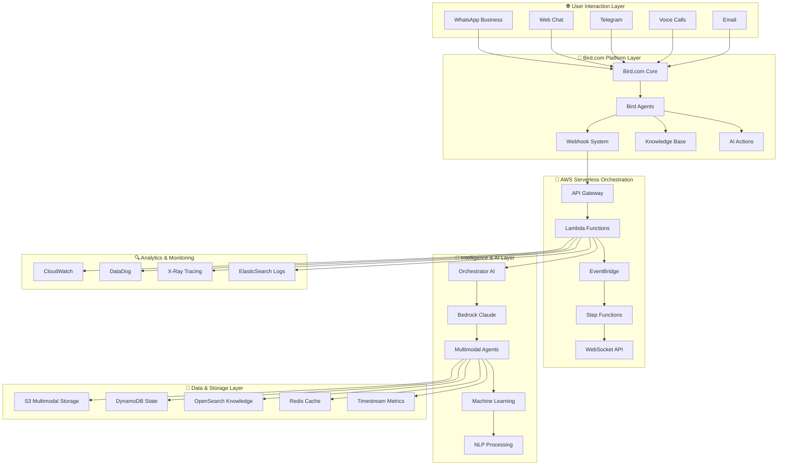
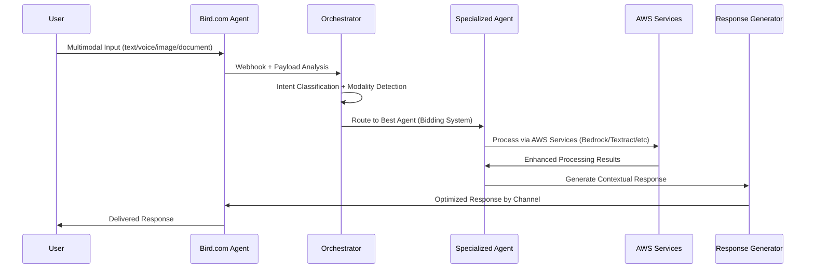
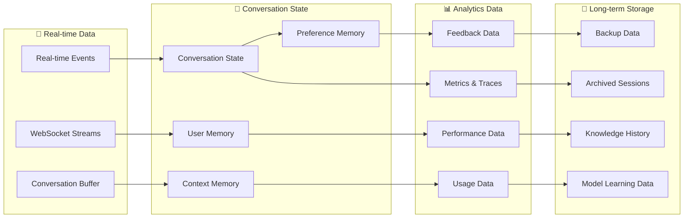

# 🏗️ Arquitectura Multimodal Avanzada - Diseño Técnico

## 📋 Resumen Ejecutivo

Esta arquitectura combina los **patrones más avanzados de LangChain** con **AWS Serverless optimizado** y la **configuración 100% manual de Bird.com** para crear el sistema de agentes multimodales más sofisticado del mercado inmobiliario.

### 🎯 Principios de Diseño

#### **1. Hybrid-First Architecture**
- **Bird.com** como capa de presentación y configuración
- **AWS Serverless** como motor de procesamiento avanzado
- **Manual Configuration** para máxima compatibilidad
- **Event-Driven** para escalabilidad automática

#### **2. LangChain Patterns Integration**
- **DialogueSimulator** adaptado para orquestación multimodal
- **Agent Bidding System** para selección inteligente
- **Context Preservation** entre modalidades
- **Hierarchical Fallbacks** para robustez

#### **3. Multimodal Excellence**
- **Unified Processing** para texto + voz + imagen + documento
- **Cross-Modal Context** sharing inteligente
- **Real-time Streaming** para interacciones fluidas
- **Adaptive Responses** basadas en modalidad preferida

## 🏛️ Arquitectura General del Sistema



## 🔄 Flujo de Procesamiento Multimodal

### 1. **Input Processing Flow**



### 2. **Agent Selection & Orchestration**

```python
class BirdDialogueOrchestrator:
    """
    Adaptación del patrón DialogueSimulator de LangChain
    Optimizado para Bird.com + AWS Serverless
    """
    
    def __init__(self):
        self.agents = self._initialize_agents()
        self.conversation_memory = ConversationMemory()
        self.context_manager = CrossModalContextManager()
        
    def process_bird_webhook(self, event):
        # 1. Analyze input and determine best processing approach
        analysis = self.analyze_multimodal_input(event)
        
        # 2. Agent bidding system - each agent bids for handling
        agent_bids = self.collect_agent_bids(analysis)
        
        # 3. Select best agent based on bidding + context
        selected_agent = self.select_agent(agent_bids, analysis.context)
        
        # 4. Process with cross-modal context
        response = selected_agent.process_with_context(
            analysis, 
            self.context_manager.get_context(analysis.user_id)
        )
        
        # 5. Update context and return
        self.context_manager.update_context(analysis.user_id, response)
        return self.format_bird_response(response)
        
    def collect_agent_bids(self, analysis):
        """Each agent bids to handle the conversation"""
        bids = []
        for agent in self.agents:
            bid_score = agent.calculate_bid_score(analysis)
            bids.append({
                'agent': agent,
                'score': bid_score,
                'confidence': agent.confidence_level(analysis),
                'specialization_match': agent.specialization_score(analysis)
            })
        return sorted(bids, key=lambda x: x['score'], reverse=True)
```

## 🤖 Arquitectura de Agentes Especializados

### **Agent Architecture Pattern**

```python
class MultimodalBirdAgent:
    """
    Base class para agentes Bird.com multimodales
    Implementa patrones LangChain con optimizaciones específicas
    """
    
    def __init__(self, agent_config):
        self.agent_id = agent_config.id
        self.specializations = agent_config.specializations
        self.modality_support = agent_config.modalities
        self.bird_config = agent_config.bird_settings
        
        # LangChain components
        self.memory = ConversationBufferWindowMemory(k=10)
        self.tools = self._initialize_tools()
        self.llm = self._initialize_bedrock_llm()
        
    def calculate_bid_score(self, analysis):
        """
        Calculate bid score for handling specific conversation
        Based on specialization match + current load + context
        """
        specialization_score = self._match_specialization(analysis.intent)
        modality_score = self._match_modality(analysis.modality_type)
        context_score = self._match_context(analysis.context)
        load_penalty = self._current_load_penalty()
        
        return (specialization_score * 0.4 + 
                modality_score * 0.3 + 
                context_score * 0.2 - 
                load_penalty * 0.1)
    
    def process_with_context(self, analysis, context):
        """Process multimodal input with full context"""
        # Determine processing pipeline based on modality
        if analysis.modality_type == "multimodal":
            return self._process_multimodal_unified(analysis, context)
        elif analysis.modality_type == "voice":
            return self._process_voice_input(analysis, context)
        elif analysis.modality_type == "image":
            return self._process_image_input(analysis, context)
        elif analysis.modality_type == "document":
            return self._process_document_input(analysis, context)
        else:
            return self._process_text_input(analysis, context)
```

### **Specialized Agent Implementations**

#### **1. Orchestrator Coordinator**
```python
class OrchestratorCoordinator(MultimodalBirdAgent):
    """
    Traffic controller con DialogueSimulator pattern
    Especializado en routing inteligente y coordinación
    """
    
    specializations = [
        "intent_classification",
        "conversation_routing", 
        "context_management",
        "escalation_handling"
    ]
    
    def process_routing_decision(self, analysis, context):
        # Advanced routing logic with LangChain patterns
        routing_chain = self._build_routing_chain()
        decision = routing_chain.run({
            'input': analysis.text,
            'context': context,
            'history': self.memory.chat_memory.messages[-5:],
            'user_profile': context.get('user_profile', {})
        })
        return self._format_routing_response(decision)
```

#### **2. Multimodal Conversation AI**
```python
class MultimodalConversationAI(MultimodalBirdAgent):
    """
    Procesamiento unificado de múltiples modalidades
    Con capacidades avanzadas de NLP + Vision + Audio
    """
    
    specializations = [
        "natural_language_processing",
        "sentiment_analysis",
        "multimodal_understanding",
        "context_aware_responses"
    ]
    
    def _process_multimodal_unified(self, analysis, context):
        # Unified processing pipeline
        text_features = self._extract_text_features(analysis.text)
        audio_features = self._extract_audio_features(analysis.audio) if analysis.audio else None
        visual_features = self._extract_visual_features(analysis.image) if analysis.image else None
        
        # Fusion processing with Bedrock
        unified_understanding = self._multimodal_fusion({
            'text': text_features,
            'audio': audio_features,
            'visual': visual_features,
            'context': context
        })
        
        return self._generate_contextual_response(unified_understanding)
```

#### **3. Document Intelligence**
```python
class DocumentIntelligence(MultimodalBirdAgent):
    """
    Especialista en procesamiento de documentos
    OCR + Análisis + Clasificación + Validación
    """
    
    specializations = [
        "document_ocr",
        "legal_document_analysis", 
        "contract_extraction",
        "document_classification",
        "signature_verification"
    ]
    
    def _process_document_input(self, analysis, context):
        # Advanced document processing pipeline
        document_type = self._classify_document(analysis.document)
        
        if document_type == "lease_contract":
            return self._process_lease_contract(analysis.document, context)
        elif document_type == "identification":
            return self._process_identification(analysis.document, context)
        elif document_type == "financial_document":
            return self._process_financial_document(analysis.document, context)
        else:
            return self._process_generic_document(analysis.document, context)
```

## 💾 Arquitectura de Datos

### **Data Flow Architecture**



### **Storage Strategy**

#### **Hot Storage (Redis/DynamoDB)**
- **Active conversations** (< 1 hour old)
- **User context** and preferences
- **Real-time metrics** and counters
- **Session state** management

#### **Warm Storage (DynamoDB/S3)**
- **Recent conversations** (1 hour - 30 days)
- **User profiles** and history
- **Document cache** and metadata
- **Analytics aggregations**

#### **Cold Storage (S3/Glacier)**
- **Historical conversations** (> 30 days)
- **Compliance archives**
- **Model training data**
- **Backup and recovery**

## 🔍 Monitoring y Observabilidad

### **Monitoring Stack**

```python
class AdvancedMonitoring:
    """
    Sistema de monitoring avanzado con AWS Powertools
    Métricas en tiempo real + Alertas inteligentes
    """
    
    def __init__(self):
        self.metrics = Metrics(namespace="UrbanHub/MultimodalAI")
        self.logger = Logger(service="multimodal-orchestrator") 
        self.tracer = Tracer(service="multimodal-orchestrator")
        
    @tracer.capture_method
    def track_conversation_metrics(self, event_data):
        """Track comprehensive conversation metrics"""
        
        # Performance metrics
        self.metrics.add_metric("ConversationLatency", event_data.latency, "Milliseconds")
        self.metrics.add_metric("AgentSelection", 1, "Count", 
                               agent_type=event_data.selected_agent)
        
        # Quality metrics  
        self.metrics.add_metric("IntentAccuracy", event_data.intent_confidence, "Percent")
        self.metrics.add_metric("UserSatisfaction", event_data.satisfaction_score, "Rating")
        
        # Business metrics
        self.metrics.add_metric("LeadQualified", 1, "Count",
                               property=event_data.property_interest)
        self.metrics.add_metric("TourScheduled", 1, "Count",
                               conversion_path=event_data.conversion_source)
        
        # Modality metrics
        self.metrics.add_metric("ModalityUsage", 1, "Count",
                               modality=event_data.primary_modality)
```

### **Key Performance Indicators**

#### **Technical KPIs**
- **Response Time**: < 2s for 95% of requests
- **Agent Selection Accuracy**: > 90% optimal routing
- **Context Preservation**: > 98% cross-modal continuity
- **System Availability**: 99.9% uptime SLA

#### **Business KPIs** 
- **Lead Qualification Rate**: > 80% automation
- **Tour Conversion**: > 40% qualified leads to tours
- **Maintenance Resolution**: < 24h average time
- **Customer Satisfaction**: > 4.7/5 average rating

#### **AI Performance KPIs**
- **Intent Recognition**: > 95% accuracy
- **Multimodal Processing**: < 3s end-to-end
- **Document Analysis**: > 98% OCR accuracy
- **Voice Recognition**: > 97% transcription accuracy

## 🚀 Escalabilidad y Performance

### **Auto-scaling Strategy**

```python
class AutoScalingOrchestrator:
    """
    Sistema de auto-scaling inteligente
    Basado en métricas de negocio + técnicas
    """
    
    def __init__(self):
        self.cloudwatch = boto3.client('cloudwatch')
        self.application_autoscaling = boto3.client('application-autoscaling')
        
    def calculate_scaling_decision(self, current_metrics):
        # Business-driven scaling
        conversation_volume = current_metrics['active_conversations']
        lead_velocity = current_metrics['leads_per_minute'] 
        peak_hours = self._is_peak_hours()
        
        # Technical scaling factors
        cpu_utilization = current_metrics['cpu_percent']
        memory_utilization = current_metrics['memory_percent']
        queue_depth = current_metrics['message_queue_depth']
        
        # Predictive scaling based on historical patterns
        predicted_load = self._predict_load(current_metrics)
        
        scaling_factor = self._calculate_scaling_factor(
            conversation_volume, lead_velocity, peak_hours,
            cpu_utilization, memory_utilization, queue_depth,
            predicted_load
        )
        
        return self._execute_scaling_decision(scaling_factor)
```

### **Performance Optimization**

#### **Caching Strategy**
- **Agent State Cache**: Redis con TTL adaptativo
- **Knowledge Base Cache**: OpenSearch con warming
- **Response Cache**: S3 con CloudFront CDN
- **Model Cache**: EFS para modelos compartidos

#### **Processing Optimization**
- **Parallel Processing**: Step Functions para workflows complejos
- **Batch Processing**: SQS + Lambda para documentos
- **Stream Processing**: Kinesis para real-time analytics
- **Edge Processing**: Lambda@Edge para latencia mínima

---

## 📚 Documentos Relacionados

- **[Agent Implementation Guide](../intelligent-agents/README.md)** - Implementación detallada de agentes
- **[Integration Patterns](../hybrid-integrations/README.md)** - Patrones de integración híbrida
- **[Knowledge Base Design](../knowledge-intelligence/README.md)** - Diseño de base de conocimiento
- **[Deployment Guide](../enterprise-deployment/README.md)** - Guía de despliegue empresarial

---

**🤖 Arquitectura diseñada con patrones LangChain + AWS Powertools**  
📅 Versión: 2.0 - Advanced Patterns Integration  
🔄 Última actualización: 2025-09-01